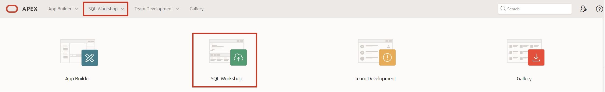
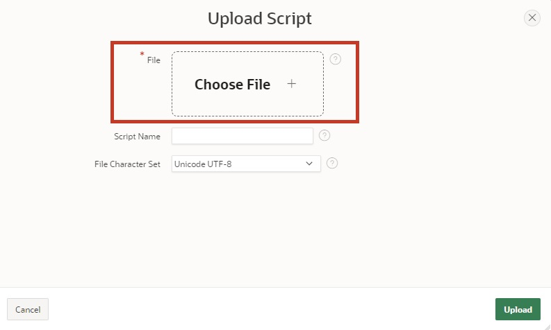
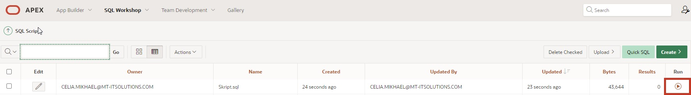
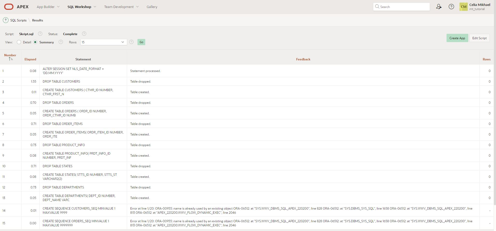

# Preparation

Welcome to the “Hands-On APEX 24.1” workshop by Hyand Solutions.  
Before you can begin working on this tutorial, you need to request a workspace on Oracle's servers. You can do this in just a few minutes at [apex.oracle.com](apex.oracle.com).

If you want to work on English-language tutorials, there is an option to do so through the following link. Simply click on [https://apex.oracle.com/en/learn/tutorials/](https://apex.oracle.com/en/learn/tutorials/) and work on the tutorials provided by APEX if you want to gain a deeper insight into the world of APEX.  

#  1. Importing the Required Data 

##  1.1 Script

A script is a list of commands for automating processes. In this case, the script creates tables and sequences. Additionally, the tables are populated with data by the script.

Tables are the basic unit of data storage in an Oracle database. Data is stored in rows and columns within them. A row is a collection of column information that corresponds to a single data record. The columns define the data types of the individual data in a row.

Before you can start creating the application, you must first load the required data into your workspace's database using a SQL script.

Uploading and executing the script ensures that all database objects are created and all data is inserted. Subsequently, you can access this data in your application.

Use the provided SQL script (**Script.sql**) to import the data as described below.

##  1.2 Importing the Script

- Navigate to the **SQL Workshop** by choosing one of the two highlighted options.

 

- Once you are in the **SQL Workshop**, click on **SQL Scripts**.

- Now click on **Upload**.

- Select the **Script.sql** script, which is located in the **Chapter-01** folder. Upload the script by clicking the upload button or by dragging it into the designated field.

- Execute the script by pressing the **Run** button.

- Click on **Run Now**.

- After the successful import, you should see the following result:

All tables and data needed for this tutorial should now be present in your workspace.  

## 1.3 Data Modeling with Quick SQL

Another way to create data models with little effort is Quick SQL.  
How it works is explained in **Task #14: Excursion: Data Modeling with Quick SQL**.