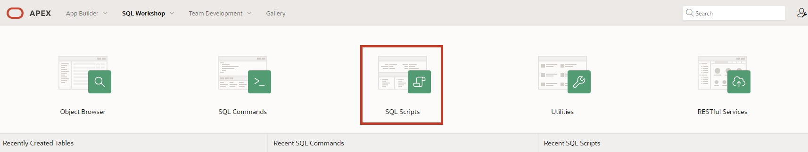
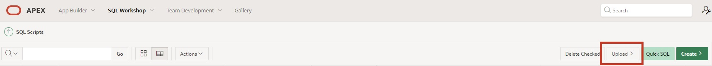
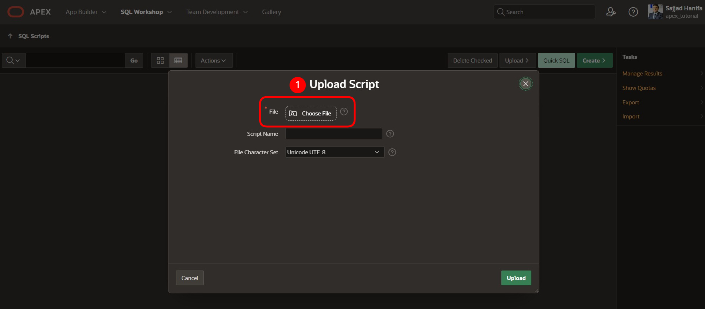
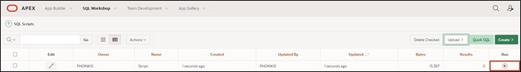
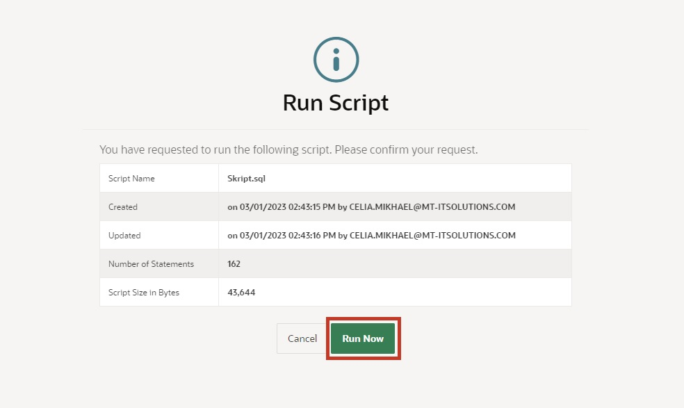
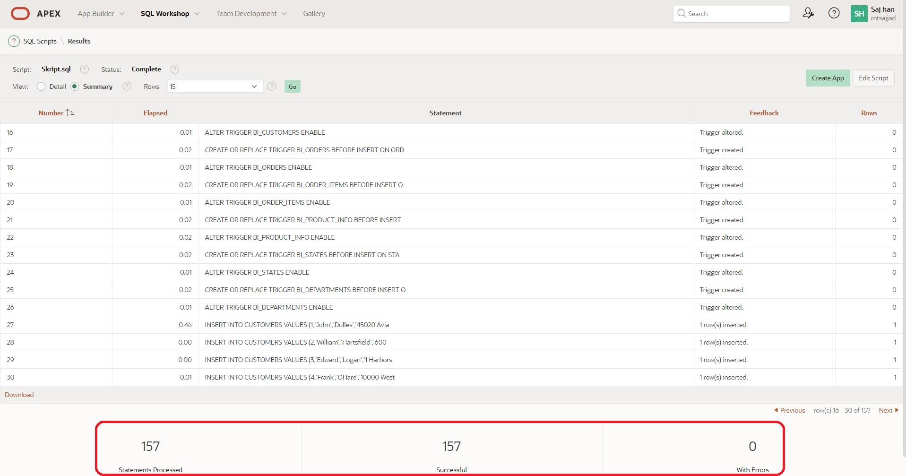

# Preparation

Welcome to the “Hands-On APEX 24.1” workshop by Hyand Solutions.
Before you can start working on this tutorial, you need to request a workspace on Oracle's servers. You can do this in a few minutes at [apex.oracle.com](apex.oracle.com).

If you would like to work on English tutorials, you can do so at the following link. Simply click on [https://apex.oracle.com/en/learn/tutorials/](https://apex.oracle.com/en/learn/tutorials/) and explore the tutorials provided by APEX for a deeper insight into the world of APEX.

#  1. Importing the Required Data

##  1.1 Script

A script is a list of commands to automate processes. In this case, the script creates tables and sequences. The tables are also populated with data using the script.

Tables are the basic units of data storage in an Oracle database. Data is stored in rows and columns. A row is a collection of column information corresponding to a single data record. The columns define the data types of the individual data in a row.

Before you can start creating the application, you must first load the required data into your workspace database using an SQL script.

Uploading and executing the script ensures that all database objects are created and all data is inserted. You can then access this data in your application.

Use the attached SQL script (**Skript.sql**) to import the data as described below.

##  1.2 Importing the Script

- Navigate to the **SQL Workshop** by choosing one of the two red-marked options.

 

- When in the **SQL Workshop**, click on **SQL Scripts**.

- Click on **Upload**.

- Select the script **Skript.sql** located in the folder **Chapter-01**. Upload the script by clicking the upload button or dragging it into the designated field.

- Run the script by pressing the **Run** button.

- Click on **Run Now**.

- After successful import, you should see the following result:

All tables and data required for this tutorial should now be available in your workspace.

## 1.3 Data Modeling Using Quick SQL

Another way to easily create data models is with Quick SQL.  
You will learn how this works in **Task #14: Excursion: Data Modeling Using Quick SQL**.