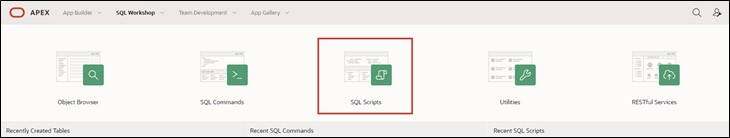

# Preparation

Welcome to the "Hands-On APEX 24.1" workshop by Hyand Solutions.
Before you can start working on this tutorial, you need to request a workspace on Oracle's servers. You can do this in just a few minutes at [apex.oracle.com](apex.oracle.com).

If you would like to work on English-language tutorials, you can do so via the following link. Simply click on [https://apex.oracle.com/en/learn/tutorials/](https://apex.oracle.com/en/learn/tutorials/) and complete the tutorials provided by APEX if you want to gain a greater insight into the world of APEX.

#  1. Import of Required Data

##  1.1 Script

A script is a list of commands to automate processes. In this case, the script creates tables and sequences. Additionally, the script populates the tables with data.

Tables are the basic unit of data storage in an Oracle database. They store data in rows and columns. A row is a collection of column information corresponding to a single data record. The columns define the data types of the individual data within a row.

Before you can start creating the application, you must first load the required data into your workspace's database using an SQL script.

Uploading and executing the script ensures that all database objects are created and all data is inserted. You can then access this data in your application.

Use the attached SQL script (**Skript.sql**) to import the data as described below.

##  1.2 Script Import

- Navigate to the **SQL Workshop** by choosing one of the two red-marked options.

- Once you are in the **SQL Workshop**, click on **SQL Scripts**.

- Now click on **Upload**.

- Select the script **Skript.sql**, which is located in the folder **Chapter-01**. Upload the script by clicking the upload button or drag it into the designated area.

- Start the script by pressing the **Run** button.

- Click on **Run Now**.

- After a successful import, you should see the following result:

All tables and data required for this tutorial should now be present in your workspace.

## 1.3 Data Modeling Using Quick SQL

Another way to create data models with minimal effort is by using Quick SQL.  
You can learn how this works in **Task #14: Excursion: Data Modeling Using Quick SQL**.