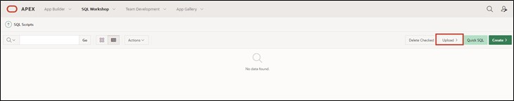

# Preparation

Welcome to the "Hands-On APEX 22.1" workshop by MT AG.
Before you can begin working on this tutorial, you need to request a workspace on Oracle's servers. You can do this in a few minutes at [apex.oracle.com](apex.oracle.com).

If you would like to take advantage of English-language tutorials, there is an option available via the following link. Simply click on [https://apex.oracle.com/en/learn/tutorials/](https://apex.oracle.com/en/learn/tutorials/) and work on the tutorials provided by APEX if you want a broader insight into the world of APEX.  

# 1. Import of Required Data

## 1.1. Script

A script is a list of commands for automating processes. In this case, the script creates tables and sequences. Additionally, the script populates the tables with data.

Tables are the basic unit of data storage in an Oracle database. In them, data is stored in rows and columns. A row is a collection of column information corresponding to a single record. The columns define the data types of the individual data in a row.

Before you can start creating the application, you must first load the required data into your workspace's database using a SQL script.

Uploading and running the script ensures that all database objects are created and all data is inserted. Afterwards, you can access this data in your application.

Use the attached SQL script (**Script.sql**) to import the data as described below.

## 1.2. Import the Script

- Navigate to the **SQL Workshop** by choosing one of the two options marked in red.

- Once in the **SQL Workshop**, click on **SQL Scripts**.

- Now click on **Upload**.

- Select the script **Script.sql** located in the **Chapter-01** folder. Upload the script by clicking the upload button or by dragging it into the designated field.

- Start the script by pressing the **Run** button.

- Click on **Run Now**.

- After a successful import, you should see the following result:

All tables and data needed for this tutorial should now be available in your workspace.  

## 1.3. Data Modeling Using Quick SQL

Another way to create data models without much effort is provided by Quick SQL. You can learn how this works in the **Task #14: Excursion: Data Modeling Using Quick SQL**. 