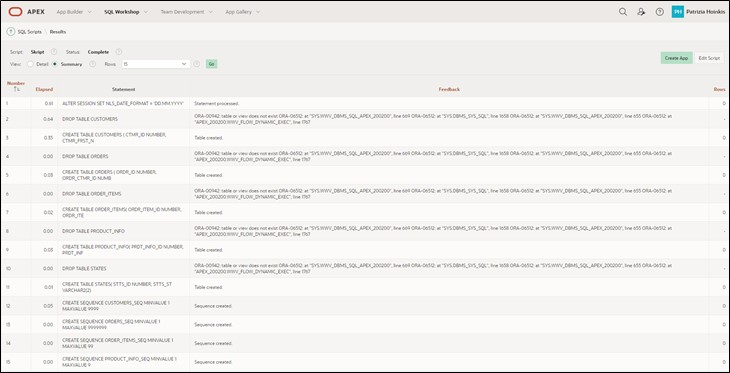

# Preparation

Welcome to the "Hands-On APEX 22.2" workshop by MT - IT Solutions.
Before you can start working on this tutorial, you need to request a workspace on Oracle's servers. You can do this within a few minutes at [apex.oracle.com](apex.oracle.com).

If you would like to work on English-language tutorials, there is an option to do so at the following link. Simply click on [https://apex.oracle.com/en/learn/tutorials/](https://apex.oracle.com/en/learn/tutorials/) and work on the tutorials provided by APEX if you want to gain a greater insight into the world of APEX.

# 1. Import of Required Data

## 1.1. Script

A script is a list of commands to automate processes. In this case, the script creates tables and sequences. The script also populates the tables with data.

Tables are the basic unit of storage in an Oracle database. They store data in rows and columns. A row is a collection of column information corresponding to a single record. The columns define the data types of each piece of data in a row.

Before you can start creating the application, you first need to load the required data into the database of your workspace using an SQL script.

Uploading and executing the script ensures that all database objects are created and all data is inserted. Subsequently, you can access this data in your application.

Use the attached SQL script (**Script.sql**) to import the data as described below.

## 1.2. Import of the Script

- Navigate to the **SQL Workshop** by choosing one of the two options marked in red.

- Once you are in the **SQL Workshop**, click on **SQL Scripts**.

- Now click on **Upload**.

- Select the script **Script.sql**, which is located in the **Chapter-01** folder. Upload the script by clicking the upload button or dragging it into the designated area.

- Start the script by pressing the **Run** button.

- Click on **Run Now**.

- After a successful import, you should see the following result:

All tables and data required for this tutorial should now be present in your workspace.

## 1.3. Data Modeling using Quick SQL

Another way to create data models without much effort is Quick SQL.  
You can learn how this works in **Task #14: Excursion: Data Modeling using Quick SQL**.