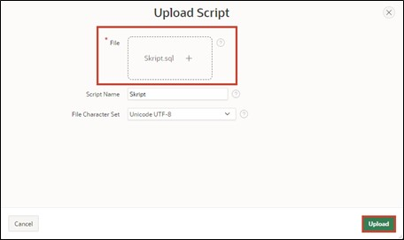
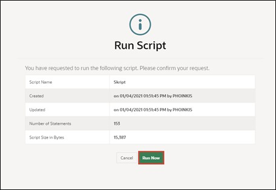

# Preparation

Welcome to the workshop "Hands-On APEX 23.2" by MT - IT Solutions.  
Before you can start working on this tutorial, you need to apply for a workspace on Oracle's servers. You can do this in just a few minutes at [apex.oracle.com](apex.oracle.com).

If you want to take advantage of English-language tutorials, you have the opportunity to do so at the following link. Simply click on [https://apex.oracle.com/en/learn/tutorials/](https://apex.oracle.com/en/learn/tutorials/) and work through the tutorials provided by APEX if you wish to gain further insight into the world of APEX.

#  1. Import the Required Data

##  1.1 Script

A script is a list of commands for automating processes. In this case, the script creates tables and sequences. In addition, the script populates the tables with data.

Tables are the basic unit of data storage in an Oracle database. They store data in rows and columns. A row is a collection of column information corresponding to a single record. The columns define the data types of each data in a row.

Before you can start creating the application, you must first load the required data into your workspace's database via a SQL script.

Uploading and executing the script ensures that all database objects are created and all data is inserted. Then you can access this data in your application.

Use the provided SQL script (**Skript.sql**) to import the data as described below.

##  1.2 Import the Script

- Navigate to the **SQL Workshop** by choosing one of the two options marked in red.

- Once you're in the **SQL Workshop**, click on **SQL Scripts**.

- Now click on **Upload**.

- Select the script **Skript.sql** located in the **Chapter-01** folder. Upload the script by clicking the upload button or dragging it into the designated area.

- Start the script by pressing the **Run** button.

- Click on **Run Now**.

- After a successful import, you should see the following result:

All tables and data required for this tutorial should now be present in your workspace.

##  1.3 Data Modeling with Quick SQL

Another way to create data models with little effort is Quick SQL.  
You can learn how this works in **Task #14: Excursion: Data Modeling with Quick SQL**.