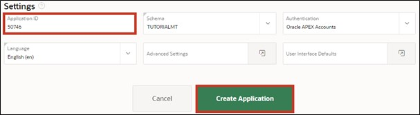
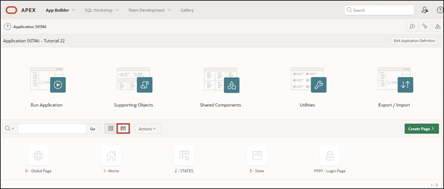

# 2. Create App Wizard

The Create App Wizard is an assistant that allows developers to quickly design and develop standard APEX applications. The assistant can be used to create complete applications consisting of multiple pages and a variety of different reports and forms.

In this chapter, the basic structure of the application and the first page will be created. In the Create App Wizard, you specify the settings for your application. After clicking on Create Application, APEX creates the application with your settings.

## 2.1. Creating an Application

- For further tasks, an **application** must first be created. To do this, first open the **App Builder** and click on the **Create** button. The App Builder shows all installed applications.

- The application creation wizard will start. Click on New Application to create a new application.

- Now enter the name of the application (e.g., Tutorial 22).

- If desired, you can also customize the Application Icon by clicking on the blue envelope to the left of the name. A wizard opens where you can select an icon and color or upload your own image.

- In the wizard, you can directly create a first page in your application. To do this, click on the plus sign or on Add Page.

## 2.2. Report

In APEX, a report is a formatted display of a SQL query. A report can be generated via the wizard or a manually entered SQL query.

APEX differentiates between a classic report and an interactive report. The difference between the two is that in an interactive report, the user can adjust the data presentation by searching, filtering, sorting, selecting columns, highlighting, and other data manipulations.

- After clicking the button to add a page, a new window opens with a page creation wizard. There, select **Interactive Report**.

- The properties of the page follow in the next window. Enter ***STATES*** as the **Page Name**.
- The settings **Table or View** and **Interactive Report** are selected by default. If this is not the case, please select them.
- Next, click on the dropdown menu on the right to select a **table** that should be displayed in the Interactive Report.

- The **Search Dialog** opens, where you select the table ***STATES***.
- Check the box for **Include Form** and then click the **Add Page** button.

 
## 2.3. Create Application

- This is how your Create App Wizard should look now.

- Now check the box for the feature **"Install Progressive Web App"**. With this feature, APEX applications can be installed on mobile devices and used as a standalone application. You can learn more about this in **Task #07: Features for Mobile Devices**.

- If you scroll down, you will see the **Application ID** under **Settings**. Since you will need this later, it is advisable to note it down.  
The Application ID is a unique number by which the application can be accessed in the browser.

- After completing all other steps, click the **Create Application** button to create the application.

 
## 2.4. Run Page

After creating the application, the page overview of your application opens. 
You will see five pages: **0 - Global Page - Desktop**, **1 - Home**, and **9999 - Login Page** are standard pages created for each application. The Global Page is a master page. Any components placed on the Global Page will appear on all pages of the application. 
You have just created the pages **2 - STATES** and **3 - State** using the Add Page wizard.
- Click on the marked button to open the **list view**.

- Click on the **Run button** of the ***STATES*** page to view the created page.

- A login screen appears where you log in using your username and password (same credentials as for the Workspace).

- After logging in, the ***STATES*** page appears with an Interactive Report.

- If you click on the **pencil icon** in the left column, a modal dialog opens where you can change the data.

- For now, we will leave the contents as they are and close the modal dialog again (using the **Cancel** button or the x at the top corner).

- Now switch back to the **App Builder** tab.

