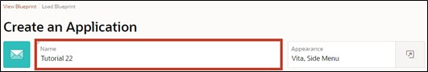
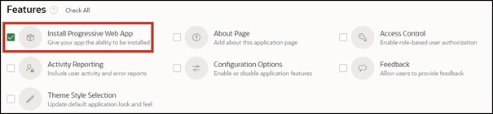
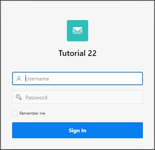
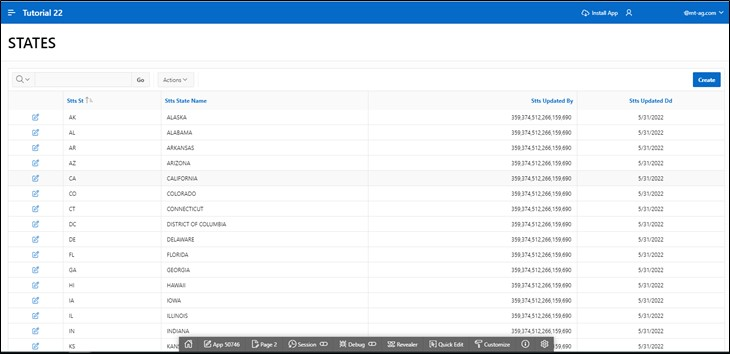

# 2. Create App Wizard

The Create App Wizard is a tool that allows developers to quickly design and develop standard APEX applications. It can be used to create complete applications consisting of multiple pages and a variety of different reports and forms.

In this chapter, the basic framework of the application and the first page are created. In the Create App Wizard, you specify the settings for your application. After clicking Create Application, APEX creates the application with your settings.

## 2.1 Creating an Application

- To proceed with further tasks, an **application** must first be created. First, open the **App Builder**. The App Builder displays all installed applications. Now click on the **Create** button.

- The application creation wizard starts. Click on Use Create App Wizard to open the wizard for a new application.

- Now enter the name of the application (e.g. Tutorial 23.2).

- If desired, you can also customize the Application Icon by clicking on the blue envelope to the left of the name. A wizard opens where an icon and a color can be selected or an own image can be uploaded.

- In the wizard, you can directly create a first page in your application. To do this, click on the plus or Add Page.

## 2.2 Report

In APEX, a report is a formatted representation of a SQL query. A report can be generated using the wizard or via a manually entered SQL query.

APEX distinguishes between the classic and the interactive report. The difference between the two is that for interactive reports, users can customize the display of data by searching, filtering, sorting, selecting columns, highlighting, and other data manipulations.

- After clicking the button to add a page, a new window opens with a wizard to create the page. There, select **Interactive Report**.

- The properties of the page follow in the next window. Enter ***STATES*** as the **Page Name**.
- The settings **Table or View** and **Interactive Report** are selected by default. If not, please select them.
- Next, click on the dropdown menu on the right to choose a **Table** to be displayed in the Interactive Report.

- The **Search Dialog** opens, where you select the table ***STATES***.
- Check the box for **Include Form** and then click on the **Add Page** button.

 
## 2.3 Create Application

- Your Create App Wizard should now look like this.

- Now check the box for the feature **“Install Progressive Web App”**. With this feature, APEX applications can be installed on mobile devices and used as standalone applications. You can learn more about this in **Task #07: Features for Mobile Devices**.

- When scrolling down, you'll see the **Application ID** under **Settings**. Since you will need this later on, it is advisable to note it.  
The Application ID is a unique number through which the application can be called up in the browser.

- After completing all other steps, click on the **Create Application** button to create the application.

 
##  2.4 Run Page

After creating the application, the page overview of your application opens. 
You will see five pages: **0 - Global Page - Desktop**, **1 - Home** and **9999 - Login Page** are standard pages created with every application. The Global Page is a master page. Any components placed on the Global Page are displayed on all pages of the application. 
The pages **2 - STATES** and **3 - State** you have just created using the Add Page wizard.
- Click on the marked button to open the **List View**.

- Click on the **Run Button** of the ***STATES*** page to view the created page.

- A login screen appears, where you log in with your Username and Password (the same credentials as for the Workspace).

- After logging in, the page ***STATES*** with an Interactive Report appears.

- If you click on the **pencil icon** in the left column, a modal dialog opens where you can change the data.

- For now, we leave the contents as they are and close the modal dialog again (using the **Cancel** button or the x in the corner).

- Now switch back to the **App Builder** tab.

