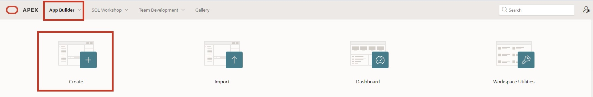
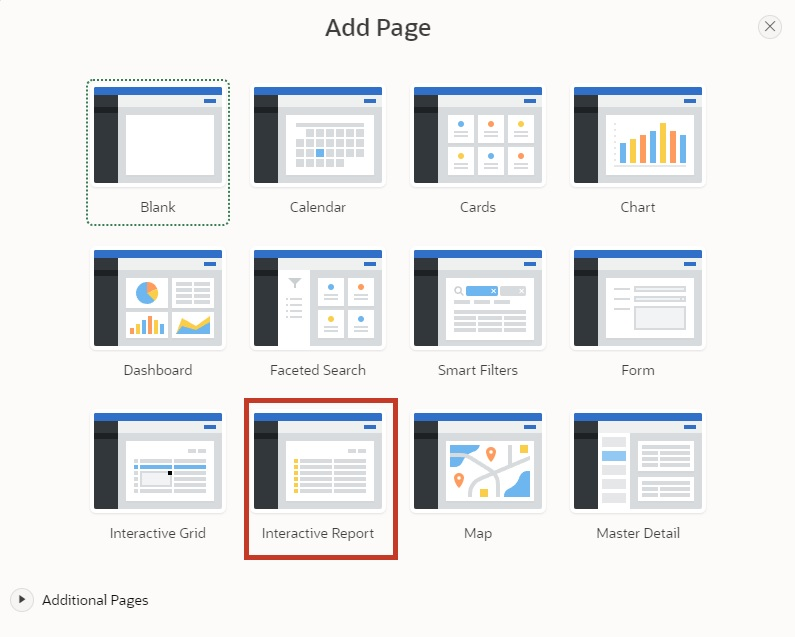
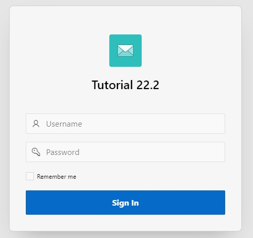
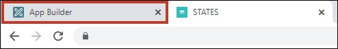

# 2. Create App Wizard

The Create App Wizard is an assistant that enables developers to quickly design and develop standard APEX applications. The assistant can be used to create complete applications consisting of multiple pages and a variety of different reports and forms.

In this chapter, the framework of the application and the first page will be created. In the Create App Wizard, you specify the settings for your application. After clicking on Create Application, APEX creates the application with your settings.

## 2.1 Creating an Application

- For the subsequent tasks, an **application** must first be created. To do this, first open the **App Builder**. The App Builder displays all installed applications. Now click on the **Create** button.

- The application creation assistant is launched. Click on Use Create App Wizard to open the wizard for a new application.

- Now enter the name of the application (e.g. Apex Tutorial).

- If desired, you can also adjust the Application Icon by clicking on the blue envelope to the left of the name. A wizard opens in which an icon and a color can be selected or your own image can be uploaded.

- In the wizard, you can directly create a first page in your application. Click on the plus or on Add Page to do so.

## 2.2 Report

In APEX, a report is a formatted representation of a SQL query. A report can be generated via the assistant or through a manually entered SQL query.

APEX distinguishes between classic reports and interactive reports. The difference between the two is that the user has the ability to customize the data display in an interactive report through searching, filtering, sorting, column selection, highlighting, and other data manipulations.

- After clicking the button to add a page, a new window with a wizard for creating the page opens. There, select **Interactive Report**.

- The properties of the page follow in the next window. Enter ***STATES*** as the **Page Name**.
- The settings **Table or View** and **Interactive Report** are selected by default. If this is not the case, please select them.
- Next, click on the dropdown menu on the right to select a **table** to be displayed in the Interactive Report.

- The **Search Dialog** opens where you select the table ***STATES***.
- Check the box for **Include Form** and then click the **Add Page** button.

## 2.3 Create Application

- Your Create App Wizard should now look like this.

- Now check the box for the feature **"Install Progressive Web App"**. This feature allows APEX applications to be installed on mobile devices and used as standalone applications. You can find out more in **Task #07: Features for Mobile Devices**.

- Scrolling down, you will see the **Application ID** under **Settings**. Since you will need this later on, it is advisable to note it down.
The Application ID is a unique number through which the application can be accessed in the browser.

- After completing all other steps, click the **Create Application** button to create the application.

##  2.4 Run Page

After you have created the application, the page overview of your application opens.
You will see five pages: **0 - Global Page - Desktop**, **1 - Home**, and **9999 - Login Page** are default pages created for every application. The Global Page is a master page. All components added to the Global Page are displayed on all pages of the application.
You have just created the pages **2 - STATES** and **3 - State** using the Add Page wizard.
- Click on the highlighted button to open the **list view**.

- Click on the **Run Button** of the ***STATES*** page to view the created page.

- A login screen appears where you log in with your username and password (same credentials as for the workspace).

- After logging in, the ***STATES*** page appears with an Interactive Report.

- Clicking on the **pencil icon** in the left column opens a modal dialog where you can change the data.

- For now, leave the contents as they are and close the modal dialog again (via the **Cancel** button or the x at the top corner).

- Now switch back to the **App Builder** tab.

