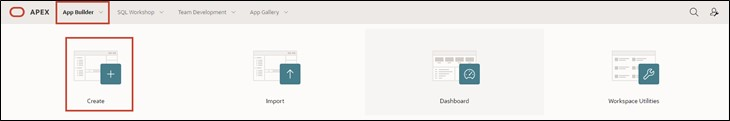
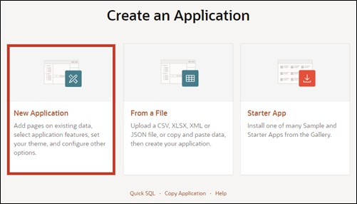
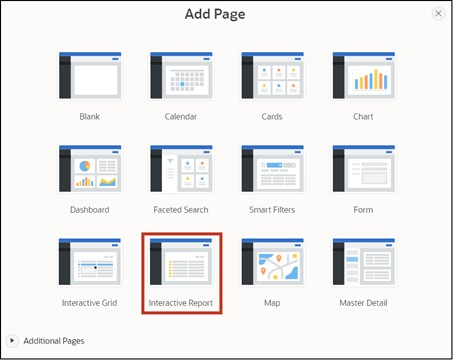
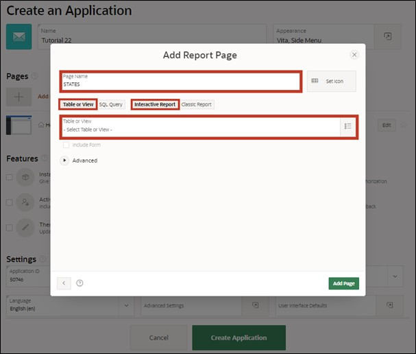
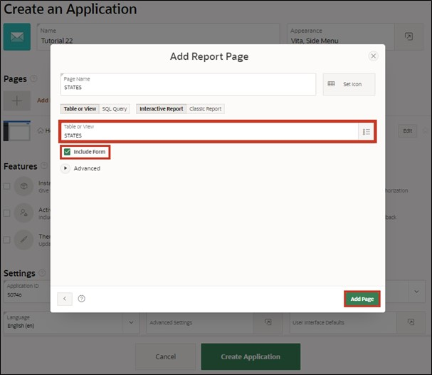

# 2. Create App Wizard

The Create App Wizard is an assistant that enables developers to quickly design and develop standard APEX applications. The assistant can be used to create complete applications consisting of multiple pages and a variety of different reports and forms.

In this chapter, the basic framework of the application and the first page will be created. In the Create App Wizard, you specify the settings for your application. After clicking on Create Application, APEX creates the application with your settings.

## 2.1. Creating an Application

- For further tasks, an **application** must first be created. First, open the **App Builder** and click the **Create** button. The App Builder displays all installed applications.

- The application creation wizard starts. Click on New Application to create a new application.

- Now enter the name of the application (e.g., Tutorial 23.1).

- If desired, the Application Icon can also be adjusted by clicking on the blue envelope left of the name. A wizard opens where an icon and a color can be selected or an own image can be uploaded.

- In the assistant, you can directly create a first page in your application. To do this, click on the plus or on Add Page.

## 2.2. Report

In APEX, a report is a formatted display of a SQL query. A report can be generated via the assistant or through a manually entered SQL query.

APEX distinguishes between the classic and interactive report. The difference between the two is that the user has the ability in the interactive report to adjust the data presentation by searching, filtering, sorting, column selection, highlighting, and other data manipulations.

- After clicking the button to add a page, a new window with a wizard for creating the page opens. There, select **Interactive Report**.

- The properties of the page follow in the next window. Enter ***STATES*** as the **Page Name**.
- The settings **Table or View** and **Interactive Report** are selected by default. If not, please select them.
- Next, click on the dropdown menu on the right to select a **table** that should be displayed in the Interactive Report.

- The **Search Dialog** opens, where you select the table ***STATES***.
- Check the box for **Include Form** and then click the **Add Page** button.

## 2.3. Create Application

- Your Create App Wizard should now look like this.

- Now check the box for the feature **“Install Progressive Web App”**. This feature allows APEX applications to be installed on mobile devices and used as standalone applications. Learn more in **Task #07: Features for Mobile Devices**. 

- If you scroll down, you will see the **Application ID** under **Settings**. As you will need this later on, it is advisable to note it down.  
The Application ID is a unique number through which the application can be accessed in the browser.

- After completing all other steps, click the **Create Application** button to create the application.

## 2.4. Run Page

After creating the application, the page overview of your application opens. 
You see five pages: **0 - Global Page - Desktop**, **1 - Home** and **9999 - Login Page** are standard pages which are created for each application. The Global Page is a master page. All components placed on the Global Page are displayed on all pages of the application. 
The pages **2 - STATES** and **3 - State** were created by you using the Add Page assistant.
- Click on the marked button to open the **List View**.

- Click the **Run Button** of the ***STATES*** page to view the created page.

- A login screen appears where you can log in with your username and password (same credentials as for the workspace).

- After logging in, the ***STATES*** page with an Interactive Report appears.

- Clicking the **pencil icon** in the left column opens a modal dialog where you can edit the data.

- For now, we'll leave the contents as they are and close the modal dialog again (via the **Cancel** button or the x in the upper corner).  

- Now switch back to the **App Builder** tab.

