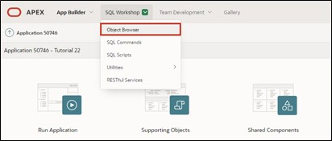
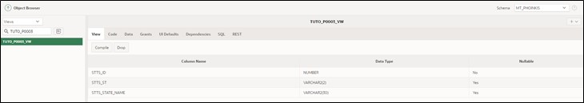

# 3. Access Views Instead of Tables

To ensure uniform access to the data, view layers are used.  

With views, you can easily select only the most important columns from large tables to display them.  

A view is an SQL query for data stored in a database, which can be queried by database users just like data in a table. Thus, the result of a view is a kind of virtual table that is dynamically generated from data in the database when access to the view is requested. If data in the table changes, the changes are mirrored to the view.   

  

It is advisable to use views in two different ways: Page-specific views are created for each APEX page. These contain the information that is displayed on the specific page. Therefore, one or more views should be created for each page.  

If views are to be used across pages, a business view should be created.  

In this tutorial, only page-specific views are used.   

Below, the views are created and the accesses to the tables are switched to the views.  

## 3.1. Tools

In the SQL Workshop, tools are provided that allow database objects to be displayed, created, and managed.  

One of the tools is **SQL-Commands**, where SQL commands can be directly entered and executed.   

Another tool is the **Object Browser**. This can be used to view and edit object properties. New objects can also be created here.   
The **Object Browser** is divided into two sections. On the left side, the object selection area is displayed. There, all database objects of a certain type present in the current schema are listed. On the right side, detailed information about the individual objects is displayed.   

- Navigate to the **Object Browser** entry via the **SQL Workshop** dropdown menu.   

  

- Start the wizard to create a view. To do this, open the dropdown menu via the + and click on the View entry.  

  

A wizard for creating the view opens.    
Now you need to enter the corresponding code and a name for the view. To achieve consistent naming across different applications, it is recommended to use naming conventions.  

In this case, the name of the view is composed as follows:  
**<APP_ABBREVIATION>_P<PAGE_ID>_VW**  

- Replace the placeholders with the following values:
  - <APP_ABBREVIATION>: Abbreviation for your application, e.g., TUTO for Tutorial
  - <PAGE_ID>: 0003 (Page number for which the view is created)  

- For example, your view could be named **TUTO_P0003_VW**.  
  As a **Query** (a query that specifically searches for data), insert the following code:
  ```sql
  select stts_id,
        stts_st,
        stts_state_name
  from states
  ```

- When inserting, pay attention to the formatting of the query. If your formatting does not look as shown, format it accordingly.  


- Finally, click on the **Create View** button.  

- Your completed view should look like this:  

  

## 3.2. Page Processes

**Page Processes** are executed at certain, predetermined times, for example, when calling the page or saving. They enable calls to application logic or database operations. For processing a form, APEX relies on two processes: **Form – Initialization** and **Form – Automatic Row Processing (DML)**.  

Both are automatically generated when creating a form page using the wizard and ensure that the input fields contain the correct data when called and that the values are stored in the corresponding data source when the form is submitted.  

Below, the created view is assigned to the DML process and a few minor changes are made to the form.  

- Go to the Page Designer by clicking on the **App Builder** in the upper bar, then on your **application** and then on page 3 - ***State***.  

  
  
- Click on the **State** region and change the **Table Name** to the view just created ***TUTO_P0003_VW***.  

  

- Now click on the **Processing** tab (the two arrows on the top left)  

  

- Select the process **Process form State** to adjust the processing.  

  

- Change the **Target Type** to ***Region Source***.  

  

This now ensures that the same source is used for processing as for the region. In our case, this is the newly created view. If the data source of the region is changed in the future, the processing no longer needs to be adjusted.   

When creating reports and forms in APEX via the wizard, the necessary standard processings (e.g., for inserting or updating data) are automatically created.  

- Then go back to the first **Rendering** tab with the overview of the elements on the page and click under State – Items on **P3_STTS_ID**. Check if the **Type** is ***Hidden***. If not, change it accordingly.   

  

- Then click on **Save**.   

  

- Switch to the ***STATES*** page by invoking the **dialog** in the **breadcrumb bar** and selecting page 2 ***STATES*** there.  
 
  

- In the Page Designer, click in the **States** area under Columns on **STTS_UPDATED_BY** and set the **Type** to ***Hidden Column***. Repeat the same for the column **STTS_UPDATED_DD** and then click on **Save**. Now the corresponding columns in the report are hidden.  

  

- If you now refresh the application in the other tab, you can see your changes.  

