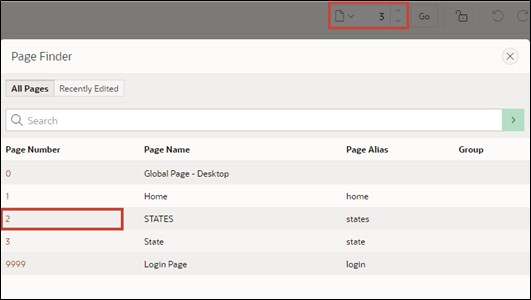

# <a name="views"></a>3. Access Views Instead of Tables

To ensure uniform access to the data, view layers are used.  

Views allow you to easily select only the most important columns from large tables to display them.  

A view is an SQL query for data stored in a database, which can be queried by database users just like the data in a table. Thus, the result of a view is a sort of virtual table dynamically generated from data in the database when access to the view is requested. If data in the table changes, these changes are mirrored onto the view.   

  

It is advisable to use views in two different ways: page-specific views are created for each APEX page. These contain the information displayed on the specific page. Therefore, one or more views should be created for each page.  

If views are to be used across pages, a business view should be created.  

In this tutorial, only page-specific views will be used.  

In the following sections, views will be created, and the accesses that occur on the tables will be switched to the views.  
 
## <a name="tools"></a>3.1 Tools
Tools are provided in the SQL Workshop to display, create, and manage database objects.  

One of the tools is **SQL-Commands**. In this, SQL commands can be directly inputted and executed.   

Another tool is the **Object Browser**. This allows object properties to be displayed and edited. New objects can also be created through this.   
The **Object Browser** is divided into two areas. On the left side, the object selection area is displayed. There, all database objects of a specific type that are present in the current schema are listed. On the right side, detailed information about the individual objects is displayed.   

- Navigate via the **SQL Workshop** dropdown menu to the entry **Object Browser**.   

  

- Start the wizard to create a view. Open the dropdown menu over the + and click on the entry View.  

  

A wizard for creating the view opens.    
Now you must specify the corresponding code and a name for the view. To achieve uniform naming across different applications, it is recommended to use naming conventions.  

In this case, the designation of the view consists of:  
**<APP_KUERZEL>_P<PAGE_ID>_VW**  

- Replace the placeholders with the following values:
  - <APP_KUERZEL>: Abbreviation for your application, e.g., TUTO for Tutorial
  - <PAGE_ID>: 0003 (page number for which the view is created)  

- For example, your view could be named **TUTO_P0003_VW**.  
  As **Query** (a query that specifically searches for data), insert the following code:
  ```sql
  select stts_id,
        stts_st,
        stts_state_name
  from states
  ```

- Pay attention to the formatting when inserting the query. If your formatting does not appear as shown, format it accordingly.  


- Finally, click the **Create View** button.  

- Your completed view should look like this:  

  

## <a name="pageprocesses"></a>3.2 Page Processes
**Page Processes** are executed at certain predetermined times, for example, when the page is called or when saving. They implement application logic calls or database operations. For processing a form in APEX, two processes are responsible: **Form – Initialization** and **Form – Automatic Row Processing (DML)**.  

Both are automatically generated when creating a form page using the wizard, ensuring the input fields contain the correct data when called and that values are stored in the corresponding data source when the form is submitted.  

In the following, the created view is assigned to the DML process, and some minor changes to the form are made.  

- Go to the Page Designer by clicking **App Builder** in the top bar, then your **Application,** and then page 3 - ***State***.  

  
  
- Click the **State** region and change the **Table Name** to the just created view ***TUTO_P0003_VW***.  

  

- Now click on the **Processing** tab (the two arrows in the top left)  

  

- Select the process **Process form State** to adjust the processing.  

  

- Change the **Target Type** to ***Region Source***.  

  

This now ensures that the same source is used for processing as for the region. In our case, this is the just created view. If the data source for the region is changed in the future, the processing will no longer need adjustments.   

When creating reports and forms in APEX via the wizard, required standard processes (e.g., for inserting or updating data) are automatically created.  

- Then go back to the first tab **Rendering** with the overview of the elements on the page and click under State – Items on **P3_STTS_ID**. Check whether the **Type** is ***Hidden***. If not, change it accordingly.   

  

- Then click **Save**.   

  

- Switch to the ***STATES*** page by calling up the **Dialog** in the **Breadcrumb Bar** and selecting page 2 ***STATES*** there.  

  

- In the Page Designer, click on **States** in the Columns section on **STTS_UPDATED_BY** and set the **Type** to ***Hidden Column***. Repeat the same for the column **STTS_UPDATED_DD** and then click **Save**. Now the corresponding columns will be hidden in the report.  

  

- If you now refresh the application in the other tab, you will see your changes.  

