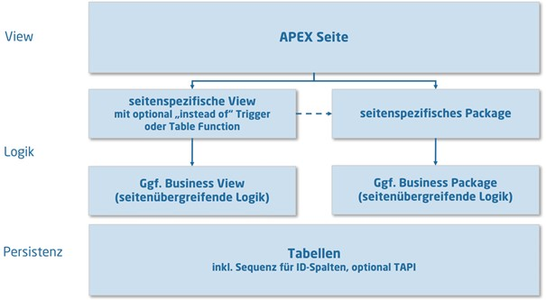
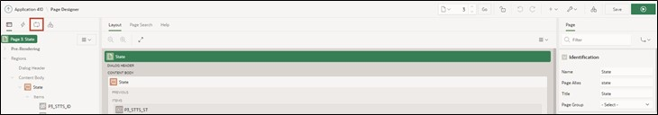
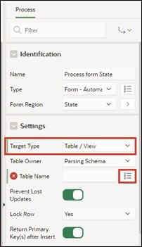

# <a name="views"></a>3. Access Views Instead of Tables

To provide consistent access to the data, view layers are used.

With views, you can easily select only the most important columns from large tables to display them.

A view is an SQL query for data stored in a database, which can be queried by database users just like data in a table. Thus, the result of a view is a kind of virtual table that is dynamically generated from data in the database when access to the view is requested. If data changes in the table, the changes are reflected in the view.

  

It is advisable to use views in two different ways: For each APEX page, page-specific views are created. These contain the information displayed on the specific page. Therefore, one or more views should be created for each page.

If views are to be used across pages, a business view should be created.

In this tutorial, only page-specific views are used.

The following sections will now create the views and switch the accesses that occur on the tables to the views.

## <a name="tools"></a>3.1 Tools
In the SQL Workshop, tools are provided to display, create, and manage database objects.

One of the tools is **SQL-Commands**. In this, SQL commands can be directly entered and executed.

Another tool is the **Object Browser**. With this, object properties can be displayed and edited. New objects can also be created through this.
The **Object Browser** is divided into two areas. The object selection area is displayed on the left side, where all the database objects of a certain type present in the current schema are listed. Detailed information about the individual objects is displayed on the right side.

- Navigate to the **Object Browser** entry via the **SQL Workshop** dropdown menu.

  

- Start the wizard to create a view. Open the dropdown menu via the + and click on the View entry.

  

A wizard for creating the view opens.  
Now you have to enter the corresponding code and a name for the view. To achieve a uniform naming across different applications, it is recommended to use naming conventions.

In this case, the designation of the view is composed as follows:  
**<APP_KUERZEL>_P<PAGE_ID>_VW**  

- Replace the placeholders with the following values:
  - <APP_KUERZEL>: Abbreviation for your application, e.g. TUTO for Tutorial
  - <PAGE_ID>: 0003 (page number for which the view is created)

- Thus, your view could be named **TUTO_P0003_VW**.  
  As a **Query** (a query that specifically searches for data), insert the following code:
  ```sql
  select stts_id,
         stts_st,
         stts_state_name
  from states
  ```

- Pay attention to the formatting of the query when inserting. If your formatting does not look as shown, format it accordingly.


- Finally, click on the **Create View** button.

- This is how your finished view should look:

  

## <a name="pageprocesses"></a>3.2 Page Processes
**Page Processes** are executed at certain predefined times, for example, when the page is called or saved. They implement calls to application logic or database operations. For processing a form in APEX, two processes are responsible: **Form – Initialization** and **Form – Automatic Row Processing (DML)**.

Both are automatically generated when creating a form page using the wizard and ensure that the input fields contain the correct data when called and that the values are stored in the corresponding data source when the form is submitted.

In the following, the created view will be assigned to the DML process and some minor changes to the form will be made.

- Enter the Page Designer by clicking on the **App Builder** at the top of the bar, then on your **Application** and then on page 3 - ***State***.

  

- Click on the **State** region and change the **Table Name** to the just created view ***TUTO_P0003_VW***.

  

- Now click on the **Processing** tab (the two arrows on the top left)

  

- Select the process **Process form State** to adjust the processing.

  

- Change the **Target Type** to ***Region Source***.

  

This now ensures that the same source is used for processing as for the region. In our case, this is the just created view. If the data source of the region is changed in the future, the processing does not need to be adjusted anymore.

When creating reports and forms via the wizard in APEX, the required standard processings (e.g., for inserting or updating data) are automatically created.

- Then go back to the first tab **Rendering** with the overview of elements on the page and click under State – Items on **P3_STTS_ID**. Check if the **Type** is ***Hidden***. If not, change it accordingly.

  

- Then click on **Save**.

  

- Switch to the ***STATES*** page by calling the **Dialog** in the **Breadcrumb Bar** and selecting page 2 ***STATES***.

  

- In the Page Designer, click on **STTS_UPDATED_BY** under Columns in the **States** area and set the **Type** to ***Hidden Column***. Repeat the same for the **STTS_UPDATED_DD** column and then click on **Save**. Now the corresponding columns will be hidden in the report.

  

- If you now refresh the application in the other tab, you will be able to see your changes.

