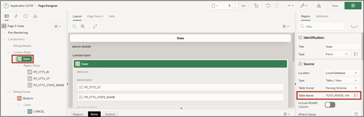

# <a name="views"></a>3. Access Views Instead of Tables

To ensure uniform access to the data, view layers are used.  

Views allow you to easily select only the most important columns from large tables to display them.  

A view is an SQL query stored in a database for data, which can be queried by database users in the same way as data in a table. Thus, the result of a view is a kind of virtual table that is dynamically generated from data in the database when access to the view is requested. If data in the table changes, the changes are mirrored onto the view.   

  

It is advisable to use views in two different ways: For each APEX page, page-specific views are created. These contain the information that is displayed on the specific page. Therefore, one or more views should be created for each page.  

If views are to be used across pages, a business view should be created.  

In this tutorial, we will rely exclusively on page-specific views.   

The following sections will describe how to create the views and adjust the accesses that are made to the tables to go through the views instead.  
 
## <a name="tools"></a>3.1 Tools
Within the SQL Workshop, tools are provided that allow you to view, create, and manage database objects.  

One of the tools is **SQL-Commands**, where SQL commands can be entered and executed directly.   

Another tool is the **Object Browser**, which allows you to view and edit object properties. You can also use it to create new objects.   
The **Object Browser** is divided into two areas. On the left side, the object selection area is displayed. It lists all database objects of a particular type present in the current schema. On the right side, detailed information about individual objects is displayed.   

- Navigate to the **Object Browser** entry via the **SQL Workshop** dropdown menu.   

  

- Start the wizard to create a view. To do this, open the dropdown menu via the + and click on the View entry.  

  

A wizard for creating the view opens.    
Now you need to provide the appropriate code and a name for the view. To achieve uniform naming across different applications, it is recommended to use naming conventions.  

In this case, the view name is composed as follows:  
**<APP_KUERZEL>_P<PAGE_ID>_VW**  

- Replace the placeholders with the following values:
  - <APP_KUERZEL>: Abbreviation for your application, e.g., TUTO for Tutorial
  - <PAGE_ID>: 0003 (Page number for which the view is being created)  

- For example, your view might be named **TUTO_P0003_VW**.  
  As a **Query** (a query that specifically searches for data), insert the following code:
  ```sql
  select stts_id,
        stts_st,
        stts_state_name
  from states
  ```

- Ensure that when inserting, the query is formatted as shown. If your formatting does not look like that, format it accordingly.  


- Finally, click on the **Create View** button.  

- Your finished view should look like this:  

  

## <a name="pageprocesses"></a>3.2 Page Processes
**Page Processes** are executed at certain defined times, such as when the page is called or when saving. They implement calls to application logic or database operations. In APEX, two processes are responsible for form processing: **Form – Initialization** and **Form – Automatic Row Processing (DML)**.  

Both are automatically generated when creating a form page using the wizard and ensure that the input fields contain the correct data when called, and that the values are saved into the appropriate data source when the form is submitted.  

The following will associate the created view with the DML process and make some minor changes to the form.  

- Enter the Page Designer by clicking the **App Builder** at the top of the bar, then your **Application** and then the page 3 - ***State***.  

  
  
- Click on the **State** region and change the **Table Name** to the newly created view ***TUTO_P0003_VW***.  

  

- Now click on the **Processing** tab (the two arrows at the top left)  

  

- Select the process **Process form State** to adjust the processing.  

  

- Change the **Target Type** to ***Region Source***.  

  

This ensures that the same source used for the region is used for processing. In our case, this is the newly created view. 
If the data source of the region is changed in the future, the processing no longer needs to be adjusted.   

When APEX creates reports and forms via the wizard, the necessary standard processings (e.g., for inserting or updating data) are automated.  

- Afterward, return to the first **Rendering** tab with the overview of elements on the page and click under State – Items on **P3_STTS_ID**. Check if the **Type** is ***Hidden***. If not, change it accordingly.   

  

- Then click on **Save**.   

  

- Switch to the ***STATES*** page by calling the **Dialog** in the **Breadcrumb trail** and selecting page 2 ***STATES*** there.  
 
  

- In the Page Designer, under the **States** section, click on **STTS_UPDATED_BY** under Columns and set the **Type** to ***Hidden Column***. Repeat the same for the **STTS_UPDATED_DD** column and then click on **Save**. The corresponding columns will now be hidden in the report.  

  

- If you now refresh the application in the other tab, you can see your changes.  

