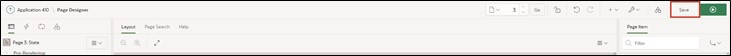

# 3. Access Views Instead of Tables

To ensure uniform access to the data, view layers are utilized.

With views, one can easily select only the most important columns from large tables to display them.

A view is an SQL query stored in a database for data, which database users can query in the same way as data in a table. Thus, the result of a view is a kind of virtual table that is dynamically generated from data in the database when access to the view is requested. If data in the table changes, the changes are mirrored in the view.


It makes sense to use views in two different ways: For each APEX page, page-specific views are created. These contain the information displayed on the specific page. Therefore, one or more views should be created for each page.

If views are to be used across pages, a business view should be created.

In this tutorial, only page-specific views are used.

The following sections will now create the views and switch the accesses from the tables to the views.

## 3.1. Tools
In the SQL Workshop, tools are provided to display, create, and manage database objects.

One of the tools is **SQL Commands**. In this, SQL commands can be directly entered and executed.

Another tool is the **Object Browser**. With it, object properties can be displayed and edited. New objects can also be created through it. The Object Browser is divided into two areas. On the left side, the object selection area is displayed. It lists all database objects of a certain type present in the current schema. Detailed information about individual objects is displayed on the right side.

- Navigate to the **Object Browser** entry via the **SQL Workshop** dropdown menu.


- Launch the assistant to create a view. Open the dropdown menu via the + and click on the View entry.


A wizard to create the view opens.  
Now, you must enter the corresponding code and a name for the view. To achieve consistent naming across various applications, using naming conventions is recommended.

In this case, the designation of the view is composed as follows:  
**<APP_ABBR>_P<PAGE_ID>_VW**

- Replace the placeholders with the following values:
  - <APP_ABBR>: Abbreviation for your application, e.g., TUTO for Tutorial
  - <PAGE_ID>: 0003 (Page number for which the view is created)

- For example, your view could be named **TUTO_P0003_VW**.  
  As a **Query** (a query aimed at retrieving data), insert the following code:
  ```sql
  select stts_id,
        stts_st,
        stts_state_name
  from states
  ```

- Ensure the formatting of the query when inserting it. If your formatting does not look as shown, format it accordingly.


- Then click on the **Next** button.
- Finally, click on the **Create View** button.


- Your completed view should look like this:


## 3.2. Page Processes
Page processes are executed at specific, predefined times, such as upon calling the page or saving. They implement calls to application logic or database operations. For processing a form in APEX, two processes are responsible: **Form – Initialization** and **Form – Automatic Row Processing (DML)**.

Both are automatically generated when creating a form page with the wizard and ensure that the input fields contain the correct data upon calling and that the values are stored in the appropriate data source when the form is submitted.

In the following, the created view will be associated with the DML process, and some minor changes to the form will be made.

- Enter the Page Designer by clicking on the **App Builder** at the top of the bar, then on your **application**, and then on page 3 - ***State***.


- Click on the **State** region and change the **Table Name** to the newly created view ***TUTO_P0003_VW***.


- Now click on the **Processing** tab (the two arrows at the top left)


- Select the Process **Process form State** to adjust the processing


- Change the **Target Type** to ***Table/View***.
- Then click on the dropdown menu at **Table Name**. Select the newly created **View** there.

 

This ensures that the newly created view is used for processing. When reports and forms in APEX are created via the wizard, the required standard processings (e.g., for inserting or updating data) are automatically created.

If, as in our case, the data source on which the region is based is changed (from the states table to the page-specific view), the processing must be adjusted. We accomplished this with the steps outlined above.

- Then go back to the first **Rendering** tab with the overview of the elements on the page and click under State – Items on **P3_STTS_ID**. Check if the **Type** is ***Hidden***. If not, change it accordingly.


- Then click on **Save**.



- Switch to the ***STATES*** page by calling up the **Dialog** in the **Breadcrumb Bar** and selecting page 2 ***STATES*** there.


- In the Page Designer, click in the **States** section under Columns on **STTS_UPDATED_BY** and set the **Type** to ***Hidden Column***. Repeat the same for the **STTS_UPDATED_DD** column and then click **Save**. This will hide the corresponding columns in the report.


- If you now refresh the application in the other tab, you can see your changes.

