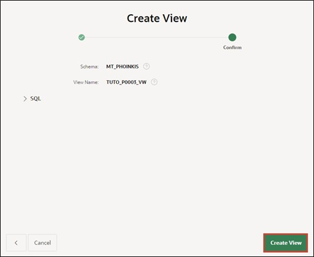
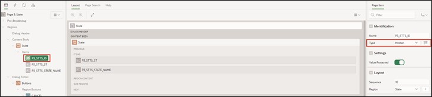
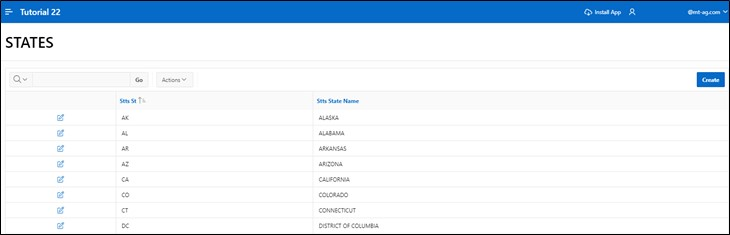

# 3. Access Views Instead of Tables

To ensure consistent data access, view layers are utilized.

With views, one can easily select only the most important columns from large tables to display them.

A view is an SQL query for data stored in a database, which can be queried by database users just like the data in a table. Thus, the result of a view is a kind of virtual table that is dynamically generated from data in the database when access to the view is requested. If data in the table changes, the changes are mirrored to the view.


It makes sense to use views in two different ways: Page-specific views are created for each APEX page. These contain the information displayed on the specific page. Therefore, one or more views should be created for each page.

If views are to be used across pages, a business view should be created.

In this tutorial, only page-specific views are used.

The following sections show the creation of views and the transition of access from tables to views.

## 3.1. Tools
In the SQL Workshop, tools are provided to display, create, and manage database objects.

One of the tools is **SQL-Commands**, where SQL commands can be entered and executed directly.

Another tool is the **Object Browser**. With it, object properties can be displayed and edited. New objects can also be created through it. The **Object Browser** is divided into two areas. On the left side is the object selection area, where all database objects of a certain type in the current schema are listed. On the right side, detailed information about the individual objects is displayed.

- Navigate to the **Object Browser** entry via the **SQL Workshop** dropdown menu.


- Start the wizard for creating a view. Open the dropdown menu over the + and click on the View entry.


A wizard for creating the view opens.
Now, you must provide the corresponding code and a name for the view. To achieve consistent naming across different applications, the use of naming conventions is recommended.

In this case, the designation of the view is composed as follows:  
**<APP_PREFIX>_P<PAGE_ID>_VW**

- Replace the placeholders with the following values:
  - <APP_PREFIX>: Prefix for your application, e.g., TUTO for Tutorial
  - <PAGE_ID>: 0003 (Page number for which the view is created)

- Your view could, for example, be named **TUTO_P0003_VW**.
  As **Query** (a query specifically searching for data), insert the following code:
  ```sql
  select stts_id,
        stts_st,
        stts_state_name
  from states
  ```

- Ensure correct formatting of the query when inserting it. If your formatting does not appear as shown, format it accordingly.


- Click the **Next** button.
- Finally, click the **Create View** button.



- Your completed view should look like this:


## 3.2. Page Processes
**Page Processes** are executed at specific predetermined times, such as when the page is called or saved. They realize calls to application logic or database operations. For processing a form in APEX, two processes are responsible: **Form – Initialization** and **Form – Automatic Row Processing (DML)**.

Both are automatically generated when creating a form page using the wizard and ensure that the input fields contain the correct data at the call and that the values are saved in the appropriate data source when submitting the form.

The following sections assign the created view to the DML process and make a few minor changes to the form.

- Go to the Page Designer by clicking on the **App Builder** at the top, then on your **application**, and then on page 3 – ***State***.


- Click on the **State** region and change the **Table Name** to the newly created view ***TUTO_P0003_VW***.


- Now click on the **Processing** tab (the two arrows in the top left corner).


- Select the process **Process form State** to adjust the processing.


- Change the **Target Type** to ***Region Source***.


This ensures that the same source is used for processing as for the region. In our case, it is the newly created view.
If the region's data source changes in the future, the processing no longer needs adjusting.

When creating reports and forms in APEX via the wizard, the necessary standard processing (e.g., for inserting or updating data) is automatically created.

- Then go back to the first tab **Rendering** with the overview of elements on the page and click under State – Items on **P3_STTS_ID**. Check whether the **Type** is ***Hidden***. If not, change it accordingly.



- Then click **Save**.


- Switch to the ***STATES*** page by opening the **dialog** in the **breadcrumb bar** and selecting page 2 ***STATES***.


- In the Page Designer, click on **States** under columns on **STTS_UPDATED_BY** and set the **Type** to ***Hidden Column***. Repeat the same for the **STTS_UPDATED_DD** column and then click **Save**. This will hide the respective columns in the report.


- When you now refresh the application in the other tab, you can see your changes.

