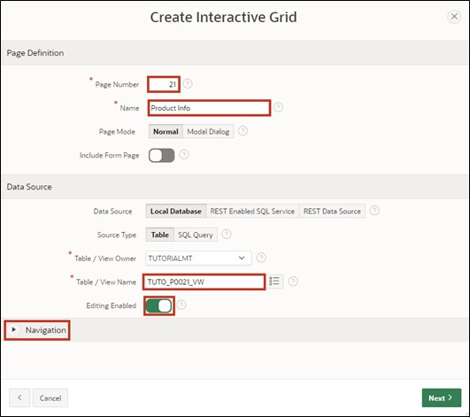

# <a name="interactivegrid"></a>4. Interactive Grid

An **Interactive Grid** displays a set of predefined records in a searchable, customizable report to the database user. In this report, the records can be modified and updated. It is also possible to add new records and delete old ones.

In this task, an **Interactive Grid** is created to utilize the aforementioned functions.

## <a name="gridview"></a>4.1 Creation of the View
- For this task, a **View** must first be created.
To do this, go to the **SQL Workshop** as described in Task #03 in the **Object Browser** and start the wizard for creating the **View** via the + button.  
Enter the following data:

- **View Name**: ***TUTO_P0021_VW***  
- **Query**:
  ```sql
  select PRDT_INFO_ID,
         PRDT_INFO_NAME,
         PRDT_INFO_DESCR,
         PRDT_INFO_CATEGORY,
         PRDT_INFO_AVAIL,
         PRDT_INFO_LIST_PRICE
  from PRODUCT_INFO
  ```


- Then click the **Next** button and then **Create View**.

## <a name="gridcreatepage"></a>4.2 Create Page
- Open the **App Builder** via the navigation bar, select your application, and click the **Create Page** button. 


- The **Wizard** for creating a **page** starts.  
Select the page type **Interactive Grid**. The transition to the next page occurs automatically; otherwise, click the **Next** button.


- Enter **Page Number** ***21*** and **Page Name** ***Product Info***.
- In the Data Source area, select the created view for *Product Info* as the **Table / View** Name and enable editing in the **Interactive Grid** by setting **Editing Enabled** to ***enabled***.  
This is particularly important in order for the column APEX$ROW_SELECTOR to be created.
- Then open the navigation area.



- Disable the breadcrumb here and then click the **Next** button.


- Select the column ***PRDT_INFO_ID (Number)*** as **Primary Key Column 1**.


- Finally, click the **Create Page** button.

- The **page** with the **Interactive Grid** has been successfully created. Now start the **page** by clicking the **Run** button.


- You now see the **Interactive Grid**. Initially, the **Interactive Grid** provides you with a report on the existing data. You can add a new record directly in this table via the **Add Row** button.

- Additionally, you can edit existing records. To do this, you can select an entry with a **double click**, whereupon the cursor is displayed in the corresponding field. When the edit mode is activated, a single click suffices. The **Edit** button allows you to activate or deactivate this mode.


- The changes you have made initially only occur in your browser. To save the changes, click the **Save** button. Alternatively, you can revoke unwanted changes by opening the **Dropdown Menu** ***Actions*** and selecting the ***Refresh*** entry under ***Data***. This reloads the original data from the database.


- Furthermore, a detailed view of individual records is available. Click the small button next to a record and select the ***Single Row View*** entry.


- You now only see the data for the selected record. You can return to the table view via the **Report View** button.


- Depending on the resolution and the number of displayed columns, horizontal scrolling may be needed.


- To maintain an overview, columns can be fixed. **Fixed columns** remain in place during horizontal scrolling. Click the **column** ***Product Name*** and select the **symbol** for ***Freeze***.


 
- Now the column *Product Name* is fixed and it remains apparent, even with horizontal scrolling, which product the other columns pertain to.

