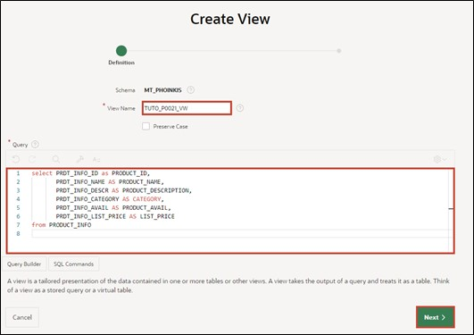
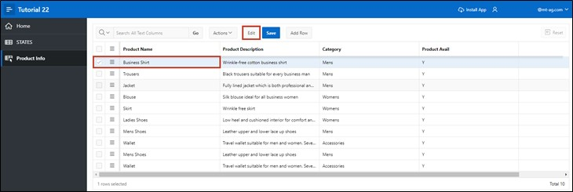

# <a name="interactivegrid"></a>4. Interactive Grid

An **Interactive Grid** displays a set of predefined records for the database user in a searchable, customizable report. In this report, records can be changed and updated. It is also possible to add new records and delete old ones.

In this task, an **Interactive Grid** will be created to utilize the above-mentioned functions.

## <a name="gridview"></a>4.1 Creation of the View
- For this task, a **View** must first be created.
To do this, go to the **SQL Workshop** in the **Object Browser** as in task #03 and start the assistant for creating the **View** via the +.  
Enter the following data:

- **View Name**: ***TUTO_P0021_VW***  
- **Query**:
  ```sql
  select PRDT_INFO_ID,
         PRDT_INFO_NAME,
         PRDT_INFO_DESCR,
         PRDT_INFO_CATEGORY,
         PRDT_INFO_AVAIL,
         PRDT_INFO_LIST_PRICE
  from PRODUCT_INFO
  ```



- Then click on the **Next** button and then on **Create View**.

## <a name="gridcreatepage"></a>4.2 Create Page
- Open the **App Builder** via the navigation bar, select your application, and click on the **Create Page** button.


- The **Assistant** for creating a **page** starts.  
Select the page type **Interactive Grid**. The switch to the next page occurs automatically, otherwise click on the **Next** button.


- Enter **Page Number** as ***21*** and **Page Name** as ***Product Info***.
- In the Data Source area, select the created View for *Product Info* as the **Table / View** Name and enable editing in the **Interactive Grid** by setting **Editing Enabled** to ***enabled***.  
This is especially important so that the column APEX$ROW_SELECTOR can be created.
- Then open the navigation area.


- Deactivate the Breadcrumb here and then click on the **Next** button.


- Select the column ***PRDT_INFO_ID (Number)*** as **Primary Key Column 1**.


- Finally, click on the **Create Page** button.

- The **page** with the **Interactive Grid** was successfully created. Now start the **page** by clicking on the **Run** button.


- You will now see the **Interactive Grid**. Initially, the **Interactive Grid** offers you a report on the existing data. You can add a new record directly in this table using the **Add Row** button.

- You can also edit existing records. To do this, you can select an entry with a **double-click**, after which the cursor will appear in the corresponding field. If the edit mode is enabled, a single click will suffice. The **Edit** button allows you to enable or disable this mode.



- The changes you make are initially only in your browser. To save the changes, click on the **Save** button. Alternatively, you can undo unwanted changes by opening the **Dropdown Menu** ***Actions*** and selecting the entry ***Refresh*** under ***Data***. This will reload the original data from the database.


- Furthermore, a detail view of individual records is available to you. Click on the small button next to a record and select the entry ***Single Row View***.


- You will now only see the data for the selected record. Use the **Report View** button to return to the table view.


- Depending on the resolution and number of columns displayed, horizontal scrolling may be necessary.


- To maintain an overview, columns can be fixed. **Fixed columns** remain stationary during horizontal scrolling. Click on the **Column** ***Product Name*** and select the **Symbol** for ***Freeze***.


 
- The column *Product Name* is now fixed, and it remains clear which product the other columns refer to during horizontal scrolling.

