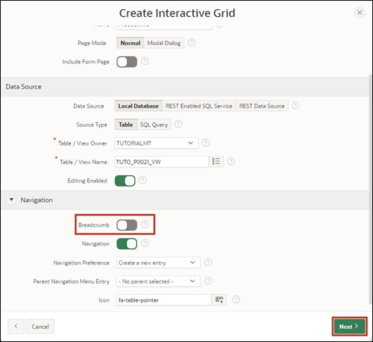
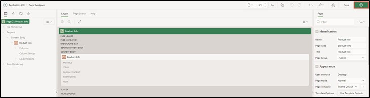
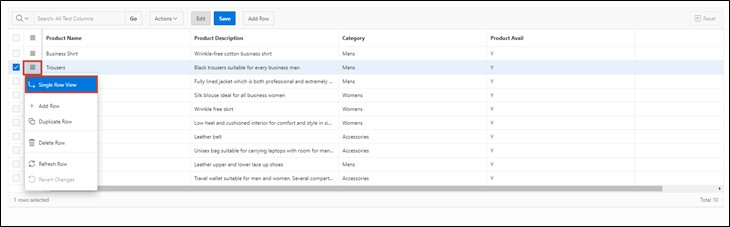

# 4. Interactive Grid

An **Interactive Grid** displays a series of predetermined records in a searchable, customizable report to the database user. In this report, records can be modified and updated. Additionally, it is possible to add new records and delete old ones.

In this task, an **Interactive Grid** will be created to utilize the aforementioned functions.

## 4.1. Creation of the View
- For this task, a **View** must first be created. To do this, navigate to the **SQL Workshop** in the **Object Browser** as described in Task #03, and start the assistant for creating the **View** via the +.  
Enter the following data there:

- **View Name**: ***TUTO_P0021_VW***  
- **Query**:
  ```sql
  select PRDT_INFO_ID as PRODUCT_ID,
         PRDT_INFO_NAME AS PRODUCT_NAME,
         PRDT_INFO_DESCR AS PRODUCT_DESCRIPTION,
         PRDT_INFO_CATEGORY AS CATEGORY,
         PRDT_INFO_AVAIL AS PRODUCT_AVAIL,
         PRDT_INFO_LIST_PRICE AS LIST_PRICE
  from PRODUCT_INFO
  ```


- Then click on the **Next** button and then on **Create View**.

## 4.2. Create Page
- Open the **App Builder** via the navigation bar, select your application, and click on the **Create Page** button.


- The **Assistant** for creating a **Page** starts.  
Select the **Interactive Grid** as the page type. Move to the next page automatically, or click on the **Next** button.


- Enter ***21*** as the **Page Number** and ***Product Info*** as the **Page Name**.
- In the Data Source area, select the created View for *Product Info* as the **Table / View** Name and enable editing in the **Interactive Grid** by setting **Editing Enabled** to ***enabled***.  
This is particularly important to ensure the APEX$ROW_SELECTOR column can be created.
- Then open the navigation area.


- Disable the Breadcrumb here and then click on the **Next** button.



- Select the column ***Product ID (Number)*** as **Primary Key Column 1**.


- Finally, click on the **Create Page** button.

- The **Page** with the **Interactive Grid** has been successfully created. Now launch the **Page** by clicking on the **Run** button.



- You will now see the **Interactive Grid**. Initially, the **Interactive Grid** offers you a report about the existing data. You can add a new record directly in this table using the **Add Row** button.

- Additionally, you can edit existing records. To do this, you can select an entry with a **double-click**, after which the cursor is shown in the corresponding field. If the edit mode is activated, a single click suffices. The edit mode can be activated or deactivated via the **Edit** button.


- The changes you make initially occur only in your browser. To save the changes, click on the **Save** button. Alternatively, you can undo unwanted changes by opening the **Dropdown Menu** ***Actions*** and selecting the ***Refresh*** entry under ***Data***. This reloads the original data from the database.


- Furthermore, a detailed view of individual records is available. Click on the small button next to a record and select the entry ***Single Row View***.



- You will now only see the data of the selected record. Use the **Report View** button to return to the table view.


- Depending on the resolution and number of displayed columns, horizontal scrolling may be necessary.


- To maintain an overview, columns can be fixed. **Fixed columns** remain stationary during horizontal scrolling. Click on the **Column** ***Product Name*** and select the **Symbol** for ***Freeze***.


 
- Now the column *Product Name* is fixed and remains visible during horizontal scrolling, showing which product the remaining columns refer to.

