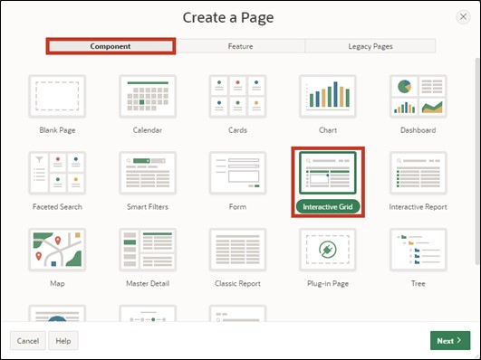
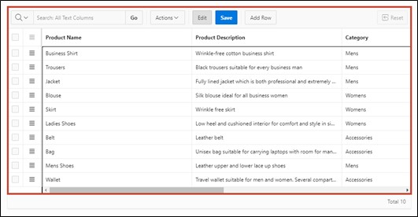

# <a name="interactivegrid"></a>4. Interactive Grid

An **Interactive Grid** displays a series of predefined records in a searchable, customizable report for the database user. In this report, the records can be modified and updated. It is also possible to add new records and delete old ones.

In this task, an **Interactive Grid** will be created to utilize the aforementioned functions.

## <a name="gridview"></a>4.1 Creation of the View
- For this task, a **View** must first be created.
To do this, go to the **SQL Workshop** in the **Object Browser** as in Task #03 and start the assistant for creating the **View** via the +.  
Enter the following data there:

- **View Name**: ***TUTO_P0021_VW***  
- **Query**:
  ```sql
  select PRDT_INFO_ID,
         PRDT_INFO_NAME,
         PRDT_INFO_DESCR,
         PRDT_INFO_CATEGORY,
         PRDT_INFO_AVAIL,
         PRDT_INFO_LIST_PRICE
  from PRODUCT_INFO
  ```


- Then click on the **Next** button and then on **Create View**.

## <a name="gridcreatepage"></a>4.2 Create Page
- Open the **App Builder** via the navigation bar, select your application, and click on the **Create Page** button. 


- The **Wizard** for creating a **Page** starts.  
Select the page type **Interactive Grid**. The transition to the next page occurs automatically; otherwise, click the **Next** button. 



- Enter **Page Number** ***21*** and **Page Name** ***Product Info***.
- In the Data Source area, select the created view for *Product Info* as **Table / View** Name and now enable editing in the **Interactive Grid** by setting **Editing Enabled** to ***enabled***.  
This is particularly important so the column APEX$ROW_SELECTOR can be created.
- Then open the navigation area.


- Here, deactivate the Breadcrumb and then click the **Next** button. 


- Select the column ***PRDT_INFO_ID (Number)*** as **Primary Key Column 1**.


- Finally, click the **Create Page** button.

- The **Page** with the **Interactive Grid** was successfully created. Now start the **Page** by clicking on the **Run** button


- You now see the **Interactive Grid**. Initially, the **Interactive Grid** offers you a report on the existing data. You can create a new record directly in this table via the **Add Row** button.

- Additionally, you can edit existing records. To do this, you can select an entry with a **double click**, whereupon the cursor will be displayed in the corresponding field. If the Edit mode is activated, a single click is also sufficient. This mode can be activated or deactivated via the **Edit** button.


- The changes you make initially only occur in your browser. To save the changes, click the **Save** button. Alternatively, you can revoke unwanted changes by opening the **Dropdown Menu** ***Actions*** and selecting the item ***Refresh*** under ***Data***. This will reload the original data from the database.


- Furthermore, a detailed view of individual records is available. Click the small button next to a record and select the entry ***Single Row View***. 


- Now you will only see the data for the selected record. You can return to the table view via the **Report View** button.


- Depending on the resolution and number of columns displayed, horizontal scrolling may be necessary



- To keep track of things, columns can be fixed. **Fixed columns** remain stationary when scrolling horizontally. Click on the **column** ***Product Name*** and select the **symbol** for ***Freeze***.


 
- Now the column *Product Name* is displayed as fixed, and it remains visible to which product the other columns refer when scrolling horizontally.

