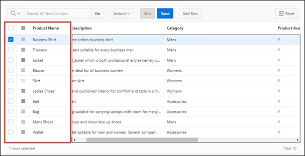

# 4. Interactive Grid

An **Interactive Grid** displays a database user's set of records in a searchable, customizable report. In this report, records can be modified and updated. It is also possible to add new records and delete old ones.

In this task, an **Interactive Grid** will be created to utilize the above-mentioned functions.

## 4.1. Creation of the View
- First, a **View** must be created for this task.
To do this, go to the **SQL Workshop** in the **Object Browser** as in Task #03 and start the **View** creation wizard via the +.  
Enter the following data there:

- **View Name**: ***TUTO_P0021_VW***  
- **Query**:
  ```sql
  select PRDT_INFO_ID as PRODUCT_ID,
         PRDT_INFO_NAME AS PRODUCT_NAME,
         PRDT_INFO_DESCR AS PRODUCT_DESCRIPTION,
         PRDT_INFO_CATEGORY AS CATEGORY,
         PRDT_INFO_AVAIL AS PRODUCT_AVAIL,
         PRDT_INFO_LIST_PRICE AS LIST_PRICE
  from PRODUCT_INFO
  ```


- Then click the **Next** button and then on **Create View**.

## 4.2. Create Page
- Open the **App Builder** via the navigation bar, select your application and click on the **Create Page** button. 


- The **wizard** for creating a **page** starts.  
Select the page type **Interactive Grid**. The switch to the next page occurs automatically; otherwise, click the **Next** button. 


- Enter **Page Number** ***21*** and **Page Name** ***Product Info***.
- In the Data Source area, select the created View for *Product Info* as **Table / View** Name and now activate editing in the **Interactive Grid** by setting **Editing Enabled** to ***enabled***.  
This is particularly important so that the column APEX$ROW_SELECTOR can be created.
- Then open the navigation area.


- Here, deactivate the Breadcrumb and then click on the **Next** button. 


- Select the column ***Product ID (Number)*** as **Primary Key Column 1**.


- Finally, click on the **Create Page** button.

- The **page** with the **Interactive Grid** has been successfully created. Now start the **page** by clicking the **Run** button


- You will now see the **Interactive Grid**. Initially, the **Interactive Grid** provides you with a report on the existing data. You can create a new record directly in this table via the **Add Row** button.

- Furthermore, you can edit existing records. To do this, you can select an entry with a **double click**, after which the cursor will be displayed in the corresponding field. When the edit mode is activated, a single click is sufficient. This mode can be activated or deactivated via the **Edit** button.


- The changes you make initially only occur in your browser. To save the changes, click the **Save** button. Alternatively, you can undo unwanted changes by opening the **Dropdown Menu** ***Actions*** and selecting the ***Refresh*** entry under ***Data***. This will reload the original data from the database.


- Additionally, a detailed view of individual records is available. Click on the small button next to a record and select the ***Single Row View*** entry. 


- Now you will only see the data for the selected record. You can return to the table view via the **Report View** button.


- Depending on the resolution and number of displayed columns, horizontal scrolling may become necessary.


- To still keep an overview, columns can be fixed. **Fixed columns** remain stationary during horizontal scrolling. Click on the **column** ***Product Name*** and choose the **symbol** for ***Freeze***.


 
- Now the column *Product Name* is displayed as fixed, and it remains evident on which product the other columns refer to during horizontal scrolling.

