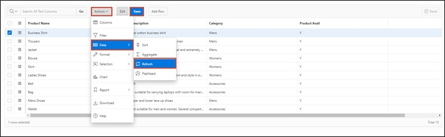

# 4. Interactive Grid

An Interactive Grid displays a set of defined records in a searchable, customizable report for the database user. In this report, the records can be modified and updated. It is also possible to add new records and delete old ones.

In this task, an Interactive Grid will be created to utilize the aforementioned functions.

## 4.1. Creation of the View
- For this task, a **View** must be created first.
To do this, as in task #03, go to the **SQL Workshop** in the **Object Browser** and start the **View** creation wizard via the +.  
There, enter the following data:

- **View Name**: ***TUTO_P0021_VW***  
  **Query**:
  ```sql
  select PRDT_INFO_ID as PRODUCT_ID,
         PRDT_INFO_NAME AS PRODUCT_NAME,
         PRDT_INFO_DESCR AS PRODUCT_DESCRIPTION,
         PRDT_INFO_CATEGORY AS CATEGORY,
         PRDT_INFO_AVAIL AS PRODUCT_AVAIL,
         PRDT_INFO_LIST_PRICE AS LIST_PRICE
  from PRODUCT_INFO
  ```


- Then click the **Next** button and then on **Create View**.

## 4.2. Create Page
- Open the **App Builder** via the navigation bar, select your application, and click the **Create Page** button. 


- The **Wizard** for creating a **page** starts.  
Select the page type **Interactive Grid**. The switch to the next page is automatic; otherwise, click the **Next** button. 


- Enter ***21*** as the **Page Number** and ***Product Info*** as the **Page Name**.
- In the Data Source area, select the created Product Info view as the **Table / View** name, and now enable editing in the Interactive Grid by setting **Editing Enabled** to ***enabled***.  
This is particularly important so that the APEX$ROW_SELECTOR column can be created.
- Then open the navigation area.


- Here, deactivate the breadcrumb and then click on the **Next** button.


- Select the column ***Product ID (Number)*** as **Primary Key Column 1**.


- Finally, click the **Create Page** button.

- The **page** with the **Interactive Grid** was successfully created. Now start the **page** by clicking the **Run** button.


- You now see the Interactive Grid. Initially, the Interactive Grid offers you a report about the existing data. You can add a new record directly in this table via the **Add Row** button.

- Additionally, you can edit existing records. To do so, you can **double-click** to select an entry, after which the cursor is displayed in the corresponding field. If the edit mode is activated, a single click is enough. The **Edit** button can be used to activate or deactivate this mode.


- The changes you make initially only take place in your browser. To save the changes, click the **Save** button. Alternatively, you can undo unwanted changes by opening the ***Actions*** **Dropdown menu** and selecting ***Refresh*** under ***Data***. This will reload the original data from the database.



- Moreover, a detail view of individual records is available. Click on the small button to the left of a record and select the ***Single Row View*** option.


- Now you only see the data for the selected record. Use the **Report View** button to return to the table view.


- Depending on the resolution and the number of displayed columns, horizontal scrolling may become necessary.


- To still keep track, columns can be fixed. **Fixed columns** remain in place during horizontal scrolling. Click on the **column** ***Product Name*** and select the **icon** for ***Freeze***.


 
- Now the Product Name column is fixed and remains visible during horizontal scrolling, allowing you to see which product the remaining columns refer to.

