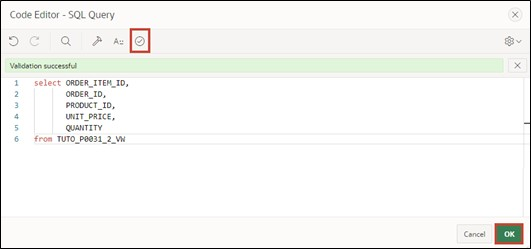
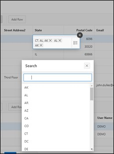

# <a name="master-detail-detail"></a>5. Master-Detail-Detail
Master – Detail regions are useful when you want to display data from interdependent tables on a single page.

In this example, the first table contains customer data, the second table contains orders per customer, and the third table contains the items of the order.

Selecting a record changes the contents of the tables, and you can view all orders for a customer and all associated items after selecting an order on one page.

## <a name="creating-the-views"></a>5.1 Creating the Views
- Four views are needed to work on this task. Create them according to the following specifications:

  - TUTO_P0031_1_VW
    ```sql
    select ordr_id, 
           ordr_ctmr_id, 
           ordr_total, 
           ordr_dd, 
           ordr_user_name, 
           ordr_tags 
      from orders
    ```
  - TUTO_P0031_2_VW
    ```sql
    select ordr_item_id,
           ordr_item_ordr_id,
           ordr_item_prdt_info_id,
           ordr_item_unit_price,
           ordr_item_quantity
      from order_items
    ```
  - TUTO_P0031_3_VW
    ```sql
    select prdt_info_id,
           prdt_info_name,
           prdt_info_descr,
           prdt_info_category,
           prdt_info_avail,
           prdt_info_list_price,
           prdt_info_product_image,
           prdt_info_mimetype,
           prdt_info_filename,
           prdt_info_image_last_update,
           prdt_info_tags
      from product_info
    ```
  - TUTO_P0031_4_VW
    ```sql
    select ctmr_id,
           ctmr_frst_name,
           ctmr_last_name,
           ctmr_street_address1,
           ctmr_street_address2,
           ctmr_state,
           ctmr_postal_code,
           ctmr_email,
           ctmr_phone_number1,
           ctmr_phone_number2,
           ctmr_url,
           ctmr_credit_limit,
           ctmr_tags
      from customers
    ```


## <a name="creating-a-master-detail-detail-page"></a>5.2 Creating a Master-Detail-Detail Page
- Open the **App Builder** from the navigation bar, select your application, and click the **Create Page** button.


- Select **Master Detail** as the page types.


- Select **Stacked** as the region types.


- Enter ***31*** as the **Page Number** and ***Customer Orders*** as the **Page Name**. 
- In the Master Data Source section, select the view created for the Master Region as the **Table / View** Name (*TUTO_P0031_4_VW*).
- Then, open the navigation area.


- Disable the **Breadcrumb** here and then click on the **Next** button. 


- Select ***CTMR_ID (Number)*** as **Primary Key Column 1** and click the **Next** button.


A region is an area on a page that serves as a container for content. This content can include items or sub-regions. Regions can be used to group page elements. Each APEX page can contain any number of regions. 

- Next, the **Detail Region** is configured. Change the following fields as indicated:  

  | | |  
  |--|--|
  | Detail Region Title | Orders by Customer |  
  | Show Only Related Tables | No |  
  | Table / View Name | View to the Orders table (*TUTO_P0031_1_VW*) |
  | | |


 
- Then click the **Next** button.
 
- Fill in the fields as follows and then click **Create Page**:

  | | | 
  |--|--|
  | Primary Key Column | ORDER_ID |
  | Master Column | CTMR_ID |
  | Detail Column | ORDR__CTMR_ID |
  | | |


- You will now see the **Page Designer** of **Page** ***31***. You can view your recently created page using the **Run** button.


- For better readability of the columns, it is advisable to adjust the **column headers**. Click on the respective columns in the Interactive Grids (e.g. CTMR_FRST_NAME in the Customer Orders Grid) and change the column header under Heading in the column properties on the right. 


- Repeat the process for the other columns. Use the **Run** button to view the modified page.


- Since only a **Master-Detail** page has been created so far, another **Detail Region** is now required. Right-click on the **Region** ***Orders by Customer*** and select **Create Region Below**. 


- Change the **Title** to ***Items in Order*** and the **Type** to ***Interactive Grid***. Then, under Source, change the **Type** to ***SQL Query***.



- APEX now highlights the field for the **SQL Query** under Source in red. A corresponding query must be entered here to make the page operable. You can either type directly in the field or display the Code Editor as a modal dialog. Click the button above the field to open the Code Editor.


- The Code Editor allows for comfortable SQL code writing and supports the developer with additional functions such as syntax highlighting and code validation. Enter the following code in the Code Editor:
  ```sql
  select ordr_item_id,
         ordr_item_ordr_id,
         ordr_item_prdt_info_id,
         ordr_item_unit_price,
         ordr_item_quantity
  from TUTO_P0031_2_VW
  ```
- Then you can click the checkmark in the Code Editor to have APEX validate the query. If everything is correct, APEX will give you appropriate feedback. 

- Then click the **OK** button.


- In **Master Detail**, select the region ***Orders by Customer*** as the Master Region.


- Now click in the Page Designer’s left panel, in the Region **Items in Order**, under Columns, on the column **ORDR_ITEM_ORDR_ID**. Then, in the right panel, select the column **ORDR_ID** as the **Master Column**. This establishes the link between the two regions. 


- Save your changes by clicking the **Save** button. Alternatively, you can click the **Run** button directly to save and then call up the page.

- On the page you created, three **Interactive Grids** can now be seen. Select any entry (customer) in the top region.


- All orders of this customer will now be displayed in the middle region. Select any entry (order) here as well.


In the bottom region, all items from the selected order are displayed. Although an **Interactive Grid** is also used here, as in the upper regions, the edit mode is not available by default if the **Interactive Grid** was created without the assistant. Also, the user is shown the ID of the ordered items but not their item names.  

To change this, the **Interactive Grid** will be adjusted accordingly in the next steps. 

- Open the **Page Designer** again. Choose the **Attributes** entry in the **Region** ***Items in Order***. Then set the value of **Enabled** in the **Edit** area to ***Yes***. This activates the **edit mode** for the **Interactive Grid**.


- A primary key must then be set for the Interactive Grid **Items in Order**. Click on the column **ORDR_ITEM_ID** and set **Primary Key** to ***Yes*** under Source.


 
- Now select the column **ORDR_ITEM_PRDT_INFO_ID** in the region **Items in Order**. Change the **Type** to ***Select List***.  
A Select List is a listing of data that allows the user to select a specific value.


- APEX reports that a *List of Values* must be stored. If you click on the **Message Icon** at the top, you will receive additional information. 


- Change the **Type** of the *List of Values* to ***SQL Query***.

*List of Values* are queries consisting of two values: a display value that is shown to the user and a return value with which APEX works in the database.

You must now enter an SQL query. Hints for creating the correct query can be found under the **Help** tab. 


Enter the following code in the **SQL Query** field:
```sql
select prdt_info_name as d,
       prdt_info_id as r
from TUTO_P0031_3_VW
```


- Then click the **Save** button first and then the **Run** button to save and execute the page.


You now see that the bottom **Region** displays the associated **names** of the items instead of the **ID**. A **Select List** now allows you to select and change the appropriate items. Only the **displayed element** has been changed.  
APEX continues to store the **ID** in the database. 


## <a name="popup-list-of-values"></a>5.3 Popup List of Values
**List of Values** can also be displayed as a pop-up window. Some functions have been optimized and expanded for this in APEX. These will now be applied in an example.

The fields of the **State** column in the **Interactive Grid** can previously be changed via a text input. Instead, a selection list should now be displayed there, corresponding to the entries in the database table **States**.

- For this task, another **View** is needed. Create it according to the following specifications:
  - TUTO_P0031_5_VW
    ```sql
    select STTS_ID,
           STTS_ST,
           STTS_STATE_NAME
      from STATES
    ```

- Open the **Page Designer** for page ***31 Customer Orders***. In the region **Customer Orders** under **Columns**, select the column **CTMR_STATE** and change the **Type** to ***Popup LOV***. Set the **Type** under **List of Values** to ***SQL Query*** and enter the following SQL statement as **Query**:
    ```sql
    select STTS_ST as r,
           STTS_ST as d
    from TUTO_P0031_5_VW
    ```

- In this case, the same table column is used as display and return value, as unlike the previous case, a text and not a number is expected as input. 

- Save your changes by clicking the **Save** button and then click the **Run** button to execute the page.

- Now, when editing a field in the column, clicking the **arrow** button on the right opens a selection menu that can be searched for entries through its own input field.


- APEX offers further options to customize the pop-up window. Switch back to the **Page Designer** to try some of them. Change the **Display as** setting of the column **CTMR_STATE** to ***Modal Dialog***. Also enable the **Search as You Type** option. 



- Save and call up the page again.

- The selection window now opens in a separate, modal dialog, and the **Search** button disappears. Instead, entries are searched directly when typing into the text field.


- In addition to the shown adjustments, it is also possible to enable the selection of multiple entries. This works through the **Multiple Values** option. The selected values are then concatenated as shown below and can be deleted individually. Here, always ensure that the data model supports multi-valued attributes.


- Furthermore, it is possible to display entries as tuples with multiple attributes. For this, the List of Values must be stored as **Shared Components** in the application.

- Open the **App Builder**, select your application, and click on **Shared Components**. 


*Shared Components* are general elements that can be used on one or any number of pages within an application.

- Click on the **List of Values** entry.


- You see a list of created lists. Click **Create** to create a new List of Values.


- Choose the **From Scratch** option and click **Next**.


- Enter **States** as the name of the list and select the **Dynamic** option. Then click **Next**.


- Select the previously created view (*TUTO_P00031_5_VW*) under the **Table/View Name** section and click **Next**.


- Select the ***STTS_ST*** column as both the **Return Column** and **Display Column**, then click **Create**.


- Post adjustments are necessary to store multiple displayed columns. Click on the corresponding entry.


- Click the **Select Columns** button at the bottom of the screen.


- In the window that opens, move the entry for the **STTS_STATE_NAME** column to the right field by selecting the entry and clicking the arrow button in the middle. Then click the **Update** button.


- To keep the currently displayed column STATE visible, enter ***State*** under **Heading** in the respective row and change the **Visible** and **Searchable** options to ***On*** and ***Enabled*** respectively. Change the Heading in the row below to **State Name**.

- Finally, click the **Apply Changes** button to save the changes.


- Click on the button with the **pencil icon** and the page number **31** to return directly to the **Page Designer**.


- For the Region Customers, change the **Type** in the List of Values tab from the column **CTMR_STATE** to ***Shared Components***, and set **List of Values** to ***STATES***.


- Save the page and refresh the tab with the application open. The dialog window now displays the attribute values for **State** and **State Name** for each entry.

