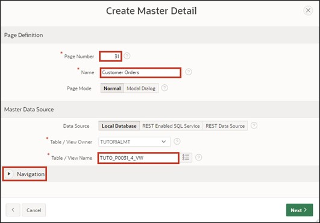
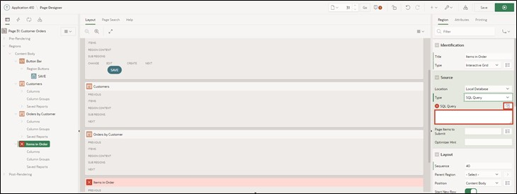
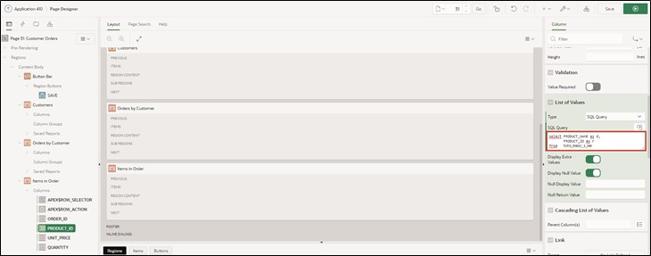
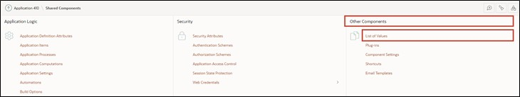
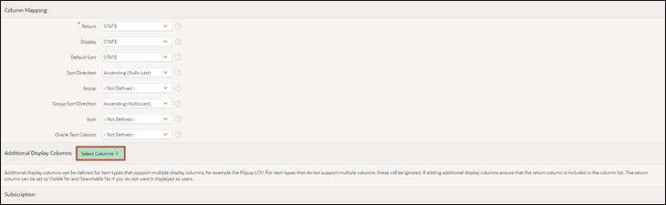
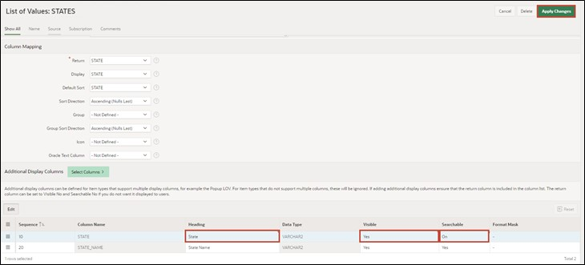
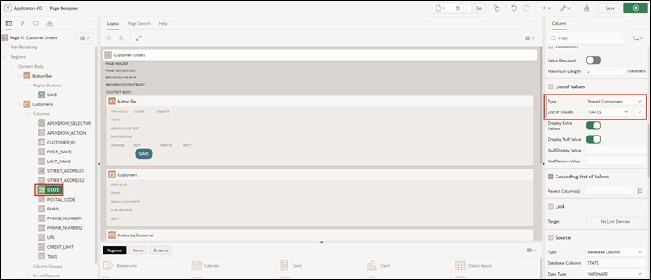

# 5. Master-Detail-Detail
Master – Detail regions are practical when you want to display data from interdependent tables on one page.

In this example, the first table contains the customer data, the second table the orders per customer, and the third table the items of the order.

When selecting a record, the contents of the tables change and you can view all orders for a customer and all associated items for an order on one page.

## 5.1. Creation of the Views
- Four views are required to complete this task. Create them according to the following specifications:

  - TUTO_P0031_1_VW
    ```sql
    select ordr_id as order_id, 
           ordr_ctmr_id as customer_id, 
           ordr_total as order_total, 
           ordr_dd as order_date, 
           ordr_user_name as user_name, 
           ordr_tags as tags 
      from orders
    ```
  - TUTO_P0031_2_VW
    ```sql
    select ordr_item_id as order_item_id,
           ordr_item_ordr_id as order_id,
           ordr_item_prdt_info_id as product_id,
           ordr_item_unit_price as unit_price,
           ordr_item_quantity as quantity
      from order_items
    ```
  - TUTO_P0031_3_VW
    ```sql
    select prdt_info_id as product_id,
           prdt_info_name as product_name,
           prdt_info_descr as product_description,
           prdt_info_category as category,
           prdt_info_avail as product_avail,
           prdt_info_list_price as list_price,
           prdt_info_product_image as product_image,
           prdt_info_mimetype as mimetype,
           prdt_info_filename as filename,
           prdt_info_image_last_update as image_last_update,
           prdt_info_tags as tags
      from product_info
    ```
  - TUTO_P0031_4_VW
    ```sql
    select ctmr_id as customer_id,
           ctmr_frst_name as first_name,
           ctmr_last_name as last_name,
           ctmr_street_address1 as street_address1,
           ctmr_street_address2 as street_address2,
           ctmr_state as state,
           ctmr_postal_code as postal_code,
           ctmr_email as email,
           ctmr_phone_number1 as phone_number1,
           ctmr_phone_number2 as phone_number2,
           ctmr_url as url,
           ctmr_credit_limit as credit_limit,
           ctmr_tags as tags
      from customers
    ```

## 5.2. Creation of a Master-Detail-Detail Page
- Open the **App Builder** via the navigation bar, select your application and click the **Create Page** button.


- Select **Master Detail** as the page type.


- Select **Stacked** as the region type.


- Enter **Page Number** as ***31*** and **Page Name** as ***Customer Orders***. 
- In the Master Data Source section, initially select the created view for the master region as **Table / View** Name (*TUTO_P0031_4_VW*).
- Then open the navigation area.



- Deactivate the **Breadcrumb** here and click the **Next** button. 


- Select **Primary Key Column 1** as the column ***CUSTOMER_ID (Number)*** and click the **Next** button.


A region is an area on a page that serves as a container for content. This content can be items or subregions, for example. Regions can be used to group page elements. Each page in APEX can contain any number of regions.

- The next step is to configure the **Detail Region**. Change the following fields as specified:

  | | |  
  |--|--|
  | Detail Region Title | Orders by Customer |  
  | Show Only Related Tables | No |  
  | Table / View Name | View to table Orders (*TUTO_P0031_1_VW*) |
  | | |


 
- Then click the **Next** button.
 
- Fill in the fields as follows and then click **Create Page**:

  | | | 
  |--|--|
  | Primary Key Column | ORDER_ID |
  | Master Column | CUSTOMER_ID |
  | Detail Column | CUSTOMER_ID |
  | | |


- You will now see the **Page Designer** of **page** ***31***. You can view your newly created page using the **Run** button.


- However, since only a **Master-Detail** page has been created so far, another **Detail Region** is needed. Right-click on the **Region** ***Orders by Customer*** and select **Create Region Below**. 


- Change the **Title** to ***Items in Order*** and the **Type** to ***Interactive Grid***. Then change the **Type** under Source to ***SQL Query***.


- APEX now marks the field for the **SQL Query** under Source in red. Here, an appropriate query must be stored to make the page operational. You can either type directly in the field or display the code editor as a modal dialog. Click the button above the field to access the code editor.



- The code editor allows comfortable writing of SQL code and supports the developer with additional functions such as syntax highlighting and code validation. Enter the following code in the code editor:
  ```sql
  select order_item_id,
         order_id,
         product_id,
         unit_price,
         quantity
  from TUTO_P0031_2_vw
  ```
- You can then click the checkmark in the code editor to validate the query by APEX. If everything is correct, APEX will give you appropriate feedback. 

- Click the **OK** button.


- For **Master Detail**, select the region ***Orders by Customer*** as the master region.


- Click on the column **ORDER_ID** in the left area of the Page Designer in the region Items in Order under Columns. Then select the column ORDER_ID as **Master Column** in the right area. This establishes the connection between the two regions. 


- Save the changes by pressing the **Save** button. Alternatively, you can click the **Run** button directly to save and then open the page.

- Now you will see three **Interactive Grids** on your created page. Select any entry (customer) in the top region.


- In the middle region, all orders of this customer will now be displayed. Select any entry (order) here as well.


In the bottom region, all items from the selected order are displayed. Even though an **Interactive Grid** is used here as in the upper regions, the edit mode is not available by default if the **Interactive Grid** was created without the wizard. Moreover, although the user is shown the ID of the ordered items, their item name is not displayed.

To change this, the **Interactive Grid** will be adapted accordingly in the next steps.

- Reopen the **Page Designer**. Select the **Entry** ***Attributes*** at the **Region** ***Items in Order***. Then set the value of **Enabled** in the **Edit** section to ***Yes***. This activates the **edit mode** for the **Interactive Grid**.


- A primary key for the Interactive Grid **Items in Order** must also be set afterwards. To do this, click on the column **ORDER_ITEM_ID** and set the **Primary Key** under Source to ***Yes***.


 
- Now select the column **PRODUCT_ID** in the region **Items in Order**. Change the **Type** to ***Select List***.  
A Select List is a list of data that allows the user to select a specific value.


- APEX reports that a *List of Values* must be stored. If you click on the **Message Icon** at the top, you will receive additional information about it. 


- Change the **Type** of the *List of Values* to ***SQL Query***.

*List of Values* are queries consisting of two values: a display value shown to the user and a return value used by APEX in the database.

Now you must store a SQL query. You can find hints for creating the correct query under the **Help** tab.


Store the following code in the **SQL Query** field:
```sql
select product_name as d,
       product_id as r
from TUTO_P0031_3_VW
```



- Click the **Save** button, then the **Run** button to save and execute the page.


You can now see that in the bottom **Region** instead of the **ID** the corresponding **Names** of the items are displayed. Using a **Select List**, the corresponding items can now be selected and changed. Only the **displayed item** was changed.  
APEX continues to store the **ID** in the database. 

## 5.3. Popup List of Values
**List of Values** can also be displayed as a popup window. In APEX 23.1, several functions were optimized and expanded for this purpose. These will now be applied in an example.

The fields of the **State** column in the **Interactive Grid** can currently be changed via text entry. Instead, a dropdown list should be displayed according to the entries in the database table **States**.

- Another **View** is required to complete this task. Create it according to the following specifications:
  - TUTO_P0031_5_VW
    ```sql
    select STTS_ID as STATE_ID,
           STTS_ST as STATE,
           STTS_STATE_NAME as STATE_NAME
      from STATES
    ```

- Open the **Page Designer** for the page ***31 Customer Orders***. Select the **Column** **State** in the **Region** **Customer Orders** and change the **Type** to ***Popup LOV***. Set the **Type** under **List of Values** to ***SQL Query*** and enter the following SQL statement as **Query**:
    ```sql
    select STATE as r,
           STATE as d
    from TUTO_P0031_5_VW
    ```

- In this case, the same table column is used as both the display and return value, because unlike the previous case, a text rather than a number is expected as input. 

- Save your changes using the **Save** button and click **Run** to execute the page.

- If a field in the column is edited, a selection menu opens through the **arrow** button on the right, which can be searched for entries using its own input field.


- APEX offers additional options to customize the popup window. Go back to the **Page Designer** to try some of these. Change the **Display as** setting of the **Column State** to ***Modal Dialog***. Also enable the **Search as You Type** option. 


- Save and reload the page.

- The selection window now opens in a separate modal dialog, also the **Search** button is omitted. Instead, the entries are searched directly when something is entered into the text field.


- Besides the shown customizations, it is possible to allow multiple entries to be selected. This works via the **Multiple Values** option. The selected values are then concatenated as shown below and can be individually deleted again. However, it should always be considered whether the data model supports multivalued attributes.


- Furthermore, it is possible to display entries as tuples with multiple attributes. For this, the List of Values must be stored as **Shared Components** in the application.

- Open the **App Builder**, select your application, and click **Shared Components**. 


*Shared Components* are common elements that can be used on one or any number of pages in an application.

- Click on the **List of Values** entry.



- You will see a listing of the created lists. Click **Create** to create a new List of Values.


- Choose the option **From Scratch** and click **Next**.


- Enter the name of the list as **States** and select the **Dynamic** option. Then click **Next**.


- Choose the previously created view (*TUTO_P0031_5_VW*) under **Table/View Name** and click **Next**.


- Select both **Return Column** and **Display Column** as the column ***State*** and click **Create**.


- To store multiple columns as displayed columns, after-the-fact adjustments to the List of Value are necessary. Click on the corresponding entry.


- Click the **Select Columns** button in the lower part of the screen.



- Move the entry for the column **State_Name** to the right field in the window that opens by selecting the entry and clicking the arrow button in the middle. Then click the **Update** button.


- To ensure that the column STATE that has been displayed so far remains visible, enter ***State*** in the corresponding row under **Heading** and change the options **Visible** and **Searchable** to ***On*** and ***Enabled***, respectively. 

- Finally, click the **Apply Changes** button to save the changes.



- Click the button with the **pencil icon** and the page number **31** to go directly back to the **Page Designer**.


- Change the **Type** for the Region Customers in the column **State** in the List of Values tab to ***Shared Components*** and the value of **List of Values** to ***STATES***.



- Save the page and refresh the tab with the open application. The dialog window now shows the attribute values for **State** and **State Name** for each entry.

