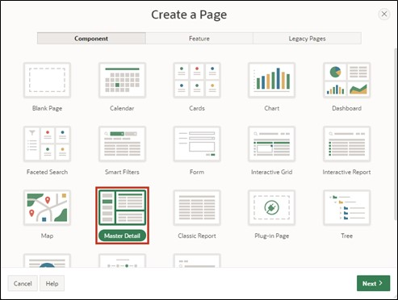
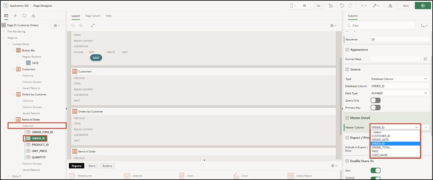
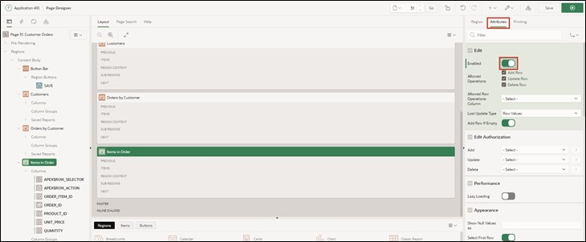
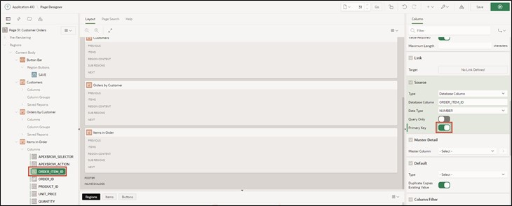
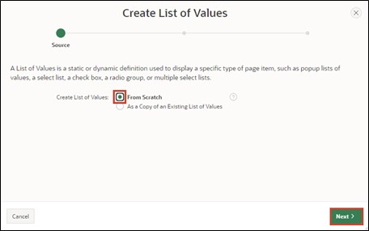
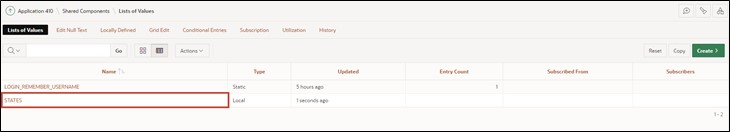

# 5. Master-Detail-Detail
Master – Detail regions are useful when you want to display data from interdependent tables on one page.

In this example, the first table contains customer data, the second table the orders per customer, and the third table the items of the order.

By selecting a record, the contents of the tables change, allowing you to view all orders for a customer and, upon selecting an order, all related items on one page.

## 5.1. Creating the Views
- For this task, four views are needed. Create them according to the following specifications:

  - TUTO_P0031_1_VW
    ```sql
    select ordr_id as order_id, 
           ordr_ctmr_id as customer_id, 
           ordr_total as order_total, 
           ordr_dd as order_date, 
           ordr_user_name as user_name, 
           ordr_tags as tags 
      from orders
    ```
  - TUTO_P0031_2_VW
    ```sql
    select ordr_item_id as order_item_id,
           ordr_item_ordr_id as order_id,
           ordr_item_prdt_info_id as product_id,
           ordr_item_unit_price as unit_price,
           ordr_item_quantity as quantity
      from order_items
    ```
  - TUTO_P0031_3_VW
    ```sql
    select prdt_info_id as product_id,
           prdt_info_name as product_name,
           prdt_info_descr as product_description,
           prdt_info_category as category,
           prdt_info_avail as product_avail,
           prdt_info_list_price as list_price,
           prdt_info_product_image as product_image,
           prdt_info_mimetype as mimetype,
           prdt_info_filename as filename,
           prdt_info_image_last_update as image_last_update,
           prdt_info_tags as tags
      from product_info
    ```
  - TUTO_P0031_4_VW
    ```sql
    select ctmr_id as customer_id,
           ctmr_frst_name as first_name,
           ctmr_last_name as last_name,
           ctmr_street_address1 as street_address1,
           ctmr_street_address2 as street_address2,
           ctmr_state as state,
           ctmr_postal_code as postal_code,
           ctmr_email as email,
           ctmr_phone_number1 as phone_number1,
           ctmr_phone_number2 as phone_number2,
           ctmr_url as url,
           ctmr_credit_limit as credit_limit,
           ctmr_tags as tags
      from customers
    ```


## 5.2. Creating a Master-Detail-Detail Page
- Open the **App Builder** via the navigation bar, select your application, and click on the **Create Page** button.


- Select **Master Detail** as the page type.



- Select **Stacked** as the region type.


- Enter **Page Number** ***31*** and **Page Name** ***Customer Orders***.
- In the Master Data Source area, first select the created view for the master region as **Table / View** Name (*TUTO_P0031_4_VW*).
- Then open the navigation area.


- Deactivate the **Breadcrumb** here and then click the **Next** button. 


- Select **Primary Key Column 1** as the column ***CUSTOMER_ID (Number)*** and click the **Next** button.


A region is an area on a page that serves as a container for content. This content can be, for example, items or subregions. Regions can be used to group page elements. Each page in APEX can contain any number of regions.

- Next, configure the **Detail Region**. Change the following fields as indicated:

  | | |  
  |--|--|
  | Detail Region Title | Orders by Customer |  
  | Show Only Related Tables | No |  
  | Table / View Name | View for the Orders table (*TUTO_P0031_1_VW*) |
  | | |


 
- Then click the **Next** button.
 
- Fill in the fields as follows and then click **Create Page**:

  | | | 
  |--|--|
  | Primary Key Column | ORDER_ID |
  | Master Column | CUSTOMER_ID |
  | Detail Column | CUSTOMER_ID |
  | | |


- You are now shown the **Page Designer** of **page** ***31***. You can view your newly created page using the **Run** button.


- Since only a **Master-Detail** page has been created so far, another **Detail Region** is now needed. Right-click on the **Region** ***Orders by Customer*** and select **Create Region Below** from the entry.


- Then change the **Title** to ***Items in Order*** and the **Type** to ***Interactive Grid***. Then change the **Type** under Source to ***SQL Query***.


- APEX now highlights the field for the **SQL Query** in red under Source. A corresponding query must be stored here to save the page as operational. You can either type directly in the field or display the code editor as a modal dialog. Click the button above the field to call up the code editor.


- The code editor allows for comfortable SQL code writing and supports the developer with additional features such as syntax highlighting and code validation. Enter the following code into the code editor:
  ```sql
  select order_item_id,
         order_id,
         product_id,
         unit_price,
         quantity
  from TUTO_P0031_2_vw
  ```
- You can then click the checkmark in the code editor and let APEX validate the query. If everything is correct, APEX will give you corresponding feedback.

- Then click the **OK** button.


- Select **Orders by Customer** as the Master Region under **Master Detail**.


- Now click in the left area of the Page Designer on the region Items in Order under Columns on the column **ORDER_ID**. Then select the column ORDER_ID as **Master Column** in the right area. This establishes the connection between the two regions.



- Save the changes by clicking the **Save** button. Alternatively, you can directly click the **Run** button to save and then call up the page.

- On the page you created, three **Interactive Grids** are now visible. Select any entry (customer) in the uppermost region.


- All orders of this customer are now displayed in the middle region. Also select any entry (order) here.


In the bottom region, all items from the selected order are displayed. Even though, as in the upper regions, an **Interactive Grid** is used here, the edit mode is not available by default when the **Interactive Grid** is created without the assistant. In addition, although the ID of the ordered items is shown to the user, their item name is not.

To change this, the **Interactive Grid** will be adjusted accordingly in the next steps.

- Open the **Page Designer** again. Select the **Entry** ***Attributes*** for the **Region** ***Items in Order***. Then set the value of **Enabled** in the **Edit** area to ***Yes***. This activates the **Edit Mode** for the **Interactive Grid**.



- Then a primary key for the Interactive Grid **Items in Order** needs to be set. To do this, click on the column **ORDER_ITEM_ID** and set the **Primary Key** under Source to ***Yes***.


 
- Now select the column **PRODUCT_ID** in the region **Items in Order**. Change the **Type** to ***Select List***.  
A Select List is a list of data that allows the user to select a certain value.


- APEX reports that a *List of Values* needs to be stored. If you click on the **Message Icon** at the top, you will receive additional information.


- Change the **Type** of the *List of Values* to ***SQL Query***.

*A List of Values* are queries consisting of two values: a display value that is shown to the user and a return value with which APEX works in the database.

Now you have to store an SQL query. Hints for creating the correct query can be found via the **Help** tab.


Enter the following code in the **SQL Query** field:
```sql
select product_name as d,
       product_id as r
from TUTO_P0031_3_VW
```


- Then first click the **Save** button and then the **Run** button to save and execute the page.


You now see that instead of the **ID**, the corresponding **names** of the items are displayed in the bottom **Region**. Through a **Select List**, the corresponding items can now be selected and changed. Only the **displayed element** has been changed.  
APEX continues to store the **ID** in the database.


## 5.3. Popup List of Values
**List of Values** can also be displayed as a popup window. In APEX 19.2, several features were optimized and expanded for this. These will be applied in the following example.

The fields in the **State** column in the **Interactive Grid** can currently be changed via text input. Instead, a selection list should now be displayed there, corresponding to the entries in the **States** database table.

- For this task, another **View** is needed. Create it according to the following specifications:
  - TUTO_P0031_5_VW
    ```sql
    select STTS_ID as STATE_ID,
           STTS_ST as STATE,
           STTS_STATE_NAME as STATE_NAME
      from STATES
    ```

- Open the **Page Designer** for the page ***31 Customer Orders***. In the region **Customers**, under **Columns**, select the column **State** and change its **Type** to ***Popup LOV***. Set **List of Values** **Type** to ***SQL Query*** and enter the following SQL statement as **Query**:
    ```sql
    select STATE as r,
           STATE as d
    from TUTO_P0031_5_VW
    ```

- In this case, the same table column is used as display and return value, because unlike the previous case, a text and not a number is expected as input. 

- Save your changes with the **Save** button and then click the **Run** button to run the page.

- If a field in the column is edited, a selection menu opens via the **Arrow** button on the right, which can be searched by its own input field for entries.


- APEX offers additional options to customize the popup window. Return to the **Page Designer** to try out some of them. Change the **Display as** setting for the **Column State** to ***Modal Dialog***. Also enable the **Search as You Type** option.


- Save and reload the tab with the open application.

- The selection window now opens in a separate modal dialog, and the **Search** button is removed. Instead, the entries are searched directly when an input is entered in the text field.


- In addition to the shown customizations, it is also possible to enable the selection of multiple entries. This works via the **Multiple Values** option. The selected values are then joined together as shown below and can be individually deleted again. However, it should always be considered whether the data model supports multivalued attributes.


- Additionally, it is possible to display entries as tuples with multiple attributes. For this, the List of Values must be stored as **Shared Components** in the application.

- Open the **App Builder**, select your application, and click **Shared Components**.


*Shared Components* are universal elements that can be used on one or multiple pages of an application.

- Click on the **List of Values** entry.


- You see a list of the created lists. Click **Create** to create a new List of Values.


- Select the **From Scratch** option and click **Next**.



- Enter **States** as the name of the list and select the **Dynamic** option. Then click **Next**.


- Choose the previously created view (*TUTO_P00031_5_VW*) under **Table/View Name** and click **Next**.


- Select **State** as both **Return Column** and **Display Column**, then click **Create**.


- To store multiple columns as displayed columns, post-adjustments to the List of Value are necessary. Click on the corresponding entry.



- Click the **Select Columns** button at the bottom of the screen.


- In the window that opens, move the entry for the **State_Name** column to the right field by selecting the entry and clicking the middle arrow button. Then click the **Update** button.


- To ensure the previously displayed STATE column remains visible, enter ***State*** under **Heading** in its corresponding line and change the **Visible** and **Searchable** options to ***On*** or ***Enabled*** respectively.

- Finally, click the **Apply Changes** button to save the changes.


- Click on the button with the **pencil icon** and the page number **31** to return directly to the **Page Designer**.


- In the **Columns** section of the region Customers, change the **Type** in the List of Values tab to ***Shared Components*** and change the **List of Values** value to ***STATES***.


- Save the page and refresh the tab with the open application. The dialog window will now display attribute values for **State** and **State Name** for each entry.

