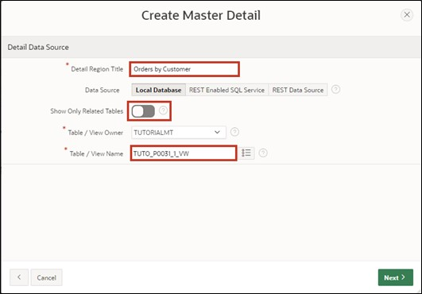
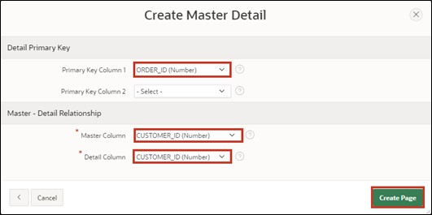
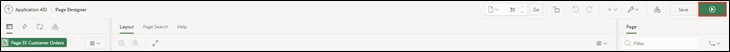
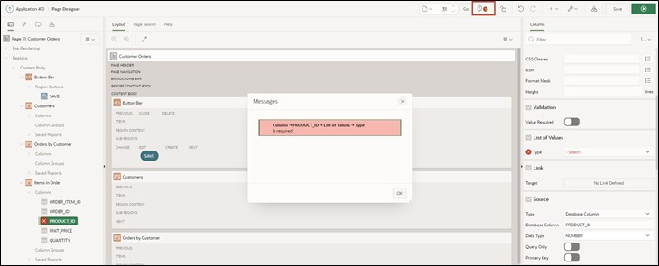
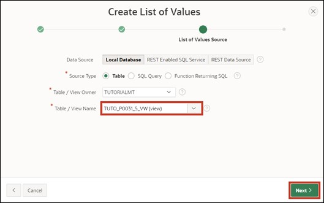

# 5. Master-Detail-Detail
Master – Detail regions are practical when you want to display data from dependent tables on one page.

In this example, the first table contains customer data, the second table orders per customer, and the third table the items of the order.

When selecting a record, the contents of the tables change, allowing you to view all orders for a customer and all related items on one page after selecting an order.

## 5.1. Creating Views
- Four views are required to complete this task. Create them according to the following specifications:

  - TUTO_P0031_1_VW
    ```sql
    select ordr_id as order_id, 
           ordr_ctmr_id as customer_id, 
           ordr_total as order_total, 
           ordr_dd as order_date, 
           ordr_user_name as user_name, 
           ordr_tags as tags 
      from orders
    ```
  - TUTO_P0031_2_VW
    ```sql
    select ordr_item_id as order_item_id,
           ordr_item_ordr_id as order_id,
           ordr_item_prdt_info_id as product_id,
           ordr_item_unit_price as unit_price,
           ordr_item_quantity as quantity
      from order_items
    ```
  - TUTO_P0031_3_VW
    ```sql
    select prdt_info_id as product_id,
           prdt_info_name as product_name,
           prdt_info_descr as product_description,
           prdt_info_category as category,
           prdt_info_avail as product_avail,
           prdt_info_list_price as list_price,
           prdt_info_product_image as product_image,
           prdt_info_mimetype as mimetype,
           prdt_info_filename as filename,
           prdt_info_image_last_update as image_last_update,
           prdt_info_tags as tags
      from product_info
    ```
  - TUTO_P0031_4_VW
    ```sql
    select ctmr_id as customer_id,
           ctmr_frst_name as first_name,
           ctmr_last_name as last_name,
           ctmr_street_address1 as street_address1,
           ctmr_street_address2 as street_address2,
           ctmr_state as state,
           ctmr_postal_code as postal_code,
           ctmr_email as email,
           ctmr_phone_number1 as phone_number1,
           ctmr_phone_number2 as phone_number2,
           ctmr_url as url,
           ctmr_credit_limit as credit_limit,
           ctmr_tags as tags
      from customers
    ```

## 5.2. Creating a Master-Detail-Detail Page
- Open the **App Builder** via the navigation bar, select your application, and click on the **Create Page** button.


- Select **Master Detail** as the page type.


- Choose **Stacked** as the region type.


- Enter **Page Number** ***31*** and **Page Name** ***Customer Orders***.
- In the Master Data Source section, select the view created for the master region as the **Table / View** name (*TUTO_P0031_4_VW*).
- Then open the navigation area.


- Disable the breadcrumb here and then click on the **Next** button.


- Choose **Primary Key Column 1** as ***CUSTOMER_ID (Number)*** and click the **Next** button.


A region is an area on a page that serves as a container for content. This content can be items or sub-regions, for example. Regions can be used to group page elements. Each page in APEX can have any number of regions.

- Next, the **Detail Region** is configured. Change the following fields as specified:

  | | |
  |--|--|
  | Detail Region Title | Orders by Customer |
  | Show Only Related Tables | No |
  | Table / View Name | View for table Orders (*TUTO_P0031_1_VW*) |



- Then click on the **Next** button.
  
- Fill in the fields as follows and then click **Create Page**:

  | | |
  |--|--|
  | Primary Key Column | ORDER_ID |
  | Master Column | CUSTOMER_ID |
  | Detail Column | CUSTOMER_ID |



- You will now see the **Page Designer** for **Page** ***31***. You can view your newly created page via the **Run** button.



- As only a **Master-Detail** page has been created so far, an additional **Detail Region** is now needed. Right-click on the **Region** ***Orders by Customer*** and select the **Create Region Below** entry.


- Change the **Title** to ***Items in Order*** and the **Type** to ***Interactive Grid***. Then change the **Type** under Source to ***SQL Query***.


- APEX now marks the field for the **SQL Query** under Source in red. A corresponding query must be entered here to save the running page. You can either type directly in the field or display the code editor as a modal dialog. Click the button above the field to open the code editor.


- The code editor allows for comfortable writing of SQL code and supports the developer with additional functions like syntax highlighting and code validation. Enter the following code in the code editor:
  ```sql
  select order_item_id,
         order_id,
         product_id,
         unit_price,
         quantity
  from TUTO_P0031_2_vw
  ```
- You can then click on the tick in the code editor to have APEX validate the query. If everything is correct, APEX will give you appropriate feedback.

- Then click on the **OK** button.


- For **Master Detail**, select the region ***Orders by Customer*** as the Master Region.


- Now click in the left part of the Page Designer on the region Items in Order under Columns on the **ORDER_ID** column. Then select the ORDER_ID column in the right part as the **Master Column**. This will establish the link between the two regions.


- Save the changes by pressing the **Save** button. Alternatively, you can click the **Run** button directly to save and then call up the page.

- On the page you created, you can now see three Interactive Grids. Select any entry (customer) in the top region.


- All orders for this customer are now displayed in the middle region. Select any entry (order) here as well.


In the bottom region, all items from the selected order are displayed. Even though an Interactive Grid is used here, as in the upper regions, the edit mode is not available by default when the Interactive Grid is created without the wizard. Additionally, the user is only shown the ID of the ordered items, but not their item name. 
To change this, the Interactive Grid will be adjusted accordingly in the following steps.

- Open the **Page Designer** again. Select the **Entry** ***Attributes*** in the **Region** ***Items in Order***. Then set the value of **Enabled** in the **Edit** area to ***Yes***. This activates the **Edit Mode** for the **Interactive Grid**.


- Next, a primary key for the Interactive Grid **Items in Order** must be defined. To do this, click on the Column **ORDER_ITEM_ID** and set the **Primary Key** under Source to ***Yes***.


- Now select the **PRODUCT_ID** column in the region **Items in Order**. Change the **Type** to ***Select List***.
A Select List is a listing of data that allows the user to select a specific value.


- APEX indicates that a List of Values must be provided. Click on the **Message Icon** at the top for additional information.



- Change the **Type** of the List of Values to ***SQL Query***.

List of Values are queries consisting of two values: a display value that is shown to the user and a return value used by APEX in the database.

Now you need to enter a SQL Query. You can get hints for creating the correct query from the **Help** tab.


Enter the following code in the **SQL Query** field:
```sql
select product_name as d,
       product_id as r
from TUTO_P0031_3_VW
```


- Then click on the **Save** button first and then on the **Run** button to save and execute the page.


You will now see that instead of the **ID**, the corresponding **names** of the items are displayed in the bottom **Region**. With a **Select List**, the respective items can now be selected and changed. Only the **displayed element** was changed.
APEX continues to store the **ID** in the database.

## 5.3. Popup List of Values
Lists of Values can also be displayed as pop-up windows. In APEX 19.2, several features have been optimized and expanded for this purpose. These will be applied in the following example.

The fields of the **State** column in the Interactive Grid can currently be changed via text input. Instead, a dropdown list should be displayed there, corresponding to the entries in the **States** database table.

- Another **View** is required to complete this task. Create it according to the following specifications:
  - TUTO_P0031_5_VW
    ```sql
    select STTS_ID as STATE_ID,
           STTS_ST as STATE,
           STTS_STATE_NAME as STATE_NAME
      from STATES
    ```

- Open the **Page Designer** for the page ***31 Customer Orders***. Select the **State** column in the **Customers** region under **Columns** and change the **Type** to ***Popup LOV***. Set the **Type** under **List of Values** to ***SQL Query*** and enter the following SQL statement as **Query**:
    ```sql
    select STATE as r,
           STATE as d
    from TUTO_P0031_5_VW
    ```

- In this case, the same table column is used as both display and return values, as opposed to the previous scenario, as a text rather than a number is expected as input.

- Save your changes by clicking the **Save** button, then click the **Run** button to execute the page.

- Now when a field in the column is edited, a dropdown menu opens via the **arrow** button to the right, which can be searched for entries through its own input field.


- APEX offers more options to customize the popup window. Return to the **Page Designer** to try some of them. Change **Display as** for the **Column State** to ***Modal Dialog***. Also enable the **Search as You Type** option.


- Save and call up the page again.

- The selection window now opens in a separate modal dialog and the **Search** button is removed. Instead, entries are searched immediately when text is typed into the field.


- Besides the shown customizations, it is also possible to allow the selection of multiple entries. This works using the **Multiple Values** option. The selected values will then be concatenated as shown below and can be individually deleted again. It is always important, however, to consider whether the data model supports multi-valued attributes.


- Furthermore, it is possible to display entries as tuples with multiple attributes. For this, the List of Values must be saved as **Shared Component** in the application.

- Open **App Builder**, select your application, and click on **Shared Components**.


Shared Components are general elements that can be used on one or many pages of an application.

- Click on the **List of Values** entry.


- You will see a list of the created lists. Click **Create** to add a new List of Values.


- Select the **From Scratch** option and click **Next**.


- Enter **States** as the list name and choose the **Dynamic** option. Then click **Next**.


- Select the previously created view (*TUTO_P00031_5_VW*) under **Table/View Name** and click **Next**.



- Choose the ***State*** column for both **Return Column** and **Display Column** and click **Create**.


- To add multiple columns as displayed columns, subsequent adjustments to the List of Value are needed. Click on the corresponding entry.


- Click on the **Select Columns** button at the bottom of the screen.


- Move the entry for the **State_Name** column to the right field by selecting the entry and clicking the middle arrow button. Then click the **Update** button.


- To ensure that the previously displayed STATE column remains visible, enter ***State*** under **Heading** in the corresponding row, and change the **Visible** and **Searchable** options to ***On*** and ***Enabled***, respectively.

- Finally, click the **Apply Changes** button to save the changes.


- Click the **pencil icon** and **page number** **31** button to return directly to the **Page Designer**.


- For the Customers region under Columns, change the **Type** on the List of Values tab to ***Shared Components*** and the **List of Values** to ***STATES***.


- Save the page and refresh the tab with the open application. In the dialog box, the attribute values for **State** and **State Name** are now displayed for each entry.

