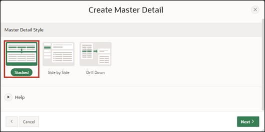
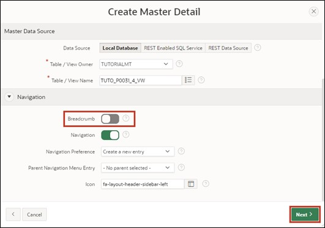
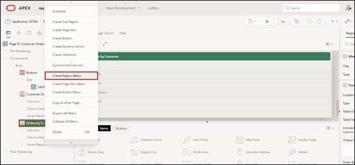
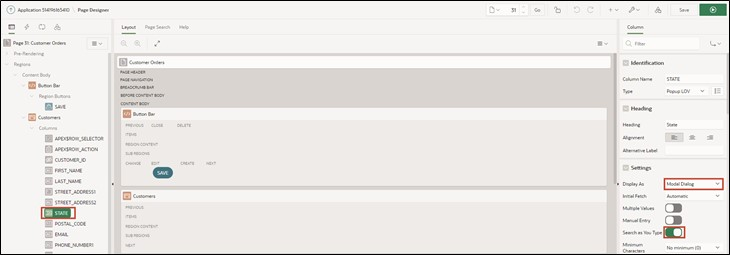
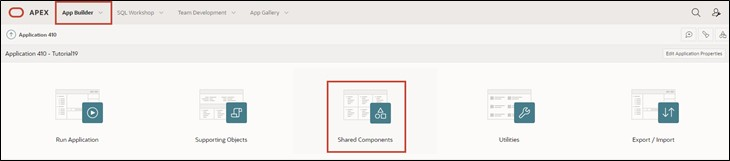
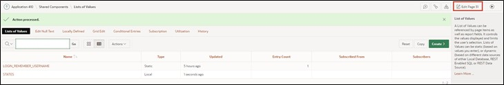
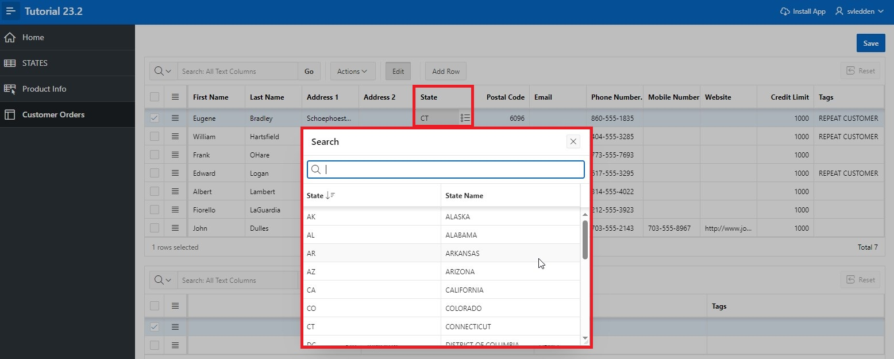

# <a name="master-detail-detail"></a>5. Master-Detail-Detail
Master-Detail regions are useful when wanting to display data from dependent tables on one page.

In this example, the first table contains customer data, the second table contains orders per customer, and the third table contains the items of the order.

By selecting a record, the contents of the tables change, and you can view all orders for a customer and, after selecting an order, all associated items on one page.

## <a name="erstellung-der-views"></a>5.1 Creating Views
- To complete this task, four views are needed. Create them based on the following specifications:

  - TUTO_P0031_1_VW
    ```sql
    select ordr_id, 
           ordr_ctmr_id, 
           ordr_total, 
           ordr_dd, 
           ordr_user_name, 
           ordr_tags 
      from orders
    ```
  - TUTO_P0031_2_VW
    ```sql
    select ordr_item_id,
           ordr_item_ordr_id,
           ordr_item_prdt_info_id,
           ordr_item_unit_price,
           ordr_item_quantity
      from order_items
    ```
  - TUTO_P0031_3_VW
    ```sql
    select prdt_info_id,
           prdt_info_name,
           prdt_info_descr,
           prdt_info_category,
           prdt_info_avail,
           prdt_info_list_price,
           prdt_info_product_image,
           prdt_info_mimetype,
           prdt_info_filename,
           prdt_info_image_last_update,
           prdt_info_tags
      from product_info
    ```
  - TUTO_P0031_4_VW
    ```sql
    select ctmr_id,
           ctmr_frst_name,
           ctmr_last_name,
           ctmr_street_address1,
           ctmr_street_address2,
           ctmr_state,
           ctmr_postal_code,
           ctmr_email,
           ctmr_phone_number1,
           ctmr_phone_number2,
           ctmr_url,
           ctmr_credit_limit,
           ctmr_tags
      from customers
    ```


## <a name="erstellung-einer-master-detail-detail-seite"></a>5.2 Creating a Master-Detail-Detail Page
- Open the **App Builder** via the navigation bar, select your application, and click on the **Create Page** button.


- Select **Master Detail** as the page type.


- Select **Stacked** as the region type.



- Enter ***31*** as the **Page Number** and ***Customer Orders*** as the **Page Name**. 
- In the Master Data Source area, first select the created view for the master region as the **Table / View** Name (*TUTO_P0031_4_VW*).
- Then open the navigation pane.


- Disable the **Breadcrumb** here and then click the **Next** button. 



- Select **Primary Key Column 1** as the column ***CTMR_ID (Number)*** and click the **Next** button.


A region is an area on a page that serves as a container for content. These contents can be items or sub-regions, for example. Regions can be used to group page elements. Each page in APEX can contain any number of regions. 

- Next, the **Detail Region** is configured. Change the following fields as specified:

  | | |  
  |--|--|
  | Detail Region Title | Orders by Customer |  
  | Show Only Related Tables | No |  
  | Table / View Name | View for the Orders table (*TUTO_P0031_1_VW*) |
  | | |


 
- Then click the **Next** button.
 
- Fill in the fields as follows and then click **Create Page**:

  | | | 
  |--|--|
  | Primary Key Column | ORDER_ID |
  | Master Column | CTMR_ID |
  | Detail Column | ORDR__CTMR_ID |
  | | |


- You are now shown the **Page Designer** for **Page** ***31***. Through the **Run** button, you can view the page you just created.


- For better readability of the columns, it is recommended to adjust the **column headings**. Click on the respective columns in the Interactive Grids (e.g., CTMR_FRST_NAME in the Grid Customer Orders) and change the column heading in the right column properties under Heading.



- Repeat the process for the other columns. Using the **Run** button, you can view the modified page.


- Since only a **Master-Detail** page has been created so far, another **Detail Region** is needed now. Right-click on the **Region** ***Orders by Customer*** and select **Create Region Below** from the menu.


- Then change the **Title** to ***Items in Order*** and the **Type** to ***Interactive Grid***. Then change the Source **Type** to ***SQL Query***.


- APEX now highlights the field for the **SQL Query** under Source in red. An appropriate query must be included here to save the page in a runnable state. You can either type directly into the field or display the code editor as a modal dialog. Click the button above the field to call up the code editor.


- The code editor allows comfortable writing of SQL code and supports the developer with additional functions such as syntax highlighting and code validation. Enter the following code in the code editor:
  ```sql
  select ordr_item_id,
         ordr_item_ordr_id,
         ordr_item_prdt_info_id,
         ordr_item_unit_price,
         ordr_item_quantity
  from TUTO_P0031_2_VW
  ```
- Afterwards, you can click the checkbox in the code editor and have APEX validate the query. If everything is correct, APEX will give you corresponding feedback. 

- Then click the **OK** button.


- Choose the region ***Orders by Customer*** as the Master Region in **Master Detail**.


- Now click in the left area of the Page Designer in the region **Items in Order** under Columns on the column **ORDR_ITEM_ORDR_ID**. Then select in the right area the column **ORDR_ID** as a **Master Column**. This establishes the link between the two regions.


- Save the changes by pressing the **Save** button. Alternatively, you can click the **Run** button directly to save and then call up the page.

- On the page you have created, there are now three **Interactive Grids**. Select any entry (customer) in the uppermost region.


- In the middle region, all orders of this customer are now displayed. Select any entry (order) here as well.


In the lowest region, all items from the selected order are displayed. Although an **Interactive Grid** is used here, as in the upper regions, the edit mode is not available by default when the **Interactive Grid** is created without the assistant. Furthermore, although the user is shown the ID of the ordered items, their item name is not displayed.

To change this, the **Interactive Grid** will be adjusted accordingly in the next steps.

- Open the **Page Designer** again. Select the **Attributes** entry for the **Region** ***Items in Order***. Then set the **Enabled** value in the **Edit** area to ***Yes***. This activates the **Edit mode** for the **Interactive Grid**.


- Then a primary key for the Interactive Grid **Items in Order** must still be defined. To do this, click on the Column **ORDR_ITEM_ID** and set the **Primary Key** under Source to ***Yes***.


 
- Now select the column **ORDR_ITEM_PRDT_INFO_ID** in the region **Items in Order**. Change the **Type** to ***Select List***.  
A Select List is a listing of data that allows the user to select a specific value.


- APEX reports that a *List of Values* must be provided. Clicking on the **Message Icon** above provides additional information. 


- Change the **Type** of the *List of Values* to ***SQL Query***.

*List of Values* are queries consisting of two values: a display value shown to the user and a return value used by APEX in the database.

You must now store a SQL query. Hints for creating the correct query are available under the **Help** tab. 


Enter the following code in the **SQL Query** field:
```sql
select prdt_info_name as d,
       prdt_info_id as r
from TUTO_P0031_3_VW
```


- Then first click the **Save** button and then click the **Run** button to save and execute the page.



You will now see that in the lowest **region** instead of the **ID**, the corresponding **names** of the items are displayed. Through a **Select List**, the corresponding items can now be selected and changed. Only the **displayed element** was changed.  
APEX continues to store the **ID** in the database. 


## <a name="popup-list-of-values"></a>5.3 Popup List of Values
**List of Values** can also be displayed as a popup window. In APEX, some functions have been optimized and extended for this purpose. These will be applied in the following with an example.

The fields of the **State** column in the **Interactive Grid** can still be changed so far via text input. Instead, a selection list should now be displayed there, corresponding to the entries in the database table **States**.

- For completing this task, another **View** is needed. Create this according to the following specifications:
  - TUTO_P0031_5_VW
    ```sql
    select STTS_ID,
           STTS_ST,
           STTS_STATE_NAME
      from STATES
    ```

- Open the **Page Designer** for page ***31 Customer Orders***. Choose the column **CTMR_STATE** in the region **Customer Orders** under **Columns** and change its **Type** to ***Popup LOV***. Set under **List of Values** the **Type** to ***SQL Query*** and enter the following SQL statement as **Query**:
    ```sql
    select STTS_ST as r,
           STTS_ST as d
    from TUTO_P0031_5_VW
    ```

- In this case, the same table column is used as both a display and return value because, unlike the previous case, a text rather than a number is expected as input. 

- Save your changes with the **Save** button and then click the **Run** button to execute the page.

- When a field is now edited in the column, a selection menu opens by clicking the **arrow** button on the right, which can be searched for entries through a separate input field.


- APEX offers more options to customize the popup window. Go back to the **Page Designer** to try some of them. Change from the column **CTMR_STATE** the setting **Display as** to ***Modal Dialog***. Also, enable the **Search as You Type** option. 


- Save and call the page again.

- The selection window now opens in a separate, modal dialog, and the **Search** button is also removed. Instead, the entries are searched directly during input in the text field.



- In addition to the shown adjustments, it is also possible to enable the selection of multiple entries. This works via the **Multiple Values** option. The selected values are then concatenated as shown below and can be individually deleted again. However, keep in mind whether the data model supports multivalued attributes.


- Furthermore, it is possible to display entries as tuples with multiple attributes. For this purpose, the List of Values must be stored as **Shared Components** in the application.

- Open the **App Builder**, select your application, and click **Shared Components**. 


*Shared Components* are common elements that can be used on one or any number of pages in an application.

- Click on the entry **List of Values**.


- You see a list of the created lists. Click **Create** to create a new List of Values.


- Choose the option **From Scratch** and click **Next**.


- Enter **States** as the name of the list and select the option **Dynamic**. Then click **Next**.


- Under the **Table/View Name**, select the previously created view (*TUTO_P00031_5_VW*) and click **Next**.


- Select both as **Return Column** and **Display Column** the column ***STTS_ST*** and click **Create**.


- To store multiple columns as displayed columns, adjustments are necessary for the List of Value afterwards. Click on the corresponding entry.


- Click the **Select Columns** button at the bottom of the screen.


- Move the entry for the column **STTS_STATE_NAME** to the right field in the opening window by selecting the entry and clicking the arrow button in the middle. Then click the **Update** button.



- To ensure that the previously displayed STATE column remains visible, enter ***State*** in the associated row under **Heading** and change the **Visible** and **Searchable** options to ***On*** and ***Enabled*** respectively. Change the heading in the row below to **State Name**.

- Finally, click the **Apply Changes** button to save the changes.


- Click the button with the **pencil icon** and the page number **31** to go back directly to the **Page Designer**.


- There for the region Customers, change the **Type** in the tab List of Values to ***Shared Components*** and the value of **List of Values** to ***STATES*** for the column **CTMR_STATE**.


- Save the page and refresh the tab with the opened application. In the dialog window, the attribute values for **State** and **State Name** are now displayed for each entry.

