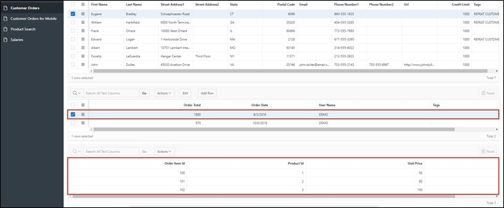
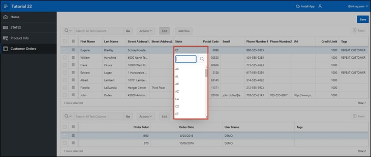
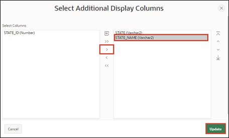
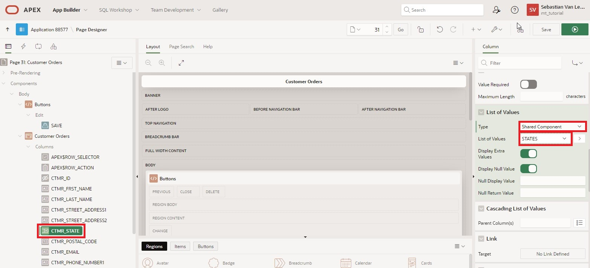

# <a name="master-detail-detail"></a>5. Master-Detail-Detail
Master – Detail regions are practical when you want to display data from interdependent tables on a single page.

In this example, the first table contains customer data, the second table the orders per customer, and the third table the items of the order.

By selecting a record, the contents of the tables change, and you can view all orders for a customer and after selecting an order, all associated items on a single page.

## <a name="erstellung-der-views"></a>5.1 Creation of Views
- For this task, four views are required. Create them according to the following specifications:

  - TUTO_P0031_1_VW
    ```sql
    select ordr_id, 
           ordr_ctmr_id, 
           ordr_total, 
           ordr_dd, 
           ordr_user_name, 
           ordr_tags 
      from orders
    ```
  - TUTO_P0031_2_VW
    ```sql
    select ordr_item_id,
           ordr_item_ordr_id,
           ordr_item_prdt_info_id,
           ordr_item_unit_price,
           ordr_item_quantity
      from order_items
    ```
  - TUTO_P0031_3_VW
    ```sql
    select prdt_info_id,
           prdt_info_name,
           prdt_info_descr,
           prdt_info_category,
           prdt_info_avail,
           prdt_info_list_price,
           prdt_info_product_image,
           prdt_info_mimetype,
           prdt_info_filename,
           prdt_info_image_last_update,
           prdt_info_tags
      from product_info
    ```
  - TUTO_P0031_4_VW
    ```sql
    select ctmr_id,
           ctmr_frst_name,
           ctmr_last_name,
           ctmr_street_address1,
           ctmr_street_address2,
           ctmr_state,
           ctmr_postal_code,
           ctmr_email,
           ctmr_phone_number1,
           ctmr_phone_number2,
           ctmr_url,
           ctmr_credit_limit,
           ctmr_tags
      from customers
    ```


## <a name="erstellung-einer-master-detail-detail-seite"></a>5.2 Creation of a Master-Detail-Detail Page
- Open the **App Builder** via the navigation bar, select your application, and click the **Create Page** button.


- Select **Master Detail** as the page type.


- Select **Stacked** as the region type.


- Enter **Page Number** as ***31*** and **Page Name** as ***Customer Orders***.
- In the Master Data Source section, select the created view for the master region as **Table / View** name (*TUTO_P0031_4_VW*).
- Then open the navigation area.


- Deactivate the **Breadcrumb** here and then click the **Next** button.


- Select **Primary Key Column 1** as the column ***CTMR_ID (Number)*** and click the **Next** button.


A region is an area on a page that acts as a container for content. This content can be items or sub-regions. Regions can be used to group page elements. Each page in APEX can contain any number of regions.

- Next, the **Detail Region** is configured. Change the following fields as specified:

  | | |  
  |--|--|
  | Detail Region Title | Orders by Customer |  
  | Show Only Related Tables | No |  
  | Table / View Name | View to the orders table (*TUTO_P0031_1_VW*) |
  | | |


 
- Then click the **Next** button.
 
- Fill in the fields as follows and then click **Create Page**:

  | | | 
  |--|--|
  | Primary Key Column | ORDER_ID |
  | Master Column | CTMR_ID |
  | Detail Column | ORDR__CTMR_ID |
  | | |


- You are now shown the **Page Designer** of **Page** ***31***. You can view your newly created page via the **Run** button.


- For better readability of the columns, it is advisable to adjust the **column headings**. Click on the respective columns in the Interactive Grids (e.g., CTMR_FRST_NAME in the grid Customer Orders) and change the column heading under Heading on the right in the column properties.


- Repeat this process for the other columns. You can view the changed page via the **Run** button.


- However, since only a **Master-Detail** page has been created so far, another **Detail Region** is now required. Right-click the **Region** ***Orders by Customer*** and select the **Create Region Below** entry.


- Then change the **Title** to ***Items in Order*** and the **Type** to ***Interactive Grid***. Then change the **Type** under Source to ***SQL Query***.


- APEX now marks the field for the **SQL Query** under Source in red. A corresponding query must be stored here to save the page operationally. You can either type directly into the field or display the code editor as a modal dialog. Click the button above the field to call up the code editor.


- The code editor enables comfortable writing of SQL code and supports the developer with additional features like syntax highlighting and code validation. Enter the following code in the code editor:
  ```sql
  select ordr_item_id,
         ordr_item_ordr_id,
         ordr_item_prdt_info_id,
         ordr_item_unit_price,
         ordr_item_quantity
  from TUTO_P0031_2_VW
  ```
- Then you can click the tick in the code editor and have the query validated by APEX. If everything is correct, APEX will give you corresponding feedback.

- Then click the **OK** button.


- Select **Master Detail** and the region ***Orders by Customer*** as the Master Region.


- Now click in the left area of the Page Designer in the **Items in Order** region under Columns on the **ORDR_ITEM_ORDR_ID** column. Then select the **ORDR_ID** column as the **Master Column** in the right area. This establishes the link between the two regions.



- Save the changes by pressing the **Save** button. Alternatively, you can directly click the **Run** button to save and then open the page.

- On the page you have created, three **Interactive Grids** are now visible. Select any entry (customer) in the top region.


- In the middle region, all orders of this customer are now displayed. Select any entry (order) here as well.


In the lowest region, all items from the selected order are displayed. Although an **Interactive Grid** is used here, as in the upper regions, the edit mode is not available by default if the **Interactive Grid** was created without the wizard. Also, although the ID of the ordered items is displayed to the user, the item name is not.

To change this, the **Interactive Grid** is adjusted accordingly in the next steps.

- Open the **Page Designer** again. Select the **Entry** ***Attributes*** in the **Region** ***Items in Order***. Then set the value of **Enabled** in the **Edit** area to ***Yes***. This enables the **Edit Mode** for the **Interactive Grid**.


- Next, a primary key must be set for the Interactive Grid **Items in Order**. To do this, click on the **ORDR_ITEM_ID** column and set **Primary Key** to ***Yes*** under Source.


 
- Now select the **ORDR_ITEM_PRDT_INFO_ID** column in the **Items in Order** region. Change the **Type** to ***Select List***.
A Select List is a data list that allows the user to select a specific value.


- APEX reports that a *List of Values* must be stored. If you click the **Message Icon** above, you will get additional information about it.


- Change the **Type** of the *List of Values* to ***SQL Query***.

*List of Values* are queries consisting of two values: a display value that is shown to the user and a return value that APEX works with in the database.

Now you need to store an SQL query. Instructions for creating the correct query are available via the **Help** tab.


Store the following code in the **SQL Query** field:
```sql
select prdt_info_name as d,
       prdt_info_id as r
from TUTO_P0031_3_VW
```



- Then first click the **Save** button and then the **Run** button to save and execute the page.


You will now see that the lowest **Region** shows the **names** of the items instead of the **ID**. A **Select List** can now be used to select and change the corresponding items. Only the **displayed item** was changed.
APEX still stores the **ID** in the database.


## <a name="popup-list-of-values"></a>5.3 Popup List of Values
**List of Values** can also be displayed as a popup window. Several functions have been optimized and expanded for this in APEX 23.1. These will be applied in an example below.

The fields of the **State** column in the **Interactive Grid** can currently be changed via text input. Instead, a selection list should now be displayed there, corresponding to the entries in the **States** database table.

- For this task, another **View** is needed. Create this according to the following details:
  - TUTO_P0031_5_VW
    ```sql
    select STTS_ID,
           STTS_ST
           STTS_STATE_NAME
      from STATES
    ```

- Open the **Page Designer** for the page ***31 Customer Orders***. Select the **CTMR_STATE** column under **Columns** in the **Customer Orders** region and change the **Type** to ***Popup LOV***. Under **List of Values**, set the **Type** to ***SQL Query*** and enter the following SQL statement as **Query**:
    ```sql
    select STTS_ST as r,
           STTS_ST as d
    from TUTO_P0031_5_VW
    ```

- In this case, the same table column is used as both the display and return value since, unlike the previous case, a text rather than a number is expected as input.

- Save your changes by clicking the **Save** button and then **Run** to execute the page.

- If a field in the column is now edited, a selection menu opens through the **arrow** button on the right, which can be searched for entries using its own input field.


- APEX offers further options for adjusting the popup window. Return to the **Page Designer** to try out some of them. Change the **Display as** setting of the **CTMR_STATE** column to ***Modal Dialog***. Also activate the **Search as You Type** option.


- Save and open the page again.

- The selection window now opens in a separate, modal dialog, and the **Search** button has disappeared. Instead, the entries are searched directly when input is entered into the text field.


- Besides the adjustments shown, it is also possible to allow the selection of multiple entries. This works via the **Multiple Values** option. The selected values are then concatenated as shown below and can be individually deleted again. However, please ensure that the data model supports multi-valued attributes.


- Furthermore, it is possible to display entries as tuples with multiple attributes. For this, the list of values must be stored as **Shared Components** in the application.

- Open the **App Builder**, select your application, and click **Shared Components**.


*Shared Components* are general elements that can be used on one or any number of pages in an application.

- Click the **List of Values** entry.


- You will see a list of the created lists. Click **Create** to create a new list of values.


- Select **From Scratch** and click **Next**.


- Enter **States** as the name of the list and select **Dynamic**. Then click **Next**.


- Select the previously created view (*TUTO_P0031_5_VW*) under the **Table/View Name** point and click **Next**.


- Select both **Return Column** and **Display Column** as the column ***STTS_ST*** and click **Create**.


- To store multiple columns as displayed columns, subsequent adjustments to the List of Value are necessary. Click the associated entry.



- Click the **Select Columns** button at the bottom of the screen.


- In the window that opens, move the entry to the **STTS_STATE_NAME** column to the right field by selecting the entry and clicking the arrow button in the middle. Then click the **Update** button.


- To keep the column STATE visible as before, enter ***State*** as the **Heading** in the associated row and change **Visible** and **Searchable** options to ***On*** and ***Enabled*** respectively. Change the heading in the row below to **State Name**.

- Finally, click the **Apply Changes** button to save the changes.


- Click the button with the **pencil icon** and page number **31** to jump directly to the **Page Designer**.


- There, change the **Type** for the **CTMR_STATE** column in the Customers region to ***Shared Components*** on the List of Values tab and the value of **List of Values** to ***STATES***.



- Save the page and refresh the tab with the open application. The dialog window now shows the attribute values for **State** and **State Name** for each entry.

