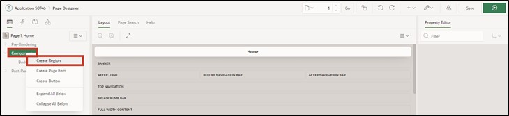

# 6. Charts
Charts/Diagrams are used for the graphical representation of numerical values. APEX supports, among others, pie charts, line charts, bubble charts, scatter charts, and bar charts by default.

The aim of this chapter is to create a chart that shows the ratio of purchases sorted by categories.


## 6.1. Creation of the View
- A **View** is needed for the execution of this task.

- Name your **View** ***TUTO_P0001_VW***
  ```sql
  select o.ordr_id as order_id,
         o.ordr_ctmr_id as customer_id,
         o.ordr_total as order_total,
         o.ordr_dd as order_date,
         o.ordr_user_name as user_name,
         oi.ordr_item_id as order_item_id,
         oi.ordr_item_prdt_info_id as product_id,
         oi.ordr_item_unit_price as unit_price,
         oi.ordr_item_quantity as quantity,
         p.prdt_info_name as product_name,
         p.prdt_info_descr as product_description,
         p.prdt_info_category as category,
         p.prdt_info_avail as product_avail,
         p.prdt_info_list_price as list_price
    from order_items oi
    join product_info p
      on oi.ordr_item_prdt_info_id = p.prdt_info_id
    join orders o
      on oi.ordr_item_ordr_id = o.ordr_id
  ```


## 6.2. Charts Region
- First, open the **App Builder** for your **application**. Then click on **Page 1 -** ***Home***.

- **Breadcrumbs** can usually be deleted after creation. They take up a lot of space and typically do not add value for the end user. **Breadcrumbs** are hierarchical lists of links and offer hierarchical navigation.

- Right-click on the *breadcrumb* **TUTORIAL 22** and select **Delete**.


- Also delete the region **Page Navigation**.

- Right-click on the entry **Components**. Select **Create Region**.



- Now select the region you created and change the **Title** to ***Orders per Category*** and the **Type** to ***Chart***.


- Select the entry **NEW** under Series and change the **Title** to ***Orders***.
- Under Source, select **Location** as ***Local Database*** and enter the **Table Name** of the view you just created (***TUTO_P0001_VW***).


- Now change the value for **Label** to the column ***CATEGORY*** and the value for **Value** to the column ***ORDER_TOTAL***.


- Now switch to the **Attributes** tab under Orders per Category. Change the **Type** to ***Pie***. Your chart will now be displayed as a pie chart. Pie charts are a form for presenting parts of a whole in the shape of a circle. The entire circle represents the sum of the individual pie segments.


- Then click the **Run** button.

- You will now see that the ratio of purchases sorted by categories is displayed on your home page.

