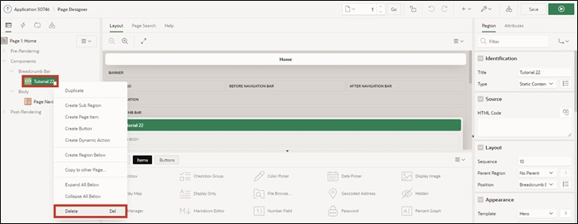
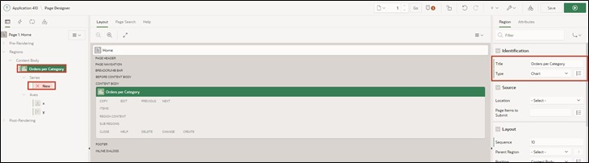
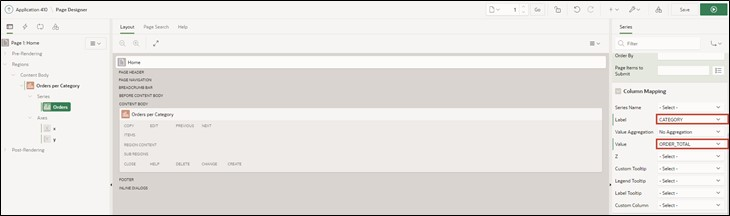
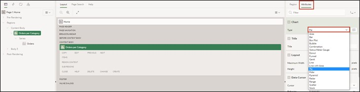

# <a name="charts"></a>6. Charts
Charts/diagrams are used for the graphical representation of numerical values. APEX natively supports pie charts, line charts, bubble charts, scatter plots, and bar charts, among others.

The aim of this chapter is to create a chart displaying the ratio of purchases sorted by categories.

## <a name="charts-erstellung-der-view"></a>6.1 Creation of the View
- A **View** is needed to carry out this task.

- Name your **View** ***TUTO_P0001_VW***
  ```sql
  select o.ordr_id,
         o.ordr_ctmr_id,
         o.ordr_total,
         o.ordr_dd,
         o.ordr_user_name,
         oi.ordr_item_id,
         oi.ordr_item_prdt_info_id,
         oi.ordr_item_unit_price,
         oi.ordr_item_quantity,
         p.prdt_info_name,
         p.prdt_info_descr,
         p.prdt_info_category,
         p.prdt_info_avail,
         p.prdt_info_list_price
    from order_items oi
    join product_info p
      on oi.ordr_item_prdt_info_id = p.prdt_info_id
    join orders o
      on oi.ordr_item_ordr_id = o.ordr_id
  ```
## <a name="charts-region"></a>6.2 Charts Region
- First, open the **App Builder** for your **application**. Then click on **Page 1 -** ***Home***.

- **Breadcrumbs** can usually be deleted after creation as they take up a lot of space and generally do not provide any added value to the end user. **Breadcrumbs** are hierarchical lists of links and offer hierarchical navigation.

- Right-click on the *Breadcrumb* **Apex TUTORIAL** and select **Delete**.



- Also delete the region **Page Navigation**.

- Right-click on the entry **Components**. Select **Create Region** here.


- Now select the region you created and change the **Title** to ***Orders per Category*** and the **Type** to ***Chart***.



- Now select the entry **NEW** under Series and change the **Title** to ***Orders***.
- Under Source, select the **Location** setting ***Local Database*** and enter the **Table Name** of the view you just created (***TUTO_P0001_VW***).


- Change the value for **Label** to the column ***PRDT_INFO_CATEGORY*** and the value for **Value** to the column ***ORDR_TOTAL***.



- Now switch for Orders per Category to the **Attributes** tab. Change the **Type** to ***Pie***. Your diagram will now be displayed as a pie chart. Pie charts are used to represent proportions of a whole in circular form. The entire circle represents the total of the individual sectors.



- Then click on the **Run** button.

- You will now see that the ratio of purchases sorted by categories is displayed on your homepage.

