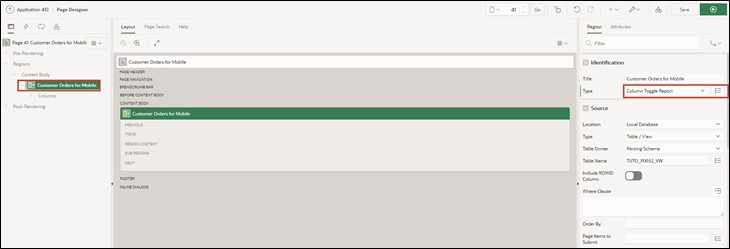

# <a name="features-for-mobile-devices"></a>7. Features for Mobile Devices
## <a name="reflow-report--column-toggle-report"></a>7.1 Reflow Report & Column Toggle Report
Two report types that help ensure APEX applications can be comfortably used on mobile devices are the **Reflow Report** and the **Column Toggle** Report.

The Reflow Report displays table columns vertically when there is not enough space to display them horizontally. The **Column Toggle** Report allows columns to be assigned different priorities, where columns with lower priority are displayed more narrowly and hidden earlier than columns with higher priority.

### <a name="create-mobile-view"></a>7.1.1 Create View
- A **View** is needed to complete this task.

- Name your **View** ***TUTO_P0032_VW***:
  ```sql
  select o.ordr_id,
         o.ordr_ctmr_id,
         o.ordr_total,
         o.ordr_dd,
         o.ordr_user_name,
         oi.ordr_item_id,
         oi.ordr_item_prdt_info_id,
         oi.ordr_item_unit_price,
         oi.ordr_item_quantity,
         p.prdt_info_name,
         p.prdt_info_descr,
         p.prdt_info_category,
         p.prdt_info_avail,
         p.prdt_info_list_price
    from order_items oi
    join product_info p
      on oi.ordr_item_prdt_info_id = p.prdt_info_id
    join orders o
      on oi.ordr_item_ordr_id = o.ordr_id
  ```

### <a name="create-mobile-report"></a>7.1.2 Create Report
- Create a new page by navigating to **App Builder** and clicking on **Create Page**.
- Select **Page Type** ***Interactive Report***.


- Enter **Page Number** ***32*** and **Page Name** ***Customer Orders for Mobile***.
- Select **Data Source** ***Local Database*** and **Table / View Name** as the view you created, ***TUTO_P0032_VW***.
- In the Navigation section, deactivate *Breadcrumb* and click on **Create Page**.


- In the Page Designer, select your report ***Customer Orders for Mobile*** on the left side. On the right, you can change the **Type**. First, choose the setting ***Reflow Report*** and click the **Run** button.


The displayed table is "responsive," meaning the display of the table columns automatically adjusts to the screen size of the device.


If you reduce the browser window size, the display area of the website also shrinks. When the display screen width is ≤ 560 pixels, the table columns are no longer displayed side by side but underneath each other.


- Return to the Page Designer and select **Type** as ***Column Toggle Report*** and click **Run**.



- In this case, you can set which table columns should be displayed. To do this, click the **Columns** button and select the desired columns.


This is a temporary personalized setting of the table columns. Other users are not affected by this setting. The setting is ***not*** saved over a reload of the webpage.
 

## <a name="progressive-web-apps"></a>7.2 Progressive Web Apps
By selecting the feature "Install Progressive Web App" when creating the application, it can now be installed as a desktop application.

Progressive web applications are faster apps because they use a special browser cache to store resources more efficiently, which makes pages load faster.

If it is a progressive web app, a new entry **Install App** appears in the navigation bar:


- Click the **Install App** button. A popup appears, confirming that you want to install the application.


Once the installation is complete, the application opens in its own window, independent of the browser you are in. Under Windows, as seen in the next screenshot, you can make some adjustments to the installation, e.g., a shortcut to the app on the desktop.


The application can now also be found and started via the start menu.

Existing applications, created from APEX version 21.2, can also be converted into or used as progressive web apps. To do this, the following settings need to be adjusted:

- Open the page overview of your application and click on **Edit Application Definition**.


- Click on **Progressive Web App** and enable the **Installable** option.


A section opens with further settings that can be used to customize the user interface of the Progressive Web App.


## <a name="persistent-authentication"></a>7.3 Persistent Authentication
For Progressive Web Apps, there is a new authentication method called "Persistent Authentication" introduced since version 23.1 of APEX.

Unlike normal APEX applications, a "**Remember me**" checkbox appears on the login screen, which is not to be confused with "**Remember Username**".


When the "Remember me" option is enabled, APEX remembers the login data for a certain period (30 days). During this time, the user can access the desired page without needing to log in again. If a session expires, a new session is automatically provided.