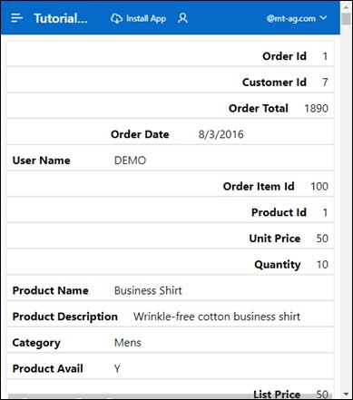
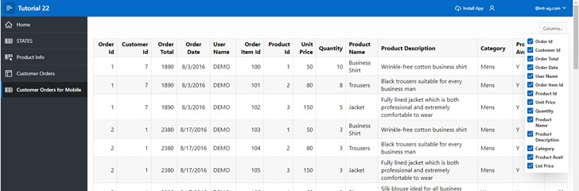

# 7. Features for Mobile Devices
## 7.1. Reflow Report & Column Toggle Report
Two report types that help make APEX applications user-friendly on mobile devices are the **Reflow Report** and the **Column Toggle** report.

The Reflow Report displays table columns vertically when there is not enough space to display them horizontally. The **Column Toggle** report allows columns to be assigned different priorities. Columns with lower priority are displayed narrower and hidden earlier than columns with a higher priority.

### 7.1.1. Create View
- A **View** is needed for this task.

- Name your **View*** ***TUTO_P0032_VW***:
  ```sql
  select o.ordr_id as order_id,
         o.ordr_ctmr_id as customer_id,
         o.ordr_total as order_total,
         o.ordr_dd as order_date,
         o.ordr_user_name as user_name,
         oi.ordr_item_id as order_item_id,
         oi.ordr_item_prdt_info_id as product_id,
         oi.ordr_item_unit_price as unit_price,
         oi.ordr_item_quantity as quantity,
         p.prdt_info_name as product_name,
         p.prdt_info_descr as product_description,
         p.prdt_info_category as category,
         p.prdt_info_avail as product_avail,
         p.prdt_info_list_price as list_price
    from order_items oi
    join product_info p
      on oi.ordr_item_prdt_info_id = p.prdt_info_id
    join orders o
      on oi.ordr_item_ordr_id = o.ordr_id
  ```

### 7.1.2. Create Report
- Create a new page. Navigate to the **App Builder** and click on **Create Page**.
- Select **Page Type** ***Interactive Report***.


- Enter **Page Number** ***32*** and **Page Name** ***Customer Orders for Mobile***.
- Choose **Data Source** ***Local Database*** and **Table / View Name** the view you created ***TUTO_P0032_VW***.
- In the Navigation area, disable the *Breadcrumb* and click **Create Page**.


- In the Page Designer, select your report ***Customer Orders for Mobile*** on the left side. On the right side, you can change the **Type**. First, select ***Reflow Report*** and click the **Run** button.


The displayed table is "responsive," meaning the table columns automatically adjust to the screen size of the device.


If you narrow the browser window, the display area of the webpage also shrinks. If the display screen width is ≤ 560 pixels, the table columns are no longer displayed side by side but underneath each other.



- Return to the Page Designer and now select **Type** ***Column Toggle Report*** and click **Run**.


- In this case, you can set which table columns should be displayed. Click the **Columns** button and select the desired columns.



This is a temporary personalized setting of the table columns. Other users are not affected by this setting. The setting is ***not*** saved after reloading the webpage.
 

## 7.2. Progressive Web Apps
By selecting the feature "Install Progressive Web App" when creating the application, it can now be installed as a desktop application.

Progressive web applications are faster apps because they use a special browser cache to store resources more efficiently, which speeds up page loading.

If it is a progressive web app, a new entry **Install App** is visible in the navigation bar:


- Click the **Install App** button. A popup appears, where you confirm that you want to install the application.


Once the installation is complete, the application opens in its own window, independent of the browser you are located in.


The application can now also be found and launched from the start menu.

Existing applications created from APEX version 21.2 can also be converted to or used as progressive web apps. The following settings need to be adjusted for this:

- Open your application's page overview and click **Edit Application Definition**.


- Click on **Progressive Web App** and enable the **Installable** option.


A section opens with additional settings that can be used to customize the user interface of the Progressive Web App.


## 7.3. Persistent Authentication
For Progressive Web Apps, a new authentication method named "Persistent Authentication" is available with version 23.1.

Unlike normal APEX applications, a "**Remember me**" checkbox appears on the login screen, which should not be confused with "**Remember Username**".


If the "Remember me" option is enabled, APEX remembers the login data for a certain period (30 days). During this time, the user can access the desired page without having to log in again. If a session expires, a new session is automatically provided.