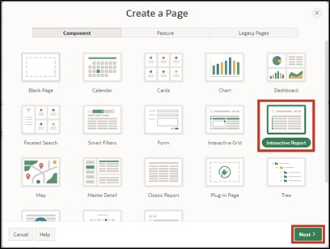

# 7. Features for Mobile Devices
## 7.1. Reflow Report & Column Toggle Report
Two report types that help ensure APEX applications can be comfortably used on mobile devices are the **Reflow Report** and the **Column Toggle** Report.

The Reflow Report displays table columns vertically when there isn't enough space to display them horizontally. The Column Toggle Report allows columns to be assigned different priorities. Columns with lower priority are displayed narrower and hidden earlier than columns with higher priority.

### 7.1.1. Create View
- A **View** is needed to complete this task.

- Name your **View** ***TUTO_P0032_VW***:
  ```sql
  select o.ordr_id as order_id,
         o.ordr_ctmr_id as customer_id,
         o.ordr_total as order_total,
         o.ordr_dd as order_date,
         o.ordr_user_name as user_name,
         oi.ordr_item_id as order_item_id,
         oi.ordr_item_prdt_info_id as product_id,
         oi.ordr_item_unit_price as unit_price,
         oi.ordr_item_quantity as quantity,
         p.prdt_info_name as product_name,
         p.prdt_info_descr as product_description,
         p.prdt_info_category as category,
         p.prdt_info_avail as product_avail,
         p.prdt_info_list_price as list_price
    from order_items oi
    join product_info p
      on oi.ordr_item_prdt_info_id = p.prdt_info_id
    join orders o
      on oi.ordr_item_ordr_id = o.ordr_id
  ```

### 7.1.2. Create Report
- Create a new page. Navigate to the **App Builder** and click on **Create Page**.
- Choose **Page Type** as ***Interactive Report***.



- Enter **Page Number** ***32*** and **Page Name** ***Customer Orders for Mobile***.
- Choose **Data Source** as ***Local Database*** and your created View as **Table / View Name*** ***TUTO_P0032_VW***.
- Disable the breadcrumb in the navigation area and click **Create Page**.


- In the Page Designer, select your report ***Customer Orders for Mobile*** on the left side. On the right side, you can change the **Type**. Initially choose the setting ***Reflow Report*** and click the **Run** button.


The displayed table is "responsive," meaning the display of the table columns automatically adjusts to the screen size of the device.


If you shrink the browser window, the display area of the webpage also reduces. At a display screen width of ≤ 560 pixels, the table columns are no longer displayed side by side, but underneath each other.


- Switch back to the Page Designer and now choose **Type** as ***Column Toggle Report*** and click **Run**.


- In this case, you can set which table columns should be displayed. Click the **Columns** button and select the desired columns.


This is a temporary personalized setting of the table columns. Other users are not affected by this setting. The setting is ***not*** saved over a page reload.
 

## 7.2. Progressive Web Apps
By selecting the "Install Progressive Web App" feature when creating the application, it can now be installed as a desktop application.

Progressive web applications are faster apps because they use a special browser cache to store resources more efficiently, thus loading pages faster.

If it is a progressive web app, a new entry **Install App** is visible in the navigation bar:


- Click the **Install App** button. A popup appears where you confirm that you want to install the application.


Once the installation is complete, the application opens in its own window, independent of the browser you are in.


The application can now also be found and started through the Start menu.

Existing applications created as of APEX version 21.2 can also be converted into progressive web apps or used as such. The following settings need to be adjusted:

- Open the page overview of your application and click on **Edit Application Properties**.


- Here, click on **Progressive Web App** and activate the **Installable** option.


A section opens with further settings that can be used to customize the user interface of the progressive web app.


## 7.3. Persistent Authentication
For progressive web apps, version 22.1 introduces a new authentication method called "Persistent Authentication."

Unlike normal APEX applications, a "**Remember me**" checkbox appears on the login screen; this is not to be confused with "**Remember Username**".


When the "**Remember me**" option is enabled, APEX remembers the login data for a certain period (30 days). During this time, the user can access the desired page without needing to log in again. If a session expires, a new session is automatically provided.