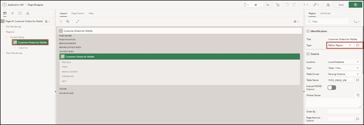
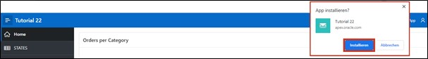

# <a name="features-for-mobile-devices"></a>7. Features for Mobile Devices
## <a name="reflow-report--column-toggle-report"></a>7.1 Reflow Report & Column Toggle Report
Two report types that help make APEX applications enjoyable to use on mobile devices are the **Reflow Report** and the **Column Toggle** Report.

The Reflow Report displays table columns vertically when there is not enough space to display them horizontally. The **Column Toggle** Report allows you to assign different priorities to columns. Columns with lower priority are displayed narrower and are hidden earlier than columns with higher priority.

### <a name="create-mobile-view"></a>7.1.1 Create View
- A **View** is required to complete this task. 

- Name your **View** ***TUTO_P0032_VW***:
  ```sql
  select o.ordr_id,
         o.ordr_ctmr_id,
         o.ordr_total,
         o.ordr_dd,
         o.ordr_user_name,
         oi.ordr_item_id,
         oi.ordr_item_prdt_info_id,
         oi.ordr_item_unit_price,
         oi.ordr_item_quantity,
         p.prdt_info_name,
         p.prdt_info_descr,
         p.prdt_info_category,
         p.prdt_info_avail,
         p.prdt_info_list_price
    from order_items oi
    join product_info p
      on oi.ordr_item_prdt_info_id = p.prdt_info_id
    join orders o
      on oi.ordr_item_ordr_id = o.ordr_id
  ```

### <a name="create-mobile-report"></a>7.1.2 Create Report
- Create a new page. To do this, navigate to the **App Builder** and click on **Create Page**. 
- Select ***Interactive Report*** as the **Page Type**. 


- Enter ***32*** as the **Page Number** and ***Customer Orders for Mobile*** as the **Page Name**.
- Select ***Local Database*** as the **Data Source** and the view you created ***TUTO_P0032_VW*** as the **Table / View Name**. 
- In the Navigation area, disable the *Breadcrumb* and click on **Create Page**.


- In the Page Designer, select your report ***Customer Orders for Mobile*** on the left side. On the right side, you can change the **Type**. First, select the ***Reflow Report*** setting and click the **Run** button.



The displayed table is "responsive", meaning the display of the table columns automatically adapts to the screen size of the device.


If you reduce the size of the browser window, the display area of the webpage also becomes smaller. When the display screen width is ≤ 560 pixels, the table columns are no longer displayed side by side but one below the other.


- Return to the Page Designer and select ***Column Toggle Report*** as the **Type** and click **Run**.


- In this case, you can set which table columns should be displayed. To do this, click on the **Columns** button and select the desired columns.


This is a temporary personalized setting of the table columns. Other users are not affected by this setting, and it is ***not*** saved across webpage reloads.
 

## <a name="progressive-web-apps"></a>7.2 Progressive Web Apps
By selecting the "Install Progressive Web App" feature when creating the application, it can now be installed as a desktop application.

Progressive Web Applications are faster apps because they use a special browser cache to store resources more efficiently, resulting in faster page loading.

For a progressive web app, a new entry **Install App** is visible in the navigation bar:


- Click on the **Install App** button. A popup will appear where you confirm that you want to install the application.



Once the installation is complete, the application opens in its own window, independent of the browser you are in. On Windows, as seen in the next screenshot, some customization options for the installation, such as creating a shortcut to the app on the desktop, are available.


The application can now also be found and started from the start menu.

Existing applications created from APEX version 21.2 onwards can be converted to or used as progressive web apps. The following settings must be adjusted for this:

- Open the page overview of your application and click on **Edit Application Definition**.


- Click on **Progressive Web App** and enable the **Installable** option.


A section opens with additional settings that can be used to customize the user interface of the Progressive Web App.


## <a name="persistent-authentication"></a>7.3 Persistent Authentication
For Progressive Web Apps, since APEX version 23.1, there is a new authentication method called "Persistent Authentication".

Unlike regular APEX applications, a "**Remember me**" checkbox appears on the login screen, which should not be confused with "**Remember Username**".


If the "Remember me" option is enabled, APEX remembers the login information for a certain period (30 days). During this time, the user can access the desired page without having to log in again. If a session has expired, a new session is automatically provided.