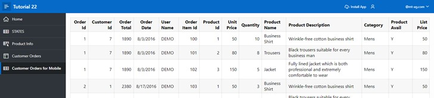
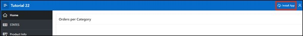
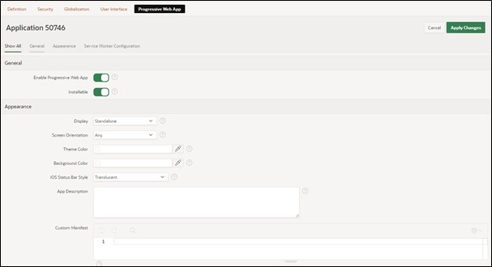

# <a name="features-fuer-mobile-endgeraete"></a>7. Features for Mobile Devices
## <a name="reflow-report--column-toggle-report"></a>7.1 Reflow Report & Column Toggle Report
Two report types that help make APEX applications pleasant to use on mobile devices are the **Reflow Report** and the **Column Toggle** Report.

The Reflow Report displays table columns vertically when there is not enough space to display them horizontally. The **Column Toggle** Report allows columns to be assigned different priorities, with lower-priority columns displayed narrower and hidden earlier than high-priority columns.

### <a name="mobile-view-erstellen"></a>7.1.1 Create View
- To complete this task, a **View** is needed.

- Name your **View** ***TUTO_P0032_VW***:
  ```sql
  select o.ordr_id,
         o.ordr_ctmr_id,
         o.ordr_total,
         o.ordr_dd,
         o.ordr_user_name,
         oi.ordr_item_id,
         oi.ordr_item_prdt_info_id,
         oi.ordr_item_unit_price,
         oi.ordr_item_quantity,
         p.prdt_info_name,
         p.prdt_info_descr,
         p.prdt_info_category,
         p.prdt_info_avail,
         p.prdt_info_list_price
    from order_items oi
    join product_info p
      on oi.ordr_item_prdt_info_id = p.prdt_info_id
    join orders o
      on oi.ordr_item_ordr_id = o.ordr_id
  ```

### <a name="mobile-report-erstellen"></a>7.1.2 Create Report
- Create a new page. To do this, navigate to the **App Builder** and click on **Create Page**.
- Select **Page Type** as ***Interactive Report***.


- Enter **Page Number** ***32*** and **Page Name** ***Customer Orders for Mobile***.
- Select **Data Source** as ***Local Database*** and **Table / View Name** as the view you created ***TUTO_P0032_VW***.
- In the navigation area, disable *Breadcrumb* and click **Create Page**.


- In the Page Designer, then select your report ***Customer Orders for Mobile*** on the left side. On the right side, you can change the **Type**. First, select the setting ***Reflow Report*** and click the **Run** button.


The displayed table is "responsive", meaning the display of the table columns automatically adjusts to the screen size of the device.



If you resize the browser window, the display area of the web page also reduces. When the display screen width is ≤ 560 pixels, the table columns are not displayed side by side but rather one below the other.


- Go back to the Page Designer and now select **Type** as ***Column Toggle Report*** and click on **Run**.


- In this case, you can set which table columns should be displayed. To do this, click on the **Columns** button and select the desired columns.


This is a temporary personalized setting of the table columns. Other users are not affected by this setting. The setting is ***not*** saved through a page reload.

## <a name="progressive-web-apps"></a>7.2 Progressive Web Apps
By selecting the "Install Progressive Web App" feature during application creation, it can now be installed as a desktop application.

Progressive web applications are faster apps because they use a special browser cache to store resources more efficiently, resulting in faster page load times.

If it's a progressive web app, a new entry **Install App** is visible in the navigation bar:



- Click on the **Install App** button. A popup appears in which you confirm that you want to install the application.


Once the installation is complete, the application opens in its own window, independent of the browser you are using. On Windows, as seen in the next screenshot, further installation adjustments, such as creating a desktop shortcut for the app, can be made.


The application can now also be found and started from the start menu.

Existing applications created from APEX version 21.2 onwards can also be converted to or used as progressive web apps. For this, the following settings need to be adjusted:

- Open the page overview of your application and click on **Edit Application Definition**.


- Click on **Progressive Web App** and enable the option **Installable**.


A section opens with additional settings that can be used to customize the user interface of the Progressive Web App.



## <a name="persistent-authentication"></a>7.3 Persistent Authentication
For Progressive Web Apps, there is a new authentication method called "Persistent Authentication" since version 23.1 of APEX.

Unlike normal APEX applications, a "**Remember me**" checkbox appears on the login screen, not to be confused with "**Remember Username**".


When the option "**Remember me**" is activated, APEX remembers the login credentials for a certain period (30 days). During this period, the user can access the desired page without needing to log in again. When a session expires, a new session is automatically provided.