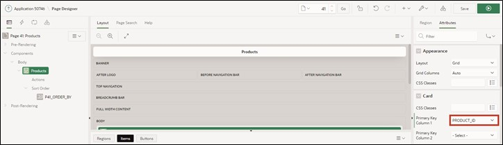

# 8. Cards Region

Cards are a popular form in web design to present information clearly and effectively. The cards in APEX can be designed in various ways. For instance, one can add icons to a card, display images or videos in it, or define actions for the card (e.g., through links or buttons).

In this chapter, we will create a page based on a cards region. In the first step, we will create a default cards region, and in the second chapter, we will edit it to display an image in the card.

## 8.1.	Create View

For the edit of this task, a **View** is needed.  
**View Name: *TUTO_P0041_VW***
**Query**:

```sql
select prdt_info_id as product_id,
       prdt_info_name as product_name,
       prdt_info_descr as product_description,
       prdt_info_category as category,
       prdt_info_product_image as product_image,
       prdt_info_list_price as list_price 
from product_info
 ```

## 8.2.	Create Page

- Open the **App Builder** through the navigation bar, select your application and click on the **Create Page** button.  
- Select the page type **Report**.  
- Select the region type **Cards**.  


- Enter **Page Number *41*** and **Page Name *Products***. Then click on the **Next** button.  
- Select the previously created view (TUTO_P0041_VW) under the **Table/View Name** section.  
- In the **Navigation** area, disable *Breadcrumb* and click **Next**.  

 

- Next, specify the attributes of your card. Use **Grid** as the format for arrangement to ensure that the cards are arranged in a uniform grid.   

Now, you need to specify which data should appear where in the card. A card must have a title area and can also include a body, an icon, and a badge.  
- Enter the following:   

  |  |  |
  |--|--|
  |**Title Column** | PRODUCT_NAME |
  |**Body Column** | PRODUCT_DESCRIPTION |
  |**Icon Initials Column** | CATEGORY |
  |**Badge Column** | LIST_PRICE |
  |  |  |  

  

- Click **Run** to access your newly created page.  

 

You will see that the products are now displayed in the form of cards. The title of the card is the product name, and the body briefly describes the product. The initials show the product's category (e.g., AC for Accessories), and the badge shows the product price.

At the top of the page, there is a select list to choose how the cards should be sorted.  
 
## 8.3.	Create Cards with Image

In this step, you will change the appearance of the cards and display the movie title images.  
- Click on **Attributes** and scroll down to **Media**.  

- Select **Source *BLOB Column*** and then under **BLOB_Column *PRODUCT_IMAGE***. 


- Also set ***PRODUCT_ID*** as **Primary Key Column 1**.  



- Then call up the page via the **Run** button.  

- Now the product images are additionally displayed in the cards. 

