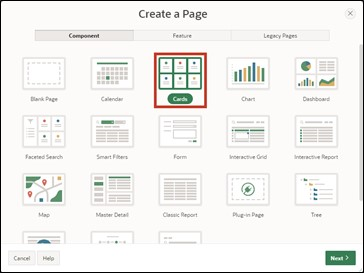
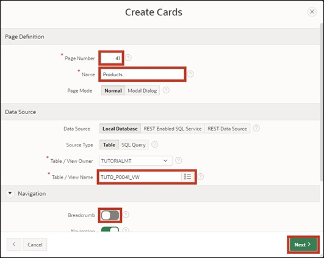
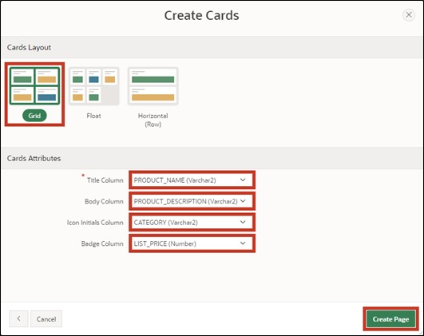

# <a name="cards-region"></a>8. Cards Region

Cards are a popular form in web design to present information clearly and visually. The cards in APEX can be styled in various ways. You can add icons to a card, display images or videos in it, or define actions for the card (e.g., via links or buttons).

In this chapter, we will create a page based on a Cards Region. In the first step, we will create a Default Cards Region, and in the second chapter, we will edit it so that an image is displayed in the card.

## <a name="cards-view-erstellen"></a>8.1	Create View

For working on this task, a **View** is required.  
**View Name: *TUTO_P0041_VW***
**Query**:

```sql
select prdt_info_id,
       prdt_info_name,
       prdt_info_descr,
       prdt_info_category,
       prdt_info_product_image,
       prdt_info_list_price
from product_info
 ```

## <a name="cards-seite-erstellen"></a>8.2	Create Page

- Open the **App Builder** through the navigation bar, select your application, and click on the **Create Page** button.  
- Select the page type **Report**.  
- Choose the region type **Cards**.  



- Enter **Page Number *41*** and **Page Name *Products***. Then click the **Next** button.  
- Select the previously created view (TUTO_P0041_VW) under **Table/View Name**.  
- Deactivate the *Breadcrumb* in the **Navigation** section and click on **Next**.  

 

- Then specify the attributes of your card. For the layout format, choose **Grid**. This ensures that the cards are arranged in a uniform grid.   

Now you need to specify which data is displayed where in the card. A card necessarily consists of a title section. You can also add a body, an icon, and a badge to it.  
- Enter the following:   

  |  |  |
  |--|--|
  |**Title Column** | PRDT_INFO_NAME |
  |**Body Column** | PRDT_INFO_DESCR |
  |**Icon Initials Column** | PRDT_INFO_CATEGORY |
  |**Badge Column** | PRDT_INFO_LIST_PRICE |
  |  |  |  

  

- Click **Run** to call up your newly created page.  

 

You will see that the products are now displayed in the form of cards. The title of the card is the product name, and the body provides a brief description of the product. The initials show the category of the product (e.g., AC for Accessories), and the badge displays the product's price.  

At the top of the page, there is a select list to choose how the cards should be sorted. To adjust the displayed names of the sorting fields, go to the page in the Page Designer and navigate to the page item **P41_ORDER_BY**. On the right, in the properties of the page item, open the **Static Values** under **List of Values**. 

 

Here you can adjust the displayed sorting criteria under Display Value. Enter the following values from the left column and confirm with **OK**.

  |  |  |
  |--|--|
  |Product Name | **PRDT_INFO_NAME** |
  |Product Description | **PRDT_INFO_DESCR** |
  |Product List Price | **PRDT_INFO_LIST_PRICE** |
  |  |  | 

 

- With a click on **Run**, you can view the change on the page.

 
 
## <a name="cards-mit-bild-erstellen"></a>8.3	Create Cards with Image

In this step, you will change the appearance of the cards and display the product title images.  
- To do this, click on **Attributes** and then scroll down to **Media**.  

- Select **Source *BLOB Column*** and then under **BLOB_Column *PRDT_INFO_PRODUCT_IMAGE***. 


- Also set ***PRDT_INFO_ID*** as **Primary Key Column 1**.  


- Then call up the page using the **Run** button.  

- The cards will now also display the product images. 

