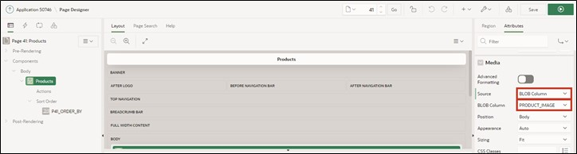
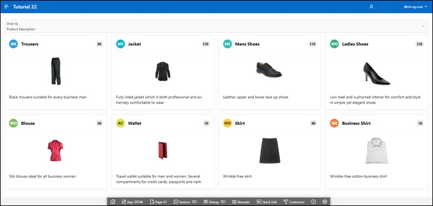

# 8. Cards Region

Cards are a popular format in web design to present information clearly and attractively. The Cards in APEX can be designed in many ways. You can add icons to a card, display images or videos within it, or define actions for the card (e.g., via links or buttons).

In this chapter, we will create a page based on a Cards Region. In the first step, we will create a Default Cards Region, and in the second chapter, we will modify it so that an image is displayed in the card.

## 8.1. Create View

For the completion of this task, a **View** is required.  
**View Name: *TUTO_P0041_VW***  
**Query**:

```sql
select prdt_info_id as product_id,
       prdt_info_name as product_name,
       prdt_info_descr as product_description,
       prdt_info_category as category,
       prdt_info_product_image as product_image,
       prdt_info_list_price as list_price 
from product_info
 ```

## 8.2. Create Page

- Open the **App Builder** via the navigation bar, select your application, and click the **Create Page** button.
- Select the page type **Report**.
- Select the region type **Cards**.


- Enter **Page Number *41*** and **Page Name *Products***. Then click the **Next** button.
- Under **Table/View Name**, select the previously created View (TUTO_P0041_VW).
- In the **Navigation** section, deactivate the Breadcrumb and click **Next**.


- Next, specify the attributes of your card. For the arrangement format, choose **Grid**. This ensures that the cards are arranged in a uniform grid.

Now you need to specify what data is displayed where on the card. A card must have a title area. Additionally, you can add a body, an icon, and a badge to it.  
- Enter the following:

**Title: *PRODUCT_NAME***  

**Body: Column *PRODUCT_DESCRIPTION***  

**Icon Initials Column: *CATEGORY***  

**Badge Column: LIST_PRICE**


- Click **Run** and access your newly created page.


You can see that the products are now displayed in the form of cards. The title of the card is the product name, the body briefly describes the product. The initials show the category of the product (e.g., AC for Accessories) and the badge shows you the product price.

At the top of the page, there is a Select List to choose how the cards should be sorted.

## 8.3. Create Cards with Image

In this step, you will change the appearance of the cards and display the movie title images.  
- To do this, click on **Attributes** and then scroll down to **Media**.
- Select **Source *BLOB Column*** and then under **BLOB_Column *PRODUCT_IMAGE***.



- Also, set ***PRODUCT_ID*** as **Primary Key Column 1**.


- Then access the page using the **Run** button.

- The product images are now additionally displayed in the cards.

