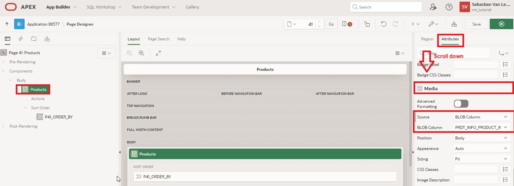

# <a name="cards-region"></a>8. Cards Region

Cards are a popular form in web design to present information clearly and vividly. The cards in APEX can be designed in a variety of ways. For instance, one can add icons to a card, display images or videos in it, or define actions for the card (e.g., through links or buttons).

In this chapter, we create a page based on a Cards Region. In the first step, we create a Default Cards Region, and in the second chapter, we edit it to display an image in the card.

## <a name="cards-view-erstellen"></a>8.1	Create View

A **View** is needed to complete this task.  
**View Name: *TUTO_P0041_VW***  
**Query**:

```sql
select prdt_info_id as product_id,
       prdt_info_name as product_name,
       prdt_info_descr as product_description,
       prdt_info_category as category,
       prdt_info_product_image as product_image,
       prdt_info_list_price as list_price 
from product_info
 ```

## <a name="cards-seite-erstellen"></a>8.2	Create Page

- Open the **App Builder** via the navigation bar, select your application, and click the **Create Page** button.  
- Select the **Report** page type.  
- Choose the **Cards** region type.  


- Enter **Page Number *41*** and **Page Name *Products***, then click the **Next** button.  
- Under **Table/View Name**, select the previously created view (TUTO_P0041_VW).  
- In the **Navigation** area, deactivate the *Breadcrumb* and click **Next**.  


- Then specify the attributes of your card. Use **Grid** as the layout format. This ensures that the cards are arranged in a uniform grid.   

Now, you need to specify which data is displayed where in the card. A card must have a title section. You can also add a body, an icon, and a badge to it.  
- Enter the following:   

  |  |  |
  |--|--|
  |**Title Column** | PRDT_INFO_NAME |
  |**Body Column** | PRDT_INFO_DESCR |
  |**Icon Initials Column** | PRDT_INFO_CATEGORY |
  |**Badge Column** | PRDT_INFO_LIST_PRICE |
  |  |  |  

  

- Click **Run** and call up your newly created page.  


You see that the products are now displayed in the form of cards. The title of the card is the product name, and the body gives a brief description of the product. The initials show the category of the product (e.g., AC for Accessories), and you see the product price in the badge.

At the top of the page is a select list for choosing how the cards should be sorted. To adjust the displayed names of the sorting fields, go to the page in the Page Designer and navigate to the Page Item **P41_ORDER_BY**. In the properties of the Page Item on the right, open **Static Values** under **List of Values**. 


Here you can adjust the displayed sorting criteria under Display Value. Enter the following values from the left column here and confirm with **OK**.

  |  |  |
  |--|--|
  |Product Name | **PRDT_INFO_NAME** |
  |Product Description | **PRDT_INFO_DESCR** |
  |Product List Price | **PRDT_INFO_LIST_PRICE** |
    |  |  |  


- With a click on **Run**, you can view the change on the page.


## <a name="cards-mit-bild-erstellen"></a>8.3	Create Cards with Image

In this step, you will change the appearance of the cards and display the title images of the films.  
- Click on **Attributes** and then scroll down to **Media**.  

- Choose **Source *BLOB Column*** and then under **BLOB_Column *PRDT_INFO_PRODUCT_IMAGE***. 



- Also set ***PRDT_INFO_ID*** as **Primary Key Column 1**.  


- Then, call up the page via the **Run** button.  

- The product images are now additionally displayed in the cards. 

