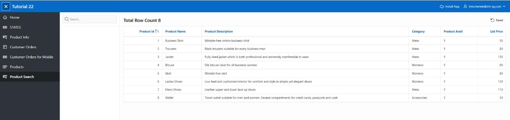
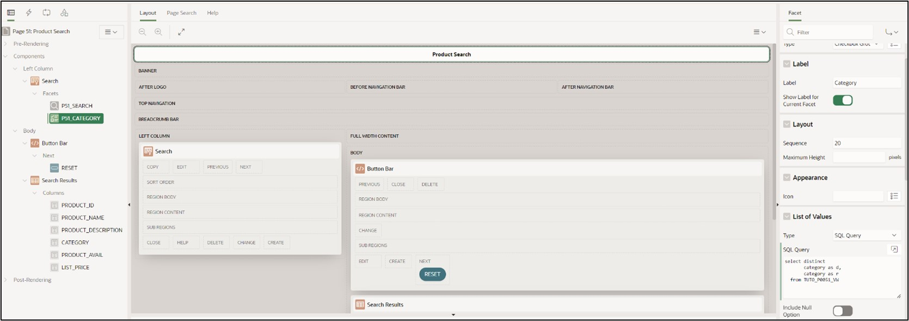
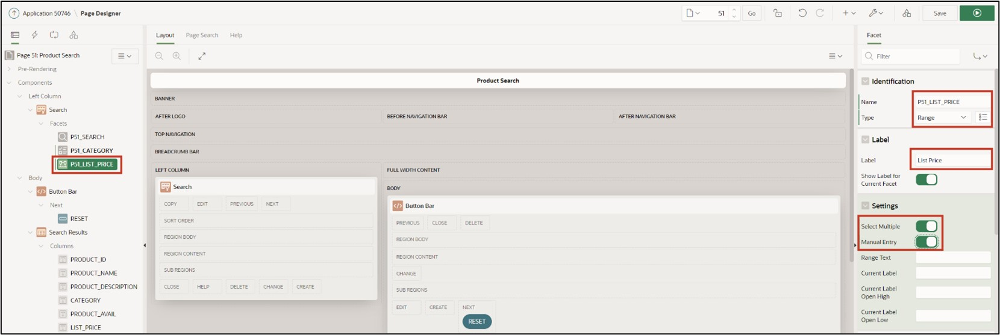

# 9. Faceted Search

Faceted Search refers to a feature for dynamically filtering displayed records and specifically searching within them. It is often used in online shops and typically features a fixed bar at the side of the page, containing different filters in the form of checkboxes, sliders, and input fields.

## 9.1. Creation of the View

For this task, a **View** is required.

**View Name: *TUTO_P0051_VW***

**Query**:

 ```sql
select prdt_info_id as product_id,
       prdt_info_name as product_name,
       prdt_info_descr as product_description,
       prdt_info_category as category,
       prdt_info_avail as product_avail,
       prdt_info_list_price as list_price 
from product_info
 ```

## 9.2. Create Page

- Open the **App Builder** via the navigation bar, select your application, and click on the **Create Page** button.
- Select the page type **Component**.
- Select the region type **Faceted Search**.


- Enter **Page Number *51*** and **Page Name *Product Search***.
- Select the previously created View (TUTO_P0051_VW) under **Table/View Name**.
- In the **Navigation** section, disable the Breadcrumb and click on **Next**.


- In the last step, disable all facets and click on the **Create Page** button.


- Then access the page using the **Run** button.

The data will be displayed on the right side as a **Classic Report**. To the left is the search/filter bar, which currently only contains a search field for searching specific data. More options in the form of facets will be added there in the following steps.



## 9.3. Create Facets

- Switch back to the **Page Designer** and create a new facet by right-clicking on the **Facets** entry and selecting **Create Facet**.


- Select the item and modify the following fields as indicated:

| | |
|--|--|
| **Identification** <br/> Name <br/> Type| *P51_CATEGORY* <br/> *Checkbox Group*|
| **Label** | *Category*|
| **List of Values** <br/> Type  SQL Query| *SQL Query* <br/>  select distinct category as d, <br/> category as r <br/> from TUTO_P0051_VW|



- Start the **page** by clicking on the **Run** button.

In the Faceted Search region, there is now a new element with three checkboxes. These allow the displayed data on the right to be dynamically filtered based on the values in the Category column.


- Switch back to the **Page Designer** to create a new **Facet**. Modify it according to the following specifications:

| | |
|--|--|
| **Identification** <br/>Name <br/>Type| *P51_LIST_PRICE* <br/>*Range*|
| **Label** | *List Price*|
| **Settings** <br/>Select Multiple <br/>Manual Entry| <br/>*Enabled* <br/>*Enabled* |
| **List of Values** <br/>Type| *Static Values* |



- To enter the List of Values, click on the button next to **Static Values**. A window will open where you can enter the specified values:


- Set the **Data Type** for the **LIST_PRICE** column to ****NUMBER****.
- Save and reload the page.


The newly created facet, like the Category facet, contains various checkboxes to filter the displayed data. Below are two input fields where values can be manually entered as upper and lower limits.


