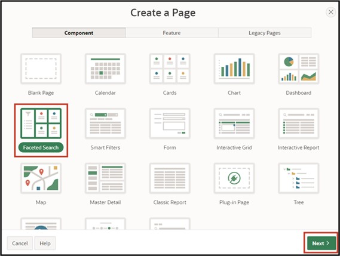

# 9. Faceted Search

The **Faceted Search** is a function for dynamically filtering displayed records and specifically searching within them. It is frequently used in online shops and is usually characterized by a fixed bar at the side of the page, where different filters are presented in the form of checkboxes, sliders, and input fields.

## 9.1. Creation of the View

A **View** is required for processing this task.

**View Name: *TUTO_P0051_VW***

**Query**:

 ```sql
select prdt_info_id as product_id,
       prdt_info_name as product_name,
       prdt_info_descr as product_description,
       prdt_info_category as category,
       prdt_info_avail as product_avail,
       prdt_info_list_price as list_price 
from product_info
 ```
 
## 9.2. Create Page

- Open the **App Builder** via the navigation bar, select your application, and click on the **Create Page** button.
- Select the page type **Component**.
- Select the region type **Faceted Search**.
 
 

- Enter **Page Number *51*** and **Page Name *Product Search***. 
- Under the **Table/View Name** section, select the previously created View (TUTO_P0051_VW).
- In the **Navigation** section, disable the *Breadcrumb* and click on **Next**.


  
- Disable all Facets in the last step and click the **Create Page** button.

 

- Then access the page via the **Run** button.

The data is displayed on the right side of the page as a **Classic Report**. To the left is the search/filter bar, which currently only contains a search field to search for specific data. Additional options in the form of facets will be added here in the following.

 

## 9.3. Create Facets

- Switch back to the **Page Designer** and create a new **Facet** by right-clicking on the **Facets** entry and selecting **Create Facet**.

 

- Select the item and modify the following fields as specified:

| | |  
|--|--|
| **Identification**| |
| Name | *P51_CATEGORY* |
| Type | *Checkbox Group*| 
| **Label** | *Category*| 
| **List of Values** | |
| Type | *SQL Query* |
| SQL Query | select distinct category as d, <br> category as r <br> from TUTO_P0051_VW| 
| | |

 

- Start the **page** by clicking the **Run** button.

In the Faceted Search Region, there is now a new element with three checkboxes. With these, the data displayed on the right can be dynamically filtered based on the values in the *Category* column.


- Return to the **Page Designer** to create a new **Facet**. Modify it according to the following specifications:

  | | |  
  |--|--|
  | **Identification** | |
  | Name | *P51_LIST_PRICE* |
  | Type | *Range* | 
  | **Label** | *List Price*| 
  | **Settings** | |
  | Select Multiple | *Enabled* |
  | Manual Entry | *Enabled* | 
  | **List of Values** | |
  | Type | *Static Values* | 
  | | |

 

- To input the **List of Values** – click the button next to **Static Values**. This opens the following window where you can enter the specified values:
 
 

- Set the **Data Type** for the **LIST_PRICE** column to ****NUMBER****.  
- Save and reload the page.

 

The newly created facet contains several checkboxes, like the *Category-Facet*, to filter the displayed data. Below are two input fields where values can be entered manually as upper and lower limits.

 
