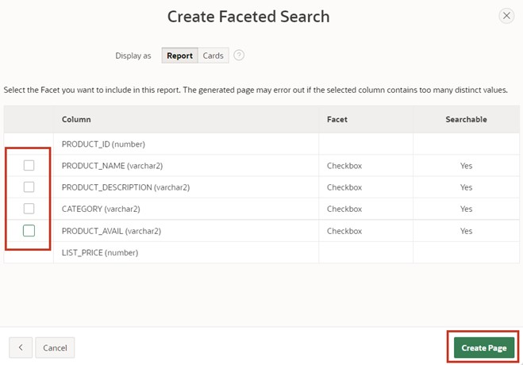
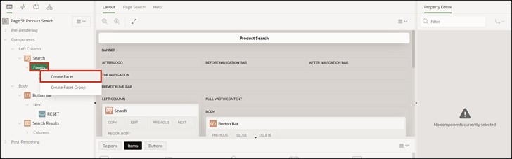
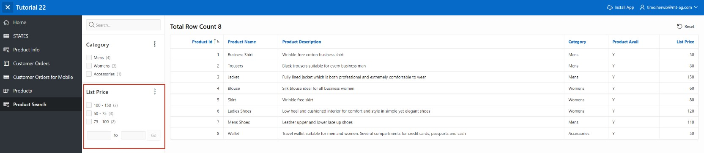

# <a name="faceted-search"></a>9. Faceted Search

The **Faceted Search** is a function for dynamically filtering the displayed records and for targeted searching within them. It is often used in online shops and is usually characterized by a fixed bar at the side of the page, where the different filters are located in the form of checkboxes, sliders, and input fields.

## <a name="fs-erstellung-der-view"></a>9.1 Creation of the View

For processing this task, a **View** is required.

**View Name: *TUTO_P0051_VW***

**Query**:

 ```sql
select prdt_info_id,
       prdt_info_name,
       prdt_info_descr,
       prdt_info_category,
       prdt_info_avail,
       prdt_info_list_price 
from product_info
 ```
 
## <a name="fs-create-page"></a>9.2 Create Page

- Open the **App Builder** via the navigation bar, select your application and click on the **Create Page** button.
- Select the page type **Component**.
- Select the region type **Faceted Search**.
 
 

- Enter **Page Number *51*** and **Page Name *Product Search***.
- Under **Table/View Name**, select the previously created view (TUTO_P0051_VW).
- In the **Navigation** area, disable *Breadcrumb* and click on **Next**.

 
  
- In the last step, deactivate all facets and click the **Create Page** button.

 

- Then open the page via the **Run** button.

The data is displayed as a **Classic Report** on the right side of the page. To the left is the search or filter bar, which currently contains only a search field for searching specific data. In the following steps, more options in the form of facets will be added there.

 

## <a name="fs-create-facets"></a>9.3 Create Facets

- Switch back to the **Page Designer** and create a new **Facet** by right-clicking on the **Facets** entry and then selecting **Create Facet**.

 

- Select the item and modify the following fields as indicated:

| | |  
|--|--|
| **Identification**|  |
| Name | *P51_CATEGORY* |
| Type| *Checkbox Group*| 
| **Label** | *Category*| 
| **List of Values**|  |
| Type | *SQL Query* |
| SQL Query | select distinct prdt_info_category as d, <br> prdt_info_category as r <br> from TUTO_P0051_VW| 
| | |

 

Scroll down to the **Source** section. Change the Database Column to **PRDT_INFO_CATEGORY**.

 

- Start the **page** by clicking the **Run** button.

In the Faceted Search region, there is now a new item with three checkboxes. These allow the displayed data on the right to be dynamically filtered by the values in the *Category* column.

 

- Switch back to the **Page Designer** to create a new **Facet**. Modify it according to the following specifications:

  | | |  
  |--|--|
  | **Identification** |  |
  | Name | *P51_LIST_PRICE* |
  | Type | *Range* | 
  | **Label** | *List Price*| 
  | **Settings** |  |
  | Select Multiple | *Enabled* |
  | Manual Entry | *Enabled* | 
  | **List of Values** |  |
  | Type | *Static Values* | 
  | | |

 

- To enter the **List of Values**, click on the button next to **Static Values**. This opens the following window where you can enter the specified values:
 
 

- Under **Source**, set the **Database Column** to **PRDT_INFO_LIST_PRICE** and the **Data Type** for the **LIST_PRICE** column to ****NUMBER****.

- Save and reopen the page.

 

The newly created facet contains various checkboxes like the *Category* facet, allowing the displayed data to be filtered. Below are two input fields where values can be manually entered as upper and lower limits.

 