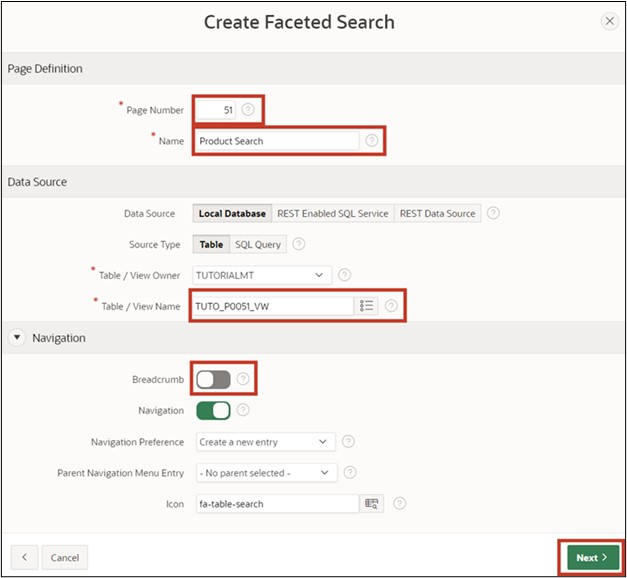
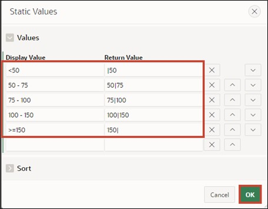
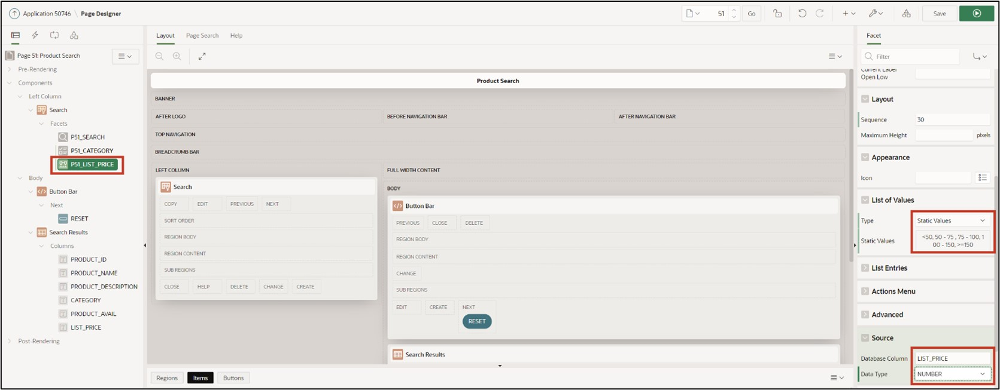

# <a name="faceted-search"></a>9. Faceted Search

The **Faceted Search** is a feature for dynamic filtering of displayed records and targeted searching within them. It is often used in online shops and is typically characterized by a fixed bar at the side of the page, where different filters in the form of checkboxes, sliders, and input fields are located.

## <a name="fs-erstellung-der-view"></a>9.1 Creation of the View

A **View** is required for editing this task.

**View Name: *TUTO_P0051_VW***

**Query**:

 ```sql
select prdt_info_id,
       prdt_info_name,
       prdt_info_descr,
       prdt_info_category,
       prdt_info_avail,
       prdt_info_list_price 
from product_info
 ```
 
## <a name="fs-create-page"></a>9.2 Create Page

- Open the **App Builder** via the navigation bar, select your application, and click the **Create Page** button.
- Select the page type **Component**.
- Select the region type **Faceted Search**.


- Enter **Page Number *51*** and **Page Name *Product Search***. 
- Under the **Table/View Name** point, select the view previously created (TUTO_P0051_VW).
- In the **Navigation** section, deactivate *Breadcrumb* and click **Next**.



- In the last step, deactivate all facets and click the **Create Page** button.


- Then access the page using the **Run** button. 

The data is displayed in the right section as a **Classic Report**. On the left is the search/filter bar, which currently only contains a search field to search for specific data. The following steps will add additional options in the form of facets.


## <a name="fs-create-facets"></a>9.3 Create Facets

- Go back to the **Page Designer** and create a new **Facet** by right-clicking on the **Facets** entry and then selecting **Create Facet**. 


- Select the item and change the following fields as specified:

| | |  
|--|--|
| **Identification**|  |
| Name | *P51_CATEGORY* |
| Type| *Checkbox Group*| 
| **Label** | *Category*| 
| **List of Values**|  |
| Type | *SQL Query* |
| SQL Query | select distinct prdt_info_category as d, <br> prdt_info_category as r <br> from TUTO_P0051_VW| 
| | |


Scroll further down to the **Source** section. Change the Database Column to **PRDT_INFO_CATEGORY**.


- Start the **page** by clicking the **Run** button.

A new element with three checkboxes is now in the Faceted Search region. These can be used to dynamically filter the displayed data on the right based on the values in the *Category* column.


- Go back to the **Page Designer** to create a new **Facet**. Modify it according to the following specifications:

  | | |  
  |--|--|
  | **Identification** |  |
  | Name | *P51_LIST_PRICE* |
  | Type | *Range* | 
  | **Label** | *List Price*| 
  | **Settings** |  |
  | Select Multiple | *Enabled* |
  | Manual Entry | *Enabled* | 
  | **List of Values** |  |
  | Type | *Static Values* | 
  | | |


- To enter the **List of Values** – click the button next to **Static Values**. The following window will open, where you can enter the specified values:



- Under **Source**, set the **Database Column** to **PRDT_INFO_LIST_PRICE** and the **Data Type** for the **LIST_PRICE** column to ****NUMBER****.  

- Save and access the page again. 



The newly created facet, like the *Category Facet*, contains various checkboxes to filter the displayed data. Below are two input fields where values can be manually entered as upper and lower limits.

