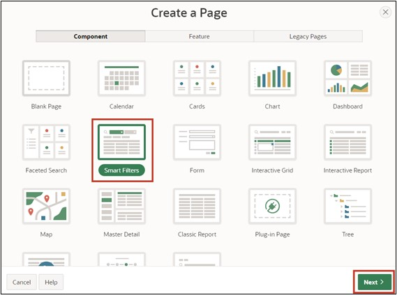
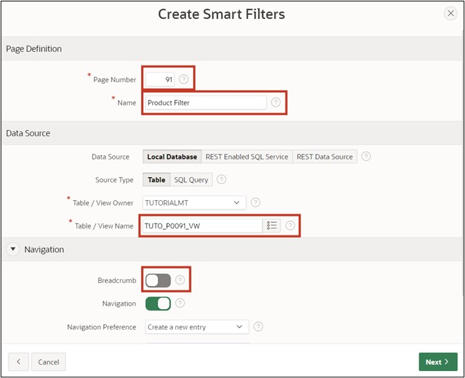
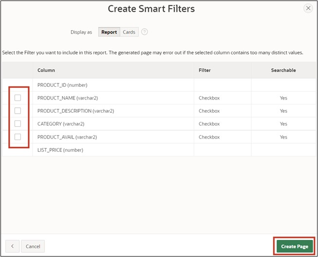
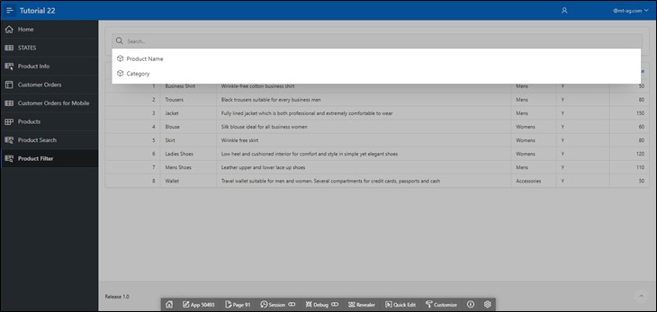

# 10. Smart Filters
The Smart Filters provide the ability to easily narrow down data using filter suggestions or search terms. These are displayed as chips below the search bar or as suggestions while typing.

## 10.1. Creation of the View
A **View** is required for editing this task.
**View Name: TUTO_P0091_VW**
Query:
 ```sql
select prdt_info_id as product_id,
       prdt_info_name as product_name,
       prdt_info_descr as product_description,
       prdt_info_category as category,
       prdt_info_avail as product_avail,
       prdt_info_list_price as list_price 
from product_info
```

## 10.2. Create Page
- Open the **App Builder** via the navigation bar, select your application, and click on the **Create Page** button.
- Select the page type **Component**.
- Select the region type **Smart Filters**.



- Enter **Page Number 91** and **Page Name Product Filter**.
- Select the previously created view (TUTO_P0091_VW) under **Table/View Name**.
- In the **Navigation** section, disable the breadcrumb and click **Next**.



- In the final step, deactivate all filters and click the **Create Page** button.



- Then access the page via the **Run** button.<br/>
The data is displayed as a **Classic Report**. Above it is a search bar, under which the chips that are added next are displayed.


## 10.3. Create Filters
- Go back to the **Page Designer** and create a new filter by right-clicking on the **Filters** entry and then selecting **Create Filter**.


- Select the item and change the following fields as specified:

  | | |  
  |--|--|
  | **Identification** <br/> Name <br/> Type | P91_PRODUCT_NAME <br/> *Checkbox Group*|  
  | **Label**| *Product Name* |
  | **List of Values** <br/> Type| *Distinct Values* |

- Run the page by clicking on the Run Button.


When clicking in the search bar, the filter Product Name appears. When you click on the filter, all filter options based on the column values are displayed. Clicking on the displayed suggestion will adopt it as a filter in the search bar.

- Go back to the **Page Designer** to create another filter. Modify this according to the following specifications:

  | | |  
  |--|--|
  | **Identification** <br/> Name <br/> Type | P91_CATEGORY <br/> *Checkbox Group*|  
  | **Label**| *Category* |
  | **List of Values** <br/> Type| *Distinct Values* |


- Save and access the page again.<br/>
The created filters for *Product* Name and *Category* are now displayed when clicking in the search bar.

