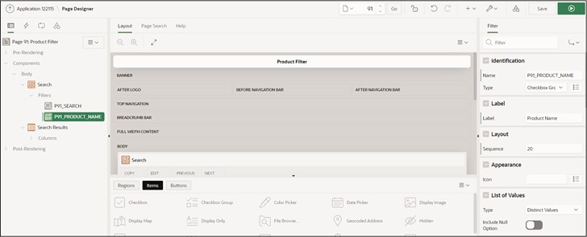

# 10. Smart Filters
The **Smart Filters** provide the ability to easily narrow down data using filter suggestions or search terms. These are displayed as chips under the search bar or as suggestions while typing.
## 10.1. Creation of the View
For editing this task, a **View** is required. 
**View Name: TUTO_P0091_VW**
Query:
 ```sql
select prdt_info_id as product_id,
       prdt_info_name as product_name,
       prdt_info_descr as product_description,
       prdt_info_category as category,
       prdt_info_avail as product_avail,
       prdt_info_list_price as list_price 
from product_info
```

## 10.2. Create Page
- Open the **App Builder** from the navigation bar, select your application, and click on the **Create Page** button.  
- Select the page type **Component**.  
- Select the region type **Smart Filters**.  
 
  

- Enter **Page Number 91** and **Page Name Product Filter**. 
- Select the previously created View (TUTO_P0091_VW) under **Table/View Name**.  
- Disable *Breadcrumb* in the **Navigation** section and click **Next**.  
  
  

- Disable all filters in the last step and click the **Create Page** button.  
 
  

- Then, call up the page using the **Run** button.  
The data is displayed as a **Classic Report**. Above it is a search bar, under which the chips are displayed, which will be added next.  

  
 
## 10.3. Create Filters
- Switch back to the **Page Designer** and create a new filter by right-clicking on the **Filters** entry and selecting **Create Filter**.  

  

- Select the item and change the following fields as specified:  

  | | |  
  |--|--|
  | **Identification** |  |
  | Name | *P91_PRODUCT_NAME* |
  | Type | *Checkbox Group* |  
  | **Label**| *Product Name* |
  | **List of Values** |  |
  | Type | *Distinct Values* |
  | | |  

- Launch the page by clicking the Run button.  

  

When you click into the search bar, the *Product Name* filter appears. If you click on the filter, all filter options based on the column values are displayed. Clicking on the displayed suggestion adopts it as a filter in the search bar.  

- Switch back to the **Page Designer** to create another filter. Modify it according to the following specifications:  

  | | |  
  |--|--|
  | **Identification** |
  | Name | *P91_CATEGORY* |
  | Type | *Checkbox Group*|  
  | **Label**| *Category* |
  | **List of Values** |  |
  | Type | *Distinct Values* |
  | | |  

  

- Save and call up the page again.  
The created filters for *Product Name* and *Category* are now displayed when clicking in the search bar.  

  
