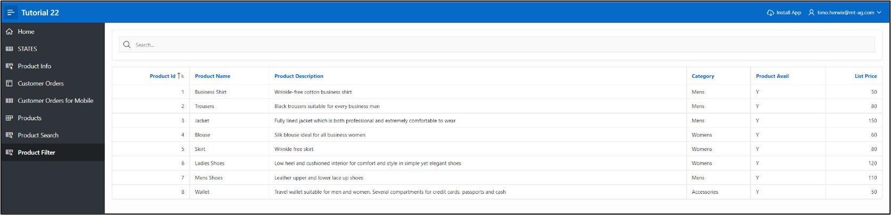
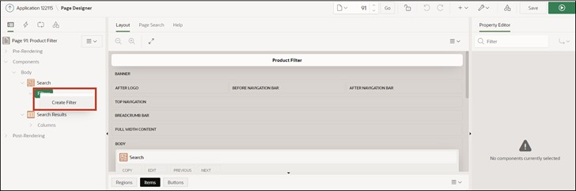
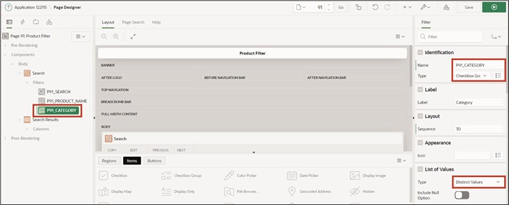

# <a name="smart-filters"></a>10. Smart Filters
The **Smart Filters** offer the possibility to easily narrow data using filter suggestions or search terms. These are displayed as chips under the search bar or as suggestions while typing.
## <a name="sf-erstellung-der-view"></a>10.1 Creation of the View
A **View** is needed to work on this task.  
**View Name: TUTO_P0091_VW**  
Query:  
 ```sql
select prdt_info_id,
       prdt_info_name,
       prdt_info_descr,
       prdt_info_category,
       prdt_info_avail,
       prdt_info_list_price
from product_info
```

## <a name="sf-create-page"></a>10.2 Create Page
- Open the **App Builder** via the navigation bar, select your application, and click on the **Create Page** button.  
- Select the **Component** page type.  
- Select the **Smart Filters** region type.  
 
  

- Enter **Page Number 91** and **Page Name Product Filter**. 
- Select the view (TUTO_P0091_VW) created earlier under the point **Table/View Name**.  
- In the **Navigation** area, disable the *Breadcrumb* and click **Next**.  
  
  

- In the last step, disable all filters and click the **Create Page** button.  
 
  

- Then call up the page via the **Run** button.  
The data is displayed as a **Classic Report**. Above it is a search bar, under which the filters are displayed as chips that will be added in the following.  

  
 
## <a name="sf-create-filters"></a>10.3 Create Filters
- Switch back to the **Page Designer** and create a new filter by right-clicking on the **Filters** entry and selecting **Create Filter**.  

  

- Select the item and modify the following fields as specified:  

  | | |  
  |--|--|
  | **Identification** |  |
  | Name | *P91_PRDT_INFO_NAME* |
  | Type | *Checkbox Group* |  
  | **Label**| *Product Name* |
  | **List of Values** |  |
  | Type | *Distinct Values* |
  | | |  

- Start the page by clicking the Run button.  

  

When clicking in the search bar, the filter *Product Name* appears. If you click on the filter, all filter options based on the column values will be displayed. Clicking on the displayed suggestion will adopt it as a filter in the search bar.  

- Switch back to the **Page Designer** to create another filter. Modify it according to the following specifications:  

  | | |  
  |--|--|
  | **Identification** |
  | Name | *P91_PRDT_INFO_CATEGORY* |
  | Type | *Checkbox Group*|  
  | **Label**| *Category* |
  | **List of Values** |  |
  | Type | *Distinct Values* |
  | | |  

  

- Save and call up the page again.  
The created filters for *Product Name* and *Category* are now displayed when clicking in the search bar.  

  