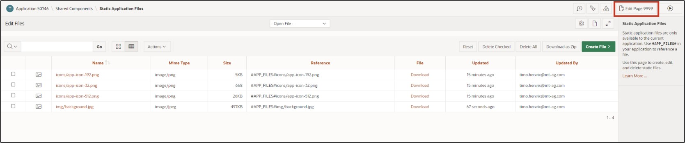
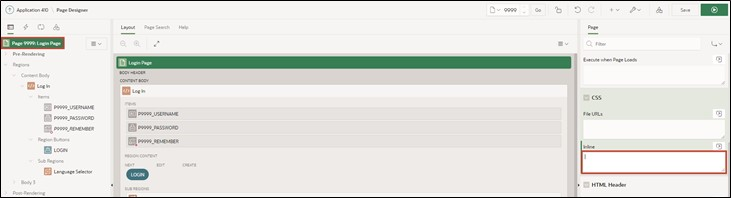

# <a name="optische-anpassungen"></a> 11. Visual Adjustments
Different use cases result in different requirements for an application's user interface. By default, the interface of APEX is rather plain, but it can be extensively customized by combining component settings and custom CSS code.

CSS code allows developers to adjust the design attributes of pages, regions, and items beyond the standard. CSS consists of a list of rules that describe to the web browser how certain elements of a webpage should be displayed. To avoid defining a separate list of rules for each element, identical elements can be grouped into classes.  

## <a name="dark-mode"></a>11.1 Dark Mode
A dark mode can be activated for both the development environment and the final application. For the latter, this is set in the theme settings of the application.
- First, open your **application** from the APP Builder. Click on **Customize** in the bar at the bottom of the screen and then on **Theme Roller**. If the bottom bar is hidden, move your mouse to the bottom edge of the browser. Through the bar, you can change the theme and make further CSS adjustments.  

 

- Under **Style**, select the theme **Vita – Dark** and set it as the current theme by clicking the **Save** button.  

 

Your created application should now look like this:  

 

## <a name="anpassung-des-login-screens"></a>11.2 Customization of the Login Screen
After this chapter, your login screen will have a background image and will thus look more appealing.
- First, open the **App Builder** and then click on your created **application**. 
- Click on **Page 9999 - *Login Page***. 

 

A template contains all the elements that users need to create a page, including examples of the elements so developers can see how to use each one. Every time a new page is created in APEX, a template must be selected for it. Developers have the option to edit existing templates or create new ones.
- Select the **Region TUTORIAL23.2**. Change its **Name** to ***Log In***. 

 

- Select the **Item *P9999_USERNAME***. Delete the value in the **Label** field and change the value for **Icon** to **fa-user**.  
- Select the **Item *P9999_PASSWORD***. Delete the value in the **Label** field and change the value for **Icon** to **fa-lock-password**.
- Finally, save the page.

 

- The application icon can be changed in the ***Shared Components***. 

 

- Click on the ***User Interfaces Attributes*** entry under **User Interface**.

  

- Click here on ***Change Icon***.

 

- Here you can upload your own logo or select one from the existing ones. You can also determine the logo color here. For example, select the ***APEX Icon in blue*** and then click ***Save Icon***.  

  

You can now see the changes you made on your page. The region is displayed with a different template, and the fields Username and Password are displayed with an icon and a placeholder. 

Additionally, an icon is displayed above the region title, which can support the identification of the application. 

  

- The background image for the login page needs to be uploaded next in the application. Click again on ***Shared Components***.  
- Then click on the ***Static Application Files*** entry under **Files**.

  

In the Static Application Files, you can upload and manage your own files. This is particularly useful for images, CSS, and JavaScript files. Files in Static Application Files are exported with application exports. 
- Click on the **Create File** button. 


- **Directory** displays the folder path to your file in text form. Enter ***img*** here so that your file is loaded into the **folder *img***. Upload the background.jpg file into the **Content** field. Then click on **Create**.  

  

- Your uploaded file is now displayed. 
Click on the **Edit Page 9999** button in the **Breadcrumb** bar to go directly to the Page Designer for the Login Page. 



- Your uploaded file is now displayed. 
Click on the **Edit Page 9999** button in the **Breadcrumb** bar to go directly to the Page Designer for the Login Page. 
- Add a **Static Content Region** to the **Background Image** position and name it Image.


- Change the **Template** of the region to **Image**. Finally, the **File URL** of the previously uploaded image needs to be specified. Please enter **#APP_FILES#img/background.jpg** here.


- The following additional **CSS code** will be used to display the **Region *Log In*** as transparent. Click on the **Page 9999: Login Page** entry on the left and select the **Inline** field under **CSS** in the page properties on the right.



- Click the **Icon** above the field to start the code editor. Enter the following CSS specifications there:
 ```css
.t-Login-region {
    opacity: 0.9;
}
 ```  

  

- Click the **Save and Run Page** button to view the revised page. 
You will now see the changes you made. 

