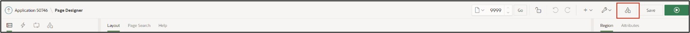
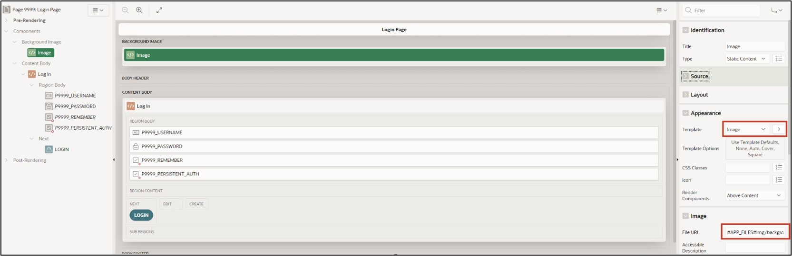

# <a name="optische-anpassungen"></a> 11. Visual Adjustments
Different use cases bring different requirements for the user interface of an application. By default, the APEX interface is rather simple but can be extensively customized by combining component settings with custom CSS code.

CSS code allows developers to customize the design attributes of pages, regions, and items beyond the standard. CSS consists of a list of rules that describe to the web browser how certain elements of a webpage should be displayed. To avoid defining a separate list of rules for each element, identical elements can be grouped together in classes.

## <a name="dark-mode"></a>11.1 Dark Mode
A Dark Mode can be activated both for the development environment and for the finished application. For the latter, it is set in the application's theme settings.
- First, open your **application** from the APP Builder. Click on **Customize** in the bar at the bottom edge of the screen, then on **Theme Roller**. If the bottom bar is hidden, move the cursor to the bottom of the browser. The bar allows you to change the theme and make further CSS adjustments.


- Under **Style**, select the theme **Vita – Dark** and set it as the current theme by clicking the **Save** button.


Your created application should now appear as follows:


## <a name="anpassung-des-login-screens"></a>11.2 Customizing the Login Screen
After this chapter, your login screen will have a background image and thus look more attractive.
- First, open the **App Builder** and then click on your created **application**.
- Click on **Page 9999 - *Login Page***.


A template includes all the elements that users need to create a page, including examples of the elements so developers can see how to use each item. Whenever a new page is created in APEX, a template must be selected for it. Developers have the option to edit existing templates or create new ones.
- Select the **Region TUTORIAL24.1**. Change the **Name** to ***Log In***.


- Select the **Item *P9999_USERNAME***. Delete the value of the **Label** field and change the **Icon** value to **fa-user**.
- Select the **Item *P9999_PASSWORD***. Delete the value of the **Label** field and change the **Icon** value to **fa-lock-password**.
- Finally, save the page.


- The Application Icon can be changed in the ***Shared Components***.



- Click on ***User Interfaces Attributes*** under **User Interface**.


- Click on ***Change Icon*** here.


- Here you can upload your own logo or select one from the existing ones. You can also determine the color of the logo here. For example, choose the ***APEX Icon in blue*** and then click ***Save Icon***.


You can now see the changes you made on your page. The region is displayed with a different template and the fields for Username and Password are shown with an icon and a placeholder.

Additionally, an icon will be displayed above the region's title, which can help in identifying the application.


- The background image for the login page must be next uploaded to the application. For this, click again on ***Shared Components***.
- Then click on ***Static Application Files*** under **Files**.


In the Static Application Files section, you can upload and manage your own files. This is particularly useful for images, CSS, and JavaScript files. Files in Static Application Files are exported with application exports.
- Click on the **Create File** button.


- **Directory** represents the folder path to your file in text form. Enter ***img*** here so that your file is loaded into the **folder *img***. Upload the file background.jpg in the **Content** field. Then click on **Create**.


- Your uploaded file will now be displayed.
Click the **Edit Page 9999** button in the **Breadcrumb** bar to go directly to the Page Designer for the Login Page.


- Your uploaded file will now be displayed.
Click on the **Edit Page 9999** button in the **Breadcrumb** bar to directly access the Page Designer for the Login Page.
- Next, add a **Static Content Region** to the **Background Image** location and name it Image.


- Change the **Template** of the region to **Image**. Finally, the **File URL** of the previously uploaded image must be specified. Please enter **#APP_FILES#img/background.jpg** here.



- Additional **CSS code** will be used to make the **Region *Log In*** appear transparent. Click on **Page 9999: Login Page** on the left and under **CSS** in the page properties on the right, select the **Inline** field.


- Click on the **icon** above the field to start the code editor. Enter the following CSS specifications there:
 ```css
.t-Login-region{
   opacity: 0.9;
}

.apex-item-text, .t-Button{
    border-radius: 20px;
}

.t-Login-region{
    border-top-left-radius: 100px;
    border-top-right-radius: 100px;
}
 ```


- Click on the **Save and Run Page** button to view the revised page.
You will now see the changes you made.

