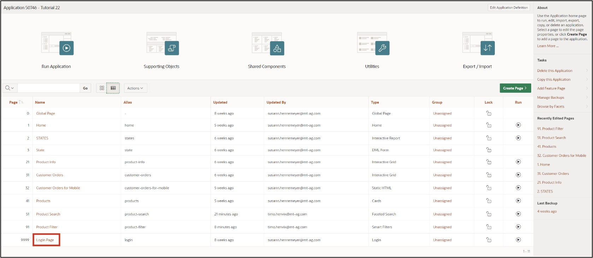
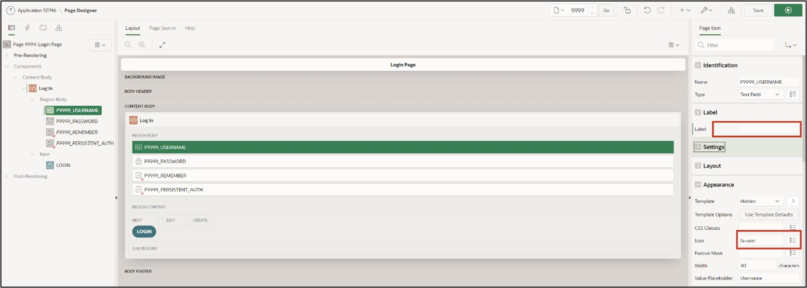
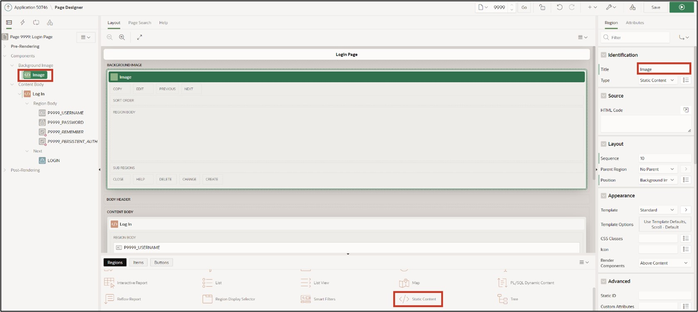
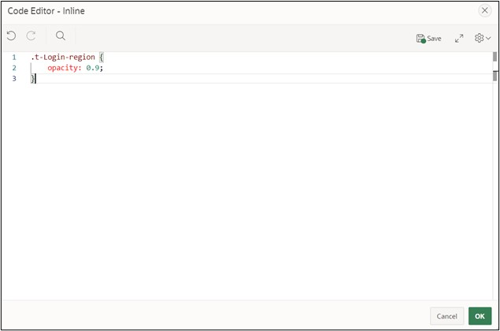

# <a name="optische-anpassungen"></a> 11. Visual Adjustments
Different use cases bring different requirements for the user interface of an application. By default, the interface of APEX is rather plain, but it can be extensively customized by combining component settings and custom CSS code.

CSS code allows developers to adjust the design attributes of pages, regions, and items beyond the standard. CSS consists of a list of rules that describe to the web browser how certain elements of a webpage should be displayed. So that a separate list of rules does not have to be defined for each element, identical elements can be grouped into classes.

## <a name="dark-mode"></a>11.1 Dark Mode
A dark mode can be activated for both the development environment and the finished application. For the latter, it is specified in the theme settings of the application.
- First, open your **application** from the APP Builder. Click on **Customize** in the bar at the bottom of the screen and then on **Theme Roller**. If the bottom bar is hidden, move the mouse pointer to the bottom edge of the browser. Via the bar, you can change the theme and make further CSS adjustments.


- Under **Style**, select the theme **Vita – Dark** and set it as the current theme by clicking the **Save** button.


Your created application should now look like this:


## <a name="anpassung-des-login-screens"></a> 11.2 Adjustment of the Login Screen
After this chapter, your login screen will have a background image and thus appear more appealing.
- First, open the **App Builder** and then click on the **application** you created.
- Click on **Page 9999 - *Login Page***.



A template contains all the elements that users need to create a page, including examples of the elements so that developers can see how the individual elements are to be used. Whenever a new page is created in APEX, a template must be selected for it. Developers have the option of editing existing templates or creating new ones.
- Select the **Region TUTORIAL24.1**. Change the **Name** there to ***Log In***.


- Select the **Item *P9999_USERNAME***. Delete the value of the **Label** field and change the value for **Icon** to **fa-user**.
- Select the **Item *P9999_PASSWORD***. Delete the value of the **Label** field and change the value for **Icon** to **fa-lock-password**.
- Finally, save the page.



- The Application Icon can be changed in the ***Shared Components***.


- Click on ***User Interfaces Attributes*** under **User Interface**.


- Click here on ***Change Icon***.


- Here you can upload your own logo or select one from the existing ones. You can also determine the color of the logo here. For example, select the ***APEX Icon in blue*** and then click ***Save Icon***.


You can now see the changes you made on your page. The region is displayed with a different template, and the Username and Password fields are displayed with an icon and a placeholder.

In addition, an icon is displayed above the title of the region, which can support the identification of the application.


- Next, the background image for the login page must be uploaded in the application. To do this, click ***Shared Components*** again.
- Then click ***Static Application Files*** under **Files**.


Under the Static Application Files, you can upload and manage your own files. This is especially useful for images, CSS, and JavaScript files. Files under Static Application Files are exported with application exports.
- Click the **Create File** button.


- **Directory** represents the folder path to your file in text form. Enter ***img*** here so that your file is loaded into the **folder *img***. Upload the file background.jpg in the **Content** field. Then click **Create**.


- Your uploaded file will now be displayed. Click the **Edit Page 9999** button in the **Breadcrumb Leiste** to go directly to the Page Designer for the login page.


- Your uploaded file will now be displayed. Click the **Edit Page 9999** button in the **Breadcrumb Leiste** to go directly to the Page Designer for the login page.
- Next, add a **Static Content Region** to the position **Background Image** and name it Image.



- Change the **Template** of the region to **Image**. Finally, the **File URL** of the previously uploaded image must be specified. Please enter **#APP_FILES#img/background.jpg** here.


- The following additional **CSS code** is used to make the **Region *Log In*** transparent. Click on **Page 9999: Login Page** on the left and select the field **Inline** under **CSS** in the Page Properties on the right.


- Click the **Icon** above the field on the right to start the code editor. Enter the following CSS specifications there:
 ```css
.t-Login-region{
   opacity: 0.9;
}

.apex-item-text, .t-Button{
    border-radius: 20px;
}

.t-Login-region{
    border-top-left-radius: 100px;
    border-top-right-radius: 100px;
}
 ```  



- Click the **Save and Run Page** button to view the revised page. You now see the changes you made.

