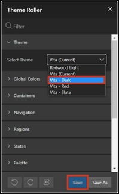

# 11. Visual Adjustments
Different use cases bring different requirements for the user interface of an application. By default, the interface of APEX is rather simple, but it can be extensively customized by combining component settings and custom CSS code.

CSS code allows developers to adjust the design attributes of pages, regions, and items beyond the standard. CSS consists of a list of rules that describe to the web browser how certain elements of a webpage should be displayed. So that a separate list of rules doesn't have to be defined for each element, identical elements can be grouped into classes. 
## 11.1. Dark Mode
Both the development environment and the finished application can be set to a dark mode. For the latter, this is set in the theme settings of the application.
- First, open your **application**. Click on **Customize** in the bar at the bottom of the screen and then on **Theme Roller**. Here you can change the theme and make further CSS adjustments.

<div style="text-align: center;">


</div>

- Under **Style**, select the theme **Vita – Dark** and set it as the current theme by clicking the **Save** button.

<div style="text-align: center;">



</div>

Your created application should now look like the following:


## 11.2. Customization of the Login Screen
After this chapter, your login screen will have a background image and thus look more appealing.
- First, open the **App Builder** and then click on the **application** you created.
- Click on **Page 9999 - *Login Page***.


A template contains all the elements users need to create a page, including examples of the elements so developers can see how the individual elements are to be used. Whenever a new page is created in APEX, a template must be selected for it. Developers have the option to edit existing templates or create new ones.
- Select the **Region TUTORIAL22**. Change its **Name** to ***Log In***.


- Select the **Item *P9999_USERNAME***. Delete the value of the **Label** field and change the value for **Icon** to **fa-user**.
- Select the **Item *P9999_PASSWORD***. Delete the value of the **Label** field and change the value for **Icon** to **fa-lock-password**.


- The Application Icon can be changed in the ***Shared Components***.


- Click on ***User Interface*** under the **User Interfaces Attributes** entry.


- Click here on ***Change Icon***.


- Here you can upload your own logo or select one of the existing ones. You can also determine the color of the logo here. For example, choose the ***APEX Icon in blue*** and then click ***Save Icon***.

<div style="text-align: center;">


</div>

You can now see the changes you made on your page. The region is displayed with a different template, and the Username and Password fields are shown with an icon and a placeholder. Additionally, an icon is displayed above the region title, which can aid the identification of the application.
<div style="text-align: center;">


</div>

- The background image for the login page must be uploaded to the application next. To do this, click again on ***Shared Components***.
- Then click on ***Static Application Files*** under **Files**.


Under Static Application Files, you can upload and manage your own files. This is particularly useful for images, CSS, and JavaScript files. Files under Static Application Files are exported during application exports.
- Click the **Create File** button.


- **Directory** textually represents the folder path to your file. Enter ***img*** here so that your file is loaded into the **folder *img***. Upload the file background.jpg in the **Content** field. Then click **Create**.

<div style="text-align: center;">


</div>

- Your uploaded file is now displayed.
Click on the **Edit Page 9999** button in the **Breadcrumb Bar** to go directly to the Page Designer for the login page.


- Your uploaded file is now displayed.
Click on the **Edit Page 9999** button in the **Breadcrumb Bar** to go directly to the Page Designer for the login page.
- Next, add a **Static Content Region** to the **Background Image** position and name it Image.


- Change the **Template** of the region to **Image**. Finally, the **File URL** of the previously uploaded image must be specified. Please enter **“#APP_FILES#img/background.jpg”** here.


- In the following, additional **CSS code** will be used to make the **Region *Log In*** appear transparent. Click on the entry **Page 9999: Login Page** on the left and select **Inline** under **CSS** in the page properties on the right.


- Click on the **icon** above the field to start the code editor. Enter the following CSS specifications there:
 ```css
.t-Login-region {
    opacity: 0.9;
}
 ```

<div style="text-align: center;">


</div>

- Click on the **Run** button to view the revised page.
You will now see the changes you made.

